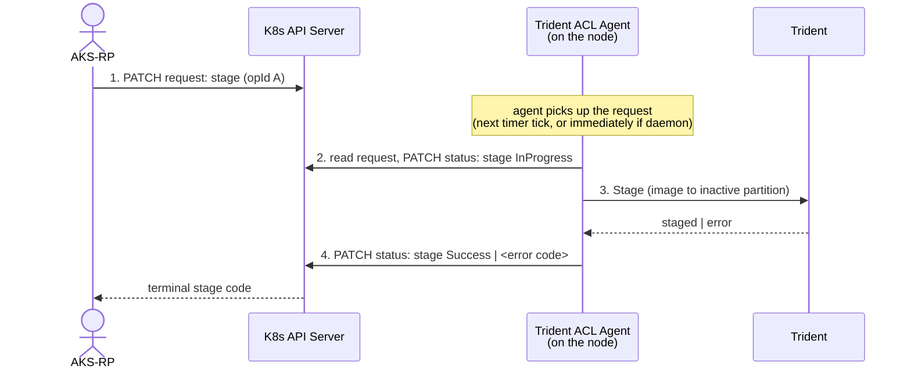
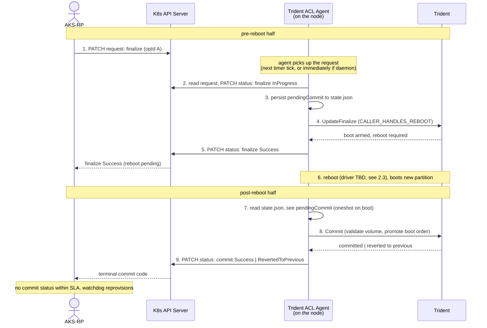
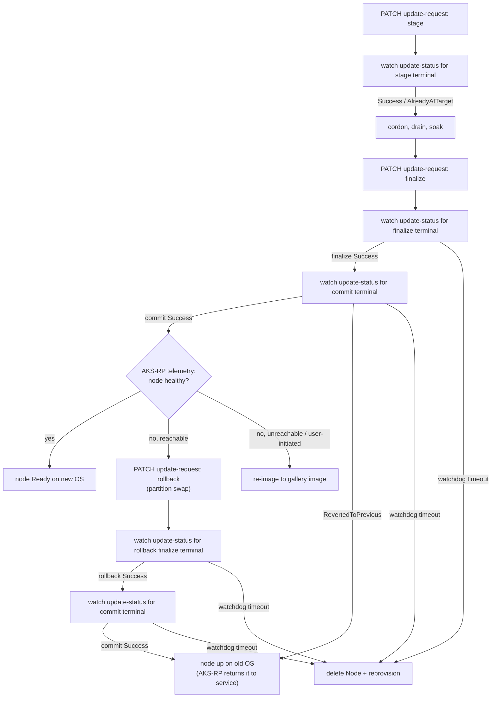

# Update Trigger - Design Document

AKS needs a way to tell a specific ACL node when to A/B update, and to learn what
happened.
This design uses annotations. The pieces are a pair of annotations on the Node object, an
in-image agent that reads and writes them, a state file that bridges the partition swap, a
watchdog AKS operates as a backstop, and a new branch in AKS's per-node upgrade loop that
drives the annotations instead of CRP.

Two alternatives were considered and rejected. A pod-based cluster extension needs kubelet
to be up, which is not guaranteed during an upgrade window or post-reboot. A manifest-only
VM extension keeps waagent on the trigger path, which runs against the ACL image's hardening
posture of minimizing waagent dependence.

## 1. Requirements

- P0: AKS-RP owns every decision. The node reports what happened and waits; it never decides
on its own to roll forward, roll back, or return to service (see 2.5).
- P0: AKS-RP can target a specific ACL node and request one of `stage`, `finalize`, or
`rollback` (names mirror Trident's API, see 2.1).
- P0: AKS-RP learns the outcome of each request as one of a fixed set of result codes.
- P0: A `finalize` (or `rollback`) produces two terminal statuses: one for `finalize`
itself, written before the reboot, and a follow-up `commit` status written after the new
partition boots and Trident validates the booted volume. AKS-RP waits for both.
- P0: Re-issuing the same `operationId` returns the cached terminal status without redoing
the work.
- P0: Silent failures (any case the agent fails to write a terminal status) are visible to
AKS-RP as "no terminal status within SLA", so the watchdog can reprovision the node.
- P1: The request and status annotations carry a `schemaVersion` field and conform to a
formal JSON Schema (2.1) so AKS-RP and the agent can evolve the contract independently and
validate payloads at both ends.
- P1: System health is observable by logging each terminal `code` per operation, so AKS-RP
can alert when non-`Success` results spike.
- P1: Performance is observable by tracking per-node downtime and per-node rollback
duration, so we can quantify how much time was saved with A/B updates.

## 2. Design

### 2.1 Annotation contract

AKS-RP triggers an update by writing a JSON payload to one annotation on the target Node
object.
The agent writes its progress and result back to a second annotation on the same Node.
Operation names mirror [Trident's CLI](https://microsoft.github.io/trident/docs/Reference/Trident-CLI/)
phases, with the exact mapping shown in the operations table below.

**Request annotation** at `acl.azure.com/update-request`:

```json
{
  "schemaVersion": "1.0",
  "nodeUpdateId":  "550e8400-e29b-41d4-a716-446655440000",
  "operationId":   "f47ac10b-58cc-4372-a567-0e02b2c3d479",
  "operation":     "finalize",
  "targetVersion": "202606.29.0"
}
```

`targetVersion` is the ACL image release version, which AKS-RP already has.
It is required for `stage` and `finalize`; for `rollback` the target
is implicit (the previous partition), so it is omitted.

`nodeUpdateId` is a UUID identifying one node's update sequence, and is set by AKS-RP once
per node update and held constant across the `stage` -> `finalize` -> `commit`
steps.
A retry that starts over from `stage` gets a fresh `nodeUpdateId`.

`operationId` is a UUID identifying this specific step.
The agent compares `operationId` against the last one it saw to decide whether to start
new work, resume in-flight work, or re-emit a cached terminal status as a no-op.

`operation` is one of three values AKS-RP can request:

| `operation` | other fields | meaning | Trident invocation |
|---|---|---|---|
| `stage` | `targetVersion` | Stage the target image on the inactive partition. No reboot. | [`trident update --allowed-operations=stage`](https://microsoft.github.io/trident/docs/Reference/Trident-CLI/#update) |
| `finalize` | `targetVersion` | Arm boot config for the staged target. The gRPC `UpdateFinalize` is called with `RebootManagement = CALLER_HANDLES_REBOOT`, so Trident arms boot and returns `Completed` (reboot required) without rebooting; the agent writes the terminal `finalize` status first, then triggers the reboot as a separate step (see 2.3). Terminal `Success` means boot was armed and the reboot is about to happen, not that the new image is good. | [`trident update --allowed-operations=finalize`](https://microsoft.github.io/trident/docs/Reference/Trident-CLI/#update) (gRPC `UpdateFinalize`, caller-handled reboot) |
| `rollback` | (target is implicit: the previous partition) | AKS-RP-initiated **partition-swap** back to the previous partition, mirroring `finalize` on the return path. Only the *last* A/B update can be undone this way. Its trigger and scope are covered in 2.5. | [`trident rollback --ab`](https://microsoft.github.io/trident/docs/Explanation/Manual-Rollback/) (CLI; no gRPC — see 2.3) |

A fourth phase, `commit`, runs implicitly post-reboot after `finalize` or `rollback`:
the agent does not need AKS-RP to PATCH a `commit` request, it just runs
[`trident commit`](https://microsoft.github.io/trident/docs/Reference/Trident-CLI/#commit)
on the new partition and writes a status annotation for it.
AKS-RP watches for this status as the terminal signal that the reboot half succeeded.

`commit` validates that the node booted the expected volume and promotes the boot order.
The `BootNext` / `BootOrder` mechanics, Trident's optional health checks, and how a failed
update is recovered are all covered in 2.5.

**Status annotation** at `acl.azure.com/update-status`:

```json
{
  "schemaVersion": "1.0",
  "nodeUpdateId":  "550e8400-e29b-41d4-a716-446655440000",
  "operationId":   "f47ac10b-58cc-4372-a567-0e02b2c3d479",
  "operation":     "finalize",
  "code":          "Success",
  "message":       "boot armed, rebooting, awaiting commit",
  "fromVersion":   "202605.15.0",
  "toVersion":     "202606.29.0",
  "startedUtc":    "2026-06-04T12:00:00Z",
  "finishedUtc":   "2026-06-04T12:00:32Z"
}
```

After the reboot, the agent writes the `commit` status to the same annotation key,
overwriting the `finalize` payload. The `commit`'s `operationId` is the finalize's
`operationId` with `.commit` appended, so AKS-RP knows up front what ID to watch for
and doesn't need an extra round-trip to discover it:

```json
{
  "schemaVersion": "1.0",
  "nodeUpdateId":  "550e8400-e29b-41d4-a716-446655440000",
  "operationId":   "f47ac10b-58cc-4372-a567-0e02b2c3d479.commit",
  "operation":     "commit",
  "code":          "Success",
  "message":       "booted expected volume, boot order promoted",
  "fromVersion":   "202605.15.0",
  "toVersion":     "202606.29.0",
  "startedUtc":    "2026-06-04T12:01:18Z",
  "finishedUtc":   "2026-06-04T12:01:32Z"
}
```

`code` is one of:

| `code` | meaning | terminal? |
|---|---|---|
| `InProgress` | Request received, work in progress. | no |
| `Success` | The operation completed. For `stage`, the image is on the inactive partition. For `finalize` / `rollback`, boot has been armed and the reboot is about to be triggered; AKS-RP is still waiting for the follow-up `commit` status. For `commit`, the node booted the expected volume and Trident promoted the boot order. | yes |
| `AlreadyAtTarget` | The node is already on `targetVersion`, nothing to do. | yes |
| `NotStaged` | `finalize` issued without a prior matching `stage`. | yes |
| `OperationFailed` | The operation could not be completed: the agent could not resolve `targetVersion` to a downloadable image, or Trident failed to stage, verify, or arm boot for it. The node is untouched and still on its current version. | yes |
| `RevertedToPrevious` | The target OS failed to boot and the firmware fell back to the previous partition. The node is up on its previous version and stays cordoned until AKS-RP returns it to service. Only appears on a `commit` status. See 2.5. | yes |
| `AgentInternalError` | The agent itself crashed or hit an unexpected error. | yes |
| `InvalidRequest` | The annotation payload did not parse, the operation is not supported, or the request conflicts with an operation already in flight (see the concurrency note below). | yes |

AKS-RP matches `operationId` on the status annotation against the request it last issued
(and for the implicit `commit`, the derived `<operationId>.commit` form).
Any other `operationId` is ignored as stale.

End-to-end, the mechanism is one annotation PATCH out, one (for `stage`) or two
(for `finalize` / `rollback`) annotation watches back, with a watchdog as a backstop.

`stage`:



`finalize` / `rollback`:



If AKS-RP re-PATCHes the same `operationId` while the agent is mid-work, the next agent
invocation matches `pendingCommit` and resumes the post-reboot commit, or for `stage`,
re-runs the idempotent work and re-emits `InProgress` until it finishes.
Either way, the outcome is the same as if the duplicate PATCH had never been sent.

However, if AKS-RP PATCHes a different `operationId` while a finalize is in flight, the
agent has no good answer: it can't cancel a reboot mid-flight, and the post-reboot half
will read the request annotation and find the new `operationId` instead of the one
it was finalizing for.
Proposal: reject the new request with `InvalidRequest` and let AKS-RP wait for the `commit`
terminal status before issuing the next operation.

**Formal JSON Schema**

Both annotation payloads conform to the following JSON Schemas, so AKS-RP and
the agent can validate at both ends and evolve the contract independently via
`schemaVersion`.

Request (`acl.azure.com/update-request`):

```json
{
  "$schema": "https://json-schema.org/draft/2020-12/schema",
  "$id": "https://acl.azure.com/schemas/update-request/1.0.json",
  "title": "ACL A/B update request annotation",
  "type": "object",
  "additionalProperties": false,
  "required": ["schemaVersion", "nodeUpdateId", "operationId", "operation"],
  "properties": {
    "schemaVersion": { "type": "string", "const": "1.0" },
    "nodeUpdateId":  { "type": "string", "format": "uuid", "pattern": "^[0-9a-fA-F]{8}-[0-9a-fA-F]{4}-[0-9a-fA-F]{4}-[0-9a-fA-F]{4}-[0-9a-fA-F]{12}$" },
    "operationId":   { "type": "string", "format": "uuid", "pattern": "^[0-9a-fA-F]{8}-[0-9a-fA-F]{4}-[0-9a-fA-F]{4}-[0-9a-fA-F]{4}-[0-9a-fA-F]{12}$" },
    "operation":     { "type": "string", "enum": ["stage", "finalize", "rollback"] },
    "targetVersion": { "type": "string", "description": "ACL image release version, e.g. 202606.29.0." }
  },
  "allOf": [
    {
      "if":   { "properties": { "operation": { "enum": ["stage", "finalize"] } }, "required": ["operation"] },
      "then": { "required": ["targetVersion"] }
    }
  ]
}
```

Status (`acl.azure.com/update-status`):

```json
{
  "$schema": "https://json-schema.org/draft/2020-12/schema",
  "$id": "https://acl.azure.com/schemas/update-status/1.0.json",
  "title": "ACL A/B update status annotation",
  "type": "object",
  "additionalProperties": false,
  "required": ["schemaVersion", "nodeUpdateId", "operationId", "operation", "code"],
  "properties": {
    "schemaVersion": { "type": "string", "const": "1.0" },
    "nodeUpdateId":  { "type": "string", "format": "uuid", "pattern": "^[0-9a-fA-F]{8}-[0-9a-fA-F]{4}-[0-9a-fA-F]{4}-[0-9a-fA-F]{4}-[0-9a-fA-F]{12}$" },
    "operationId":   { "type": "string", "pattern": "^[0-9a-fA-F]{8}-[0-9a-fA-F]{4}-[0-9a-fA-F]{4}-[0-9a-fA-F]{4}-[0-9a-fA-F]{12}(\\.commit)?$", "description": "The request operationId; the implicit post-reboot commit status appends a '.commit' suffix to the finalize/rollback operationId." },
    "operation":     { "type": "string", "enum": ["stage", "finalize", "rollback", "commit"] },
    "code":          { "type": "string", "enum": ["InProgress", "Success", "AlreadyAtTarget", "NotStaged", "OperationFailed", "RevertedToPrevious", "AgentInternalError", "InvalidRequest"] },
    "message":       { "type": "string" },
    "fromVersion":   { "type": "string" },
    "toVersion":     { "type": "string" },
    "startedUtc":    { "type": "string", "format": "date-time" },
    "finishedUtc":   { "type": "string", "format": "date-time" }
  },
  "allOf": [
    {
      "if":   { "properties": { "code": { "const": "InProgress" } }, "required": ["code"] },
      "then": { "required": ["startedUtc"] },
      "else": { "required": ["startedUtc", "finishedUtc"] }
    }
  ]
}
```

The status `operationId` pattern deliberately allows an optional `.commit` suffix so the
implicit post-reboot `commit` status (whose id is the finalize/rollback `operationId` with
`.commit` appended) validates against the same schema. Request `operationId`s are always a
bare UUID, since AKS-RP never issues a `commit` request.

### 2.2 Trident ACL Agent

The on-node half of the trigger is the Trident ACL agent, a binary baked into the ACL image
at `/usr/bin/trident-acl-agent`.
For the trigger mechanism to work, the agent needs to read the request annotation from its
own Node, invoke Trident, and write the status annotation back, including post-reboot.
The post-reboot status PATCH is what delivers the `commit`-success signal AKS-RP waits for
(see 2.3).

The execution model is open; either of the following satisfies this contract:

- **Short-lived (oneshot on boot + periodic systemd timer)**:
  Each run reads the current request annotation, decides what to do, calls Trident,
  writes back the status annotation, and exits.
  Trigger latency is bounded by the timer interval.
- **Long-lived daemon** started by systemd on boot that holds an API server watch on
  the request annotation, reacts immediately on change, and writes the status annotation
  back from the same process.
  There is lower trigger latency and no polling cost on the API server, at the cost of a
  persistent resident process competing with customer workload for CPU and memory.

Either model runs on boot, so after a `finalize` reboot, the agent comes up on the new
partition and performs the `commit`.

The agent talks to the K8s API server using kubelet's persisted kubeconfig at
`/var/lib/kubelet/kubeconfig`.
The credential there is kubelet's `system:node:<nodeName>` identity in the
`system:nodes` group, written by kubelet's TLS bootstrap.

This pattern (annotation as trigger, kubelet's kubeconfig as the credential) is what
AKS's OS-patch system uses today.
[`mariner-package-update.sh`](https://github.com/Azure/AgentBaker/blob/66f450f66aaa48b03cdd2f948f4b89f003772ac5/parts/linux/cloud-init/artifacts/mariner/mariner-package-update.sh)
reads `kubernetes.azure.com/live-patching-golden-timestamp` from its Node, applies
the patch, and writes back `kubernetes.azure.com/live-patching-current-timestamp`,
using only `/var/lib/kubelet/kubeconfig` (no `ServiceAccount`, no token, no extra RBAC).

What that identity is actually allowed to do at the API server is set by two upstream
K8s layers.
The [Node authorizer](https://kubernetes.io/docs/reference/access-authn-authz/node/)
lets that identity write to Node objects (annotations included), but doesn't restrict
it to any specific Node.
This means that in principle, the kubelet could PATCH any Node in the cluster.
The [`NodeRestriction` admission
plugin](https://kubernetes.io/docs/reference/access-authn-authz/admission-controllers/#noderestriction)
adds that restriction.
When enabled, it rejects any kubelet write that targets a Node other than its own.

The agent only PATCHes its own Node, so the practical blast radius is one Node's
annotations and status.
If NodeRestriction is enabled, the API server enforces that same one-Node boundary
itself, so a buggy or compromised agent that tried to write elsewhere would be blocked
at the cluster.

NodeRestriction also caps what the agent may change on its *own* Node: it rejects any
kubelet-identity update that modifies `spec.taints`
([`noderestriction/admission.go`](https://github.com/kubernetes/kubernetes/blob/master/plugin/pkg/admission/noderestriction/admission.go)).
The agent therefore never tries to taint a node. Keeping a failed node out of rotation
relies instead on the cordon AKS-RP already applied before `finalize`, which survives the
reboot (2.5); a taint, if AKS-RP wants one, has to come from AKS-RP.

### 2.3 Pre / post-reboot split and state persistence

A `finalize` (or `rollback`) reboots the node between two halves of the agent's work:
the pre-reboot run executes on one partition set and runs `finalize` against Trident,
the post-reboot run executes on the other partition set and runs `commit` against
Trident.

To satisfy the requirement that the `finalize` terminal status is written *before* the
reboot, the agent invokes Trident's gRPC `UpdateFinalize` with
`RebootManagement = CALLER_HANDLES_REBOOT` (per Trident's
[gRPC reboot management](https://microsoft.github.io/trident/docs/Explanation/gRPC-Server/#reboot-management)),
so Trident arms the boot configuration and returns a `Completed` response indicating a
reboot is required, without rebooting. The agent writes the terminal `finalize` status,
and only then triggers the reboot as a separate step. If arm and reboot happened in one
call (Trident's default `TRIDENT_HANDLES_REBOOT`), the reboot would kill the agent before
the status PATCH could land, and AKS-RP could not tell a successful finalize apart from a
crashed agent.

However, `rollback` cannot use that mechanism. It has no gRPC service, and the CLI's
`finalize` operation reboots the machine on its own
([Operations](https://microsoft.github.io/trident/docs/Explanation/Operations/)), which would
kill the agent before it could write the terminal `rollback` status. To preserve the same
status-before-reboot ordering, the agent splits the rollback in two:
`trident rollback --ab --allowed-operations=stage`, then the terminal `rollback` status PATCH,
then `trident rollback --allowed-operations=finalize`, which arms boot and reboots.

The agent bridges the two halves through one file, `/var/lib/trident-acl-agent/state.json`:

```json
{
  "pendingCommit": {
    "nodeUpdateId":  "550e8400-e29b-41d4-a716-446655440000",
    "operationId":   "f47ac10b-58cc-4372-a567-0e02b2c3d479",
    "operation":     "finalize",
    "targetVersion": "202606.29.0",
    "fromVersion":   "202605.15.0",
    "startedUtc":    "2026-06-04T12:00:00Z"
  },
  "completed": {
    "f47ac10b-58cc-4372-a567-0e02b2c3d479":        { /* finalize terminal status payload */ },
    "f47ac10b-58cc-4372-a567-0e02b2c3d479.commit": { /* commit terminal status payload */ }
  }
}
```

The file has two parts.

**`pendingCommit`** is what gets handed off across the reboot.
The pre-reboot run writes it; the post-reboot run reads it to know what to commit, and which
`nodeUpdateId` / `operationId` to emit the `commit` status under.

**`completed`** is the agent's record of work it has already finished, so a repeated request
gets the same answer without the work being redone.
A status watch can time out after the PATCH already landed, a controller can re-reconcile, and
the oneshot agent can run again on a later timer tick, so the same operation can come around
more than once. The map holds each finished `operationId` alongside the exact terminal status
the agent emitted for it (the status annotation payload from 2.1); on a repeat, the agent
re-writes that same payload to the status annotation that AKS-RP watches, instead of driving
Trident again.

It is keyed by `operationId` because one `finalize` yields two terminal statuses under two
IDs, written on opposite sides of the reboot and re-hit by different callers:

- the `finalize` (`A`) — re-hit when **AKS-RP re-PATCHes** the same request, e.g. after it
  missed the status watch;
- the `commit` (`A.commit`) — re-hit by the **agent's own post-reboot re-runs**, since the
  oneshot can fire several times before AKS-RP sees the terminal.

Each re-hit then re-serves that id's own cached status without redoing the work.

**Surviving the partition swap**

All of the above assumes `state.json` is still there after
the reboot, so it has to sit on a mount Trident carries across when it swaps partition sets.
If it doesn't, the post-reboot agent starts from an empty file: it sees an unfinished
`finalize` in the annotation but can't tell whether the reboot already happened or AKS-RP just
PATCHed a fresh `finalize` it has yet to run.

In that degraded case, with no `pendingCommit` to read, the agent reconstructs the answer
from the node's active version (queried from Trident) and Trident's boot history — the
annotation only carries `targetVersion`, not the previous one:

- **active == `targetVersion`** — the swap happened (the active version only changes via the
  post-`finalize` swap), so the agent runs `commit`.
- **active != `targetVersion`, and `get rollback-chain` / `get last-error` show the target
  was armed and failed to boot** — the firmware fell back, so the agent emits
  `RevertedToPrevious` (node up on its previous version) rather than forcing a
  reprovision.
- **active != `targetVersion`, and Trident shows no boot was attempted** — the reboot hasn't
  happened yet, so this is a fresh `finalize`; the agent runs it normally.
- **anything Trident can't account for** — the agent emits `AgentInternalError` and lets the
  watchdog reprovision the node.

Either way, the real fix is getting `state.json` onto a swap-surviving mount.

### 2.4 Watchdog

The annotation mechanism is best-effort on the return path.
If the node never rejoins the cluster, if the agent's kubeconfig did not survive the swap,
or if the agent crashes on the new partition, the `InProgress` annotation persists with no
on-node process able to clear it.
AKS will therefore run an out-of-band watchdog that detects a stranded `InProgress` past
the SLA and reprovisions the node.

This is not specific to annotations: any A/B update mechanism on AKS that involves a reboot
needs the same fallback, since there is no way to authoritatively confirm a successful
reboot from outside the node.

On top of the reboot itself being best-effort, the annotation transport adds a second
best-effort step: even when the node comes back and kubelet is `Ready`, the post-reboot
agent still has to write the terminal status PATCH, and any number of things can stop
that (kubeconfig did not survive the swap, agent crash, API server unreachable from the
node at that moment).
Because of this, the watchdog has to cover both "node never came back" and "node came back
but the status PATCH never landed".

### 2.5 Rollback and failure recovery

AKS-RP owns every rollback decision. The node never rolls back on its own: both failure
modes below are surfaced to AKS-RP through the status annotation, and AKS-RP decides and
initiates whatever recovery follows. Trident's own
[health-check-driven rollback](https://microsoft.github.io/trident/docs/Explanation/Health-Checks/)
is therefore left off, by declaring no `health.checks` in the Host Configuration (see 3).
That matters concretely: health checks run *inside* `trident commit`, and on an A/B update a
failing check makes `commit` itself roll the node back and reboot it into the previous OS.

The two failure modes reach AKS-RP differently:

- **Boot failure.** The `finalize` phase of `trident update` sets the one-shot UEFI
  `BootNext` to the target OS and leaves `BootOrder` booting the previous (servicing) OS,
  with the target placed last; only a successful `commit` moves the target's boot entry to
  the front of `BootOrder`
  ([UEFI variable management](https://microsoft.github.io/trident/docs/Explanation/UEFI-Variables/)).
  A target that fails to boot therefore never commits: the firmware falls through to the
  unchanged `BootOrder` and the node comes back on its prior, still-current version rather
  than being lost. Nothing was promoted, so the update simply never took effect. Trident's
  docs call this fall-through a *rollback*, which is a wording difference worth noting: it is
  a firmware-level fallback, not a decision anything on the node made. The post-reboot agent
  detects it (`state.json` shows a pending
  commit whose target is not the running version; `trident get rollback-chain` /
  `get last-error` confirm the failed boot) and surfaces `RevertedToPrevious`.
  The node does not put itself back into service. AKS-RP cordoned and drained it before
  `finalize` (2.6), and `spec.unschedulable` lives on the Node object rather than on disk, so
  it survives the reboot and the node comes back still cordoned. The fall-through is inherent
  to Trident's A/B mechanic and cannot be suppressed without leaving an unbootable node down
  (see 3), and it still honors AKS-RP ownership: the node returns to service only on AKS-RP's
  command.
- **Booted but unhealthy.** The node boots the new version and `commit` succeeds, but
  AKS-RP's telemetry judges it unhealthy. With Trident health checks off, the OS does not
  act — AKS-RP initiates the rollback itself.

The watchdog (2.4) remains a backstop for the rarer case where the node is stuck and no
terminal status is ever written.

The status annotation is a telemetry channel: the agent reports what Trident did, and
AKS-RP reacts from its own signals. The two `commit` outcomes are handled differently.

On **`Success`**, the node is up on the new version and AKS-RP judges its health, then picks
one of:

- **Accept** — the node is healthy on the new version.
- **Partition-swap `rollback`** — if AKS-RP decides the update failed while the node is
  still reachable, it PATCHes a `rollback` request for a fast swap back to the previous
  partition and waits for that operation's `commit` terminal. Executed via
  [`trident rollback --ab`](https://microsoft.github.io/trident/docs/Explanation/Manual-Rollback/).
  The `--ab` matters: a bare `trident rollback` undoes the last update of *either* kind and
  would pick a runtime update if one had been applied more recently. This path can only undo
  the most recent A/B update, so it cannot walk a node back more than one version. It is
  CLI-only today; 2.3 covers how the agent preserves status-before-reboot ordering
  without a gRPC equivalent.
- **Re-image** — if the node is unreachable (or for a user-initiated rollback), re-image to
  a tracked gallery image instead, since partition state is not tracked per node.

On **`RevertedToPrevious`**, the forward update never committed and the node is back on its
prior version, still cordoned from the pre-`finalize` drain (see the boot-failure bullet
above). There is nothing to swap back, so AKS-RP either uncordons the node on its previous
version and retries the update later, or re-images it to put it on a specific version.

### 2.6 AKS integration

AKS rolls out agent-pool changes via `UpgradeVmssPool.UpgradePool()` in
`vmsspoolupgrader.go`, which selects a per-pool "upgrader" based on pool type.
Normal pools use `vmssInstancesUpgrader`, with `vmssSpotInstancesUpgrader`,
`vmssGatewayInstancesUpgrader`, and `vmssInstancesBlueGreenUpgrader` as variants.
ACL pools would get a fifth branch, `vmssACLInstancesUpgrader`.

The customer picks one of two options for rolling updates:
`MaxSurge` (provision N extra nodes upfront, then upgrade originals) or `MaxUnavailable`
(take up to N originals out of rotation at a time, no extra capacity).

`vmssInstancesUpgrader` (the standard upgrader) processes nodes in parallel up to the
configured `MaxSurge` / `MaxUnavailable` budget.
Its per-node body, `upgradeSingleNode()`, cordons and drains the VM, waits for disk
detach, calls CRP `manualupgrade` to swap the OS disk, deletes the Node, calls CRP
`reimage`, and waits for kubelet to re-register.

`vmssACLInstancesUpgrader.upgradeSingleNode()` issues `stage` first, while the node is still
serving workloads (staging before drain shrinks the node-unavailable window to just reboot
and commit).
It then cordons, drains, and soaks, issues `finalize`, and waits for the `commit` terminal
status.
The disk-detach, CRP `manualupgrade`, Node delete, and CRP `reimage` steps are all dropped
because the partition swap happens on the existing OS disk, so the Node object stays put and
the annotation stays where the post-reboot agent can read it.

Post-`commit`, AKS-RP judges the node's real health from its own telemetry (did it rejoin
the cluster, are workloads scheduling), not from an OS-level signal — Trident's health
checks are left off (see 3). From there it accepts the node, PATCHes a partition-swap
`rollback`, or re-images, per 2.5. A `RevertedToPrevious` commit means the target never
booted, so the update never took effect and the node is back on its previous version and
still cordoned; AKS-RP owns the next action there too (2.5).
On any watchdog timeout, AKS-RP falls back to the standard delete-Node-and-reprovision
path.



One tweak to this process is to lift `stage` out of `upgradeSingleNode` into a pool-wide
phase that runs on every node before any per-node drain/finalize starts.
Upfront staging is faster and fails fast: a broken image is caught across the whole pool
before the first node is taken out of rotation.
The trade-offs are concurrent image pulls on every node at once and a structural change to
the standard upgrader instead of an isolated per-pool branch.
MVP is per-node for now (see 3).

### 2.7 Metrics

For health, count each terminal `code` per operation and alert on non-`Success` spikes.
A counter labelled by `operation` and `code` allows slicing by failure mode.
For example, a spike in `RevertedToPrevious` points at a bad image, a spike in
`OperationFailed` at staging or image-delivery trouble, and a spike in
`AgentInternalError` at the agent itself.
Watchdog firings would catch cases where no terminal code gets written at all.

For performance, track per-node downtime and per-node rollback duration.
Downtime is defined as the window between cordon and the Node being back to `Ready` on
the new partition.
Rollback duration is the same idea on the failure path: from a `rollback` request (or a
`RevertedToPrevious` boot-failure return) to the node being back up on the previous
partition.
Both of these measurements will be useful for comparison against non-A/B updates, and for
any SLAs.
(`stage` duration is worth tracking on its own as well, since a long tail will make the
case for moving to the pool-wide upfront variant in 2.6).

## 3. Decisions and Open Questions

### Decided

| Owner | Topic | Decision |
|---|---|---|
| PMC + AKS | Trigger mechanism. | Annotations. A pod-based cluster extension and a manifest-only VM extension were both considered and rejected (see the introduction). |
| AKS | Rollback model. | AKS-RP owns every rollback decision and the node never rolls back on its own. Both boot failure and post-boot health failure are surfaced to AKS-RP, which decides from its own telemetry rather than an OS-level signal. |
| AKS + Polar | Trident health checks. | Left off, so there is no OS-level auto-rollback. AKS-RP's telemetry owns the health decision and initiates any rollback (2.5). |
| AKS + Polar | Boot-failure recovery ownership. | Accepted as-is: a target that fails to boot falls through to the previous OS and the node comes back still cordoned, for AKS-RP to act on (2.5).|

### Open

| Owner | Question | Proposed / status |
|---|---|---|
| AKS + Polar | Boot-then-panic: the node boots the target, consuming the one-shot `BootNext`, then crashes. The firmware fall-through no longer applies. | Open. Caught by the watchdog (2.4) today; a boot-counting mechanism would catch it sooner. |
| PMC + AKS | Concurrency policy when a new `operationId` arrives while a `finalize` is in flight. | Proposed: reject with `InvalidRequest`. |
| Polar + AKS | Is the version a running ACL node reports comparable to the `targetVersion` AKS-RP writes (sourced from `linux_sig_version.json`, `YYYYMM.DD.PATCH`)? `AlreadyAtTarget`, `fromVersion`, and 2.3's degraded-path reconstruction all compare the two, and Omaha requires the node to send its installed version. | Currently, it looks like the release version is not exposed as an OS property — `os-release` ships on the verity-protected `/usr` volume and carries only `VERSION_ID=3.0.20260616` and `BUILD_ID=1140235`, with no `IMAGE_VERSION` field. Open: needs the release version carried on the volume it describes; setting `IMAGE_VERSION` in `os-release` at build time would satisfy this. |
| AKS | Watchdog SLA. | Proposed: ~10 min from `finalize` Success to `commit` terminal status. |
| AKS | Whether `stage` should run pool-wide upfront instead of per-node. See 2.6. | Proposed: per-node for MVP. |
| Polar | Canonical source for node name on an ACL OS box (`/etc/kubernetes/azure.json`, kubelet's `--hostname-override`, lowercased `hostname`, something else). | Proposed: lowercased `hostname`, which is what `mariner-package-update.sh` uses on AKS Mariner today. |

## 4. Dependencies

| Owner | Dependency | Impact | Status |
|---|---|---|---|
| Polar | Kubelet's kubeconfig present on the ACL image at `/var/lib/kubelet/kubeconfig` (or equivalent). | Gates the agent reaching the API server at all. Same pattern is used today by `mariner-package-update.sh` and `localdns.sh` on AKS Mariner / Azure Linux (see 2.2). | Open. |
| Polar | Post-reboot, kubelet's kubeconfig is reachable by the agent. Either `/var/lib/kubelet/` survives Trident's swap, or kubelet re-bootstraps on the new partition before the agent's `commit` PATCH. | Gates the post-reboot return path working at all. | Open. |
| Polar | Swap-surviving mount picked for `/var/lib/trident-acl-agent/state.json`. | Gates the post-reboot `commit` half of `finalize` / `rollback` working. | Open. |
| Polar | TAA binary baked into the ACL image at `/usr/bin/trident-acl-agent`, with systemd units for the chosen execution model. | Gates MVP. | Open. |
| Polar | `tridentd` present and socket-activated on the ACL image, serving the gRPC API at `/run/trident/trident.sock` (owned `root:root`, mode `0600`), with the agent running as root so it can connect. | Gates the caller-handled-reboot ordering in 2.3. Without the daemon the agent falls back to the CLI, whose `finalize` reboots before a terminal status can be written. | Open. |
| AKS | New ACL-pool branch `vmssACLInstancesUpgrader`, selected in `UpgradeVmssPool.UpgradePool()` for ACL pools. See 2.6. | Gates end-to-end integration. | Open. PMC may contribute the patch. |
| AKS | Watchdog implementation. | Backstop for silent failures on the return path. Without it, an `InProgress` annotation that never resolves can leave the node stuck. | Open. |

## 5. Timeline

| Phase | Target | Scope |
|---|---|---|
| API design | mid-June | Annotation keys, payload, operations, result codes finalized. Confirm with Polar. |
| High level design | end of June | Working PoC. Open questions resolved and dependencies are acknowledged/unblocked. |
| MVP | end of July | One AKS-triggered update end-to-end on a dev cluster node, validating AKS node-pool integration. Would require production-ready agent baked into the ACL image. |
| Integration | end of August | Multi-node ACL update on a dev cluster driven by AKS's upgrade workflow + watchdog. Confirm that bootstrapping + rest of AKS-RP workflow works post-swap. |
| Hardening and prod readiness | end of September | Fix any issues from integration. Set up metrics for service health and performance measurement. |