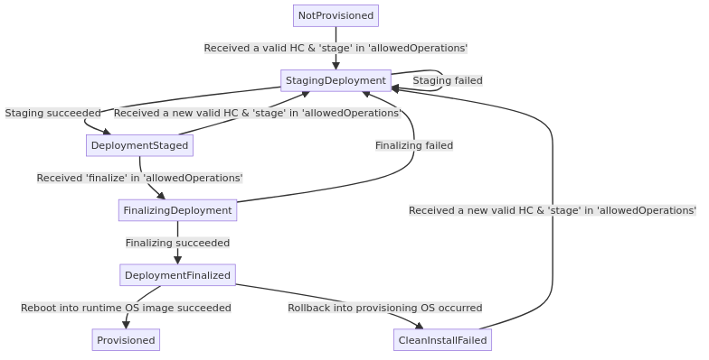
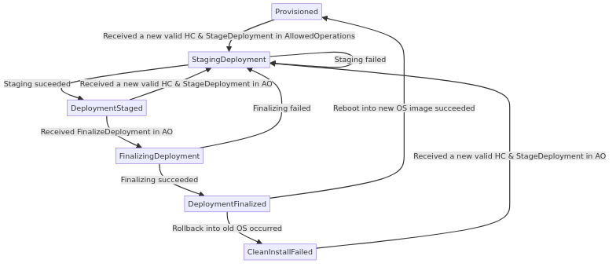

# Allowed Operations: stage vs finalize

A key feature of A/B upgrade with Trident is that **staging of new OS images**
**is decoupled from the reboot into the image**. In other words, the host does
not need to be rebooted immediately after the new OS image has been staged.
This is useful since the users often need to delay the reboot until a more
convenient point in time, when the workloads can be interrupted safely.
Moreover, after the new image has been staged, the user can repeatedly request
to have another OS image staged instead, before requesting to have the
deployment finalized. This is helpful in a scenario where an updated or a more
appropriate OS image becomes available.

This decoupled logic is implemented for **both clean install and A/B update.**
This is achieved by splitting **allowed operations**, where the user defines which
actions are permitted/desired, into `stage` and `finalize`:

1. If the user includes `stage` into allowed operations, Trident will
stage the new OS image.
2. If `finalize` is included, Trident will finalize the deployment,
by setting UEFI variables, and trigger the host's reboot into the new OS image.

## Servicing Type and Servicing State

To track the progress of clean install or A/B upgrade and enable decoupling of
`stage` from `finalize`, Trident uses **TWO** objects:

1. **Servicing type**: `ServicingType` describes the type of changes required
based on the host status and the updated host configuration. In host status,
`servicingType` describes the type of servicing that Trident is currently
executing, to achieve the desired state. This object has the following values:

   - `CleanInstall`: Clean install of the runtime OS image when the host is
   booted from the provisioning OS.
   - `HotPatch`: Update that can be applied without pausing the workload.
   - `NormalUpdate`: Update that requires pausing the workload.
   - `UpdateAndReboot`: Update that requires rebooting the host.
   - `AbUpdate`:  Update that requires switching to a different root partition
   and rebooting.
   - `Incompatible`: Update that cannot be applied given the current state of the
   system. This status will never be reflected in the host status: Trident will
   inform the user that the servicing type requested is incompatible, and will set
   `servicingState` back to Provisioned.

2. **Servicing state**: `ServicingState` describes the current state of the
servicing done by Trident. The host will transition through a different
sequence of servicing states, depending on the servicing type that Trident is
executing. In the host status, `servicingState` describes the progress of the
`ServicingType` on the host. This object has the following values:

   - `NotProvisioned`: This is the initial default state. It communicates that
   the host is still running in the provisioning OS and has not yet been
   provisioned by Trident.
   - `CleanInstallFailed`: Servicing of type CleanInstall has failed.
   - `Staging`: Trident is finalizing the ongoing servicing.
   - `Staged`: Servicing has been staged, i.e., the updated runtime OS image has
   been deployed onto block devices.
   - `Finalizing`: Trident is finalizing the ongoing servicing.
   - `Finalized`: Servicing has been finalized i.e., UEFI variables have been set,
   so that firmware boots from the updated runtime OS image after reboot.
   - `AbUpdateFailed`: Servicing of type AbUpdate has failed.
   - `Provisioned`: Servicing has been completed, and the host succesfully booted
   from the updated runtime OS image. Trident is ready to begin a new servicing.

## State Diagrams

The state diagrams below illustrate how `servicingState` of Trident and the
host will change, depending on the host configuration and `allowedOperations`.

### Clean Install State Diagram

### A/B Update State Diagram

