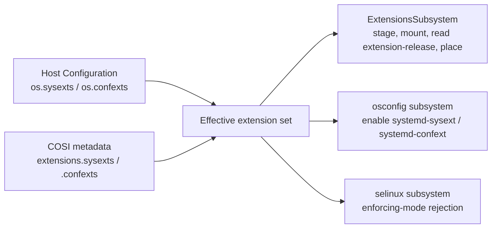

# 0000 COSI Extension Images

- Date: 2026-08-28
- RFC PR: [microsoft/trident#0000](https://github.com/microsoft/trident/pull/0000)
- Issue: [microsoft/trident#0000](https://github.com/microsoft/trident/issues/0000)

## Summary

This RFC proposes carrying systemd system extension (sysext) and configuration
extension (confext) images inside a COSI file. Extension images become ZSTD
compressed members of the COSI tar, exactly like partition images, and a new
optional `extensions` section in `metadata.json` describes them. Each entry
reuses the existing [`ImageFile`](../../Reference/Composable-OS-Image.md#imagefile-object)
object to point at the payload in the tar, and carries the destination path on
the target OS, mirroring the existing
[`Extension`](../../Reference/Host-Configuration/API-Reference/Extension.md)
object in the Host Configuration. Trident then deploys those extensions as part
of the image, in the same operation and the same reboot as the rest of the OS,
instead of fetching them from a separate location at deploy time.

## Motivation and Goals

Today the only way to get an extension onto a Trident-managed host is
`os.sysexts` / `os.confexts` in the Host Configuration, where each entry is a
URL plus a SHA-384. That works, but it makes the extension a second artefact
with a second lifecycle:

- **A second thing to host.** The operator must publish the `.raw` DDI
  somewhere Trident can reach (`http://`, `https://`, `file://` or `oci://`)
  and keep it there for as long as any host might re-run the flow.
- **A second download at deploy time.** The COSI is streamed sparsely from one
  endpoint; each extension is fetched in full from another. Two endpoints means
  two sets of network, proxy, TLS and authentication failure modes on the
  provisioning path.
- **A second integrity story.** The COSI's integrity is anchored by the
  `metadata.json` hash in `os.image.sha384`, which transitively covers every
  partition image. An extension's hash is anchored by whoever wrote the Host
  Configuration. Bundling puts the extension under the same root of trust as
  the rest of the OS.
- **A second update.** This is the important one. Extension changes are
  currently a Runtime Update, distinct from the A/B update that ships the OS.
  Delivering operator content that must land alongside a new OS therefore means
  two operations, two rollout gates and potentially two disruptions.

### A/B Updates Are the Strategic Point

If extensions ride the COSI, then operator content is delivered and activated
in the *same* A/B update and the *same* reboot as the OS. It reuses the
rollout, [health-gating](../../Reference/Host-Configuration/API-Reference/Health.md)
and rollback machinery that already exists for images, rather than needing a
parallel channel with its own staging, verification and failure semantics.

Rollback becomes trivially correct: extension images are files inside the
target slot's own filesystem, so the previous slot still holds the previous
extension set, untouched. Rolling back to the previous root volume rolls back
the extensions with it. See [Rollback](#rollback).

### Why Not Just Bake the Files Into the Root Filesystem Image?

An obvious objection: the image builder controls the root filesystem image, so
it could simply place `my-tool.raw` in `/var/lib/extensions/` before the COSI
is built, with no spec change at all. That is a genuine alternative and it
works for some configurations. It loses on four counts:

1. **Verity.** With root or usr verity, any change to the protected filesystem
   changes the root hash and requires re-signing. Extensions live outside the
   protected tree precisely so they can change independently; the mechanism
   that makes them attractive is defeated if adding one means rebuilding and
   re-signing the base image.
2. **Destination volumes that are not image-provisioned.** `/var/lib/extensions/`
   is commonly on a separate volume, which may be newly created rather than
   written from a partition image. Files baked into the image's `/var` never
   arrive in that case.
3. **Opacity.** Bytes inside a filesystem image are invisible to anything that
   reads COSI metadata. An `extensions` section makes the extension set
   inspectable, hashable and enumerable without mounting anything, which
   matters for inventory and supply-chain tooling.
4. **Trident does not know.** Trident enables `systemd-sysext.service` and
   `systemd-confext.service`, validates placement, and reads `extension-release`
   only for extensions it knows about. Files that appear inside a filesystem
   image bypass all of that, and the merge services are never enabled.

### Goals

- Extension images can be carried in a COSI file and deployed by Trident with
  no second artefact, no second endpoint and no second update.
- The metadata addition is small, reuses existing objects, and looks familiar
  to anyone who already knows `os.sysexts` / `os.confexts`.
- The Host Configuration public API does not change.

## Scope

### Requirements

- Add an optional `extensions` object to the COSI metadata root, containing
  `sysexts` and `confexts` arrays.
- Each entry MUST identify its payload in the tar via an `ImageFile` object and
  MAY specify a destination path on the target OS.
- Extension payloads are ordinary ZSTD-compressed tar members, covered by the
  existing compression and integrity rules.
- Trident deploys COSI-borne extensions during Clean Install and A/B Update,
  reusing the existing extensions subsystem.
- COSI-borne extensions and Host Configuration extensions coexist; conflicts
  are a hard error.
- New COSI validation errors for the extension section.

### Out of Scope

- Changing the Host Configuration `Extension` object. It stays exactly as it
  is.
- Runtime Update of COSI-borne extensions. A COSI-borne extension can only
  change when the image changes, which is an A/B update.
- Signing or attestation of individual extension images beyond the SHA-384
  chain already provided by COSI.
- Making extensions compatible with SELinux. That limitation is orthogonal and
  unchanged; see [SELinux](#selinux).
- Building the DDIs. This RFC specifies how a COSI carries an extension image,
  not how the extension image is produced.

### Exit Criteria

- COSI revision 1.3 is published with the `extensions` section, a
  `cosi-metadata-v1.3.schema.json`, and valid/invalid samples under
  `tests/cosi/metadata_samples/v1.3/`.
- Trident deploys a COSI carrying at least one sysext and one confext on Clean
  Install and on A/B Update, and the extensions are merged after reboot.
- A/B rollback returns the host to the previous extension set with no extra
  work.
- Conflicts between COSI-borne and Host-Configuration-borne extensions produce
  a structured error.

## Dependencies

- A COSI writer able to emit the section. [Image Customizer](https://github.com/microsoft/azure-linux-image-tools)
  is the reference implementation of the COSI writer side.
- No incomplete Trident features are required.

## Implementation

### Tar Layout

Extension payloads are ZSTD-compressed DDI files stored under
`images/extensions/`, for example `images/extensions/my-tool.rawzst`.

They stay under `images/` deliberately. The COSI specification already states
that region images "MAY be placed in subdirectories of `images/` to organize
them" and that "Readers MUST be able to handle images in subdirectories", so no
new tar-layout rule is needed. More importantly, `ImageFile.path` is
constrained by `"pattern": "^images/.+"` in every published schema. Relaxing
that pattern to also permit `extensions/` would mean a v1.3 `ImageFile` that
fails validation against the v1.0–1.2 schemas, breaking the one object this
proposal is supposed to reuse unchanged, and breaking any generic COSI
validator that has an `ImageFile` definition compiled in. There is no
compensating benefit: a subdirectory conveys the same organisation.

Two ordering constraints from the existing spec must be respected:

- Since revision 1.2, the primary GPT image MUST be the file immediately after
  `metadata.json`. Extension payloads MUST NOT be placed between them.
- Region images MUST appear in the tar in the physical order of the regions on
  the source disk. Extension payloads are not regions, so they do not
  participate in that ordering, but interleaving them would make the region
  ordering harder to verify and would hurt sparse-read locality. Extension
  payloads SHOULD therefore be written after all region images.

Extension payloads are compressed with ZSTD like everything else, and their
window log MUST be accounted for in the existing root `compression.maxWindowLog`
field. No change is needed to that object; writers simply must not forget the
new images when computing the maximum.

Older readers are unaffected by the extra tar members. The spec already says
"the tar file MAY contain other files, but Trident MUST ignore them", and
Trident's orphan-image check
(`V1_2ImageFileHasNoCorrespondingPartition`) is driven by the `images[]` and
`disk.gptRegions[]` metadata arrays, not by walking tar entries, so extra
members under `images/` do not trip it.

### Metadata Schema

A new optional root field `extensions`:

| Field        | Type                                  | Added in | Required | Description                                     |
| ------------ | ------------------------------------- | -------- | -------- | ----------------------------------------------- |
| `extensions` | [Extensions](#extensions-object)      | 1.3      | No       | Extension images carried by this COSI file.     |

#### `Extensions` Object

| Field      | Type                                       | Added in | Required | Description                        |
| ---------- | ------------------------------------------ | -------- | -------- | ---------------------------------- |
| `sysexts`  | [ExtensionImage](#extensionimage-object)[] | 1.3      | No       | System extension images.           |
| `confexts` | [ExtensionImage](#extensionimage-object)[] | 1.3      | No       | Configuration extension images.    |

#### `ExtensionImage` Object

| Field   | Type                           | Added in | Required        | Description                                              |
| ------- | ------------------------------ | -------- | --------------- | -------------------------------------------------------- |
| `image` | [ImageFile](../../Reference/Composable-OS-Image.md#imagefile-object) | 1.3      | Yes (since 1.3) | Details of the compressed extension image in the tar.     |
| `path`  | string                         | 1.3      | No              | Absolute destination path of the extension on the target OS. |

JSON Schema fragment:

```json
{
  "properties": {
    "extensions": {
      "description": "Extension images carried by this COSI file.",
      "$ref": "#/$defs/Extensions"
    }
  },
  "$defs": {
    "Extensions": {
      "type": "object",
      "properties": {
        "sysexts": {
          "description": "System extension images to place on the target OS.",
          "type": "array",
          "items": { "$ref": "#/$defs/ExtensionImage" }
        },
        "confexts": {
          "description": "Configuration extension images to place on the target OS.",
          "type": "array",
          "items": { "$ref": "#/$defs/ExtensionImage" }
        }
      }
    },
    "ExtensionImage": {
      "type": "object",
      "required": ["image"],
      "properties": {
        "image": {
          "description": "Details of the compressed extension image file in the tar file.",
          "$ref": "#/$defs/ImageFile"
        },
        "path": {
          "description": "Absolute path of the extension image on the target OS. The file name MUST be `{name}.raw`, where `{name}` matches the suffix of the `extension-release.{name}` file inside the image. When omitted, the reader places the image in its default directory for the extension kind.",
          "type": "string",
          "pattern": "^/.+\\.raw$"
        }
      }
    }
  }
}
```

Worked example:

```json
{
  "version": "1.3",
  "osArch": "x86_64",
  "osRelease": "NAME=\"Microsoft Azure Linux\"\nID=azurelinux\nVERSION_ID=\"3.0\"\n",
  "images": [
    // Filesystem objects, unchanged.
  ],
  "disk": {
    // Disk object, unchanged.
  },
  "osPackages": [
    // OsPackage objects, unchanged.
  ],
  "bootloader": {
    // Bootloader object, unchanged.
  },
  "compression": { "maxWindowLog": 22 },
  "extensions": {
    "sysexts": [
      {
        "image": {
          "path": "images/extensions/gpu-driver.rawzst",
          "compressedSize": 41943040,
          "uncompressedSize": 134217728,
          "sha384": "3a1f9c0d4e5b6a7c8d9e0f1a2b3c4d5e6f708192a3b4c5d6e7f8091a2b3c4d5e6f708192a3b4c5d6e7f8091a2b3c4d5e"
        },
        "path": "/var/lib/extensions/gpu-driver.raw"
      },
      {
        "image": {
          "path": "images/extensions/debug-tools.rawzst",
          "compressedSize": 8388608,
          "uncompressedSize": 33554432,
          "sha384": "b2c3d4e5f60718293a4b5c6d7e8f90a1b2c3d4e5f60718293a4b5c6d7e8f90a1b2c3d4e5f60718293a4b5c6d7e8f90a1"
        }
      }
    ],
    "confexts": [
      {
        "image": {
          "path": "images/extensions/fleet-config.rawzst",
          "compressedSize": 262144,
          "uncompressedSize": 1048576,
          "sha384": "c3d4e5f60718293a4b5c6d7e8f90a1b2c3d4e5f60718293a4b5c6d7e8f90a1b2c3d4e5f60718293a4b5c6d7e8f90a1b2"
        },
        "path": "/var/lib/confexts/fleet-config.raw"
      }
    ]
  }
}
```

#### Why Two Arrays Instead of One Array With a `kind`

Two arrays, mirroring `os.sysexts` / `os.confexts`.

- The distinction is not cosmetic. Sysexts and confexts have disjoint sets of
  permitted destination directories (`VALID_SYSEXT_DIRECTORIES` vs
  `VALID_CONFEXT_DIRECTORIES`), disjoint defaults, different
  `extension-release` locations (`/usr/lib/extension-release.d/` vs
  `/etc/extension-release.d/`), different identity fields (`SYSEXT_ID` vs
  `CONFEXT_ID`) and different activation units. Every rule downstream branches
  on the kind.
- With two arrays the kind is structural, so no `kind` field is needed and it
  cannot be omitted or wrong.
- It is the shape the Host Configuration already uses, which is the stated
  design constraint. A reader that already has code for `os.sysexts` has code
  for this.

The one-array-plus-discriminator form would be preferable if the two kinds
shared their rules and the set of kinds were open-ended. Neither is true here.

#### What Each Entry Carries, and What It Does Not

`image` and an optional `path`. That is the whole object. Everything else that
was considered is derivable, and every derivable field is a new opportunity for
two sources of truth to disagree.

- **`path` (kept, optional).** Not derivable: it is the one genuinely new piece
  of information, the image author's intent about where the file goes. Optional
  because the Host Configuration's `Extension.path` is optional and defaults to
  `/var/lib/extensions/{name}.raw` or `/var/lib/confexts/{name}.raw`; making it
  required here would be a gratuitous divergence, and the default is what most
  writers want anyway. When present it MUST be absolute, MUST end in `.raw`,
  MUST sit in a permitted directory for its kind, and its file name MUST match
  the `extension-release` suffix — all rules that already exist.
- **Extension name (rejected).** Trident derives the name by mounting the DDI
  and reading the `extension-release.{name}` file name, and already enforces
  that the destination file name matches it. A `name` field would be a third
  copy of the same string (DDI, `path`, `name`) and a third thing to
  cross-check.
- **`kind` (rejected).** Structural, see above.
- **Extension ID (`SYSEXT_ID` / `CONFEXT_ID`) (rejected).** Read from
  `extension-release`. It is the identity Trident already keys A/B state on;
  duplicating it in metadata invites drift with the payload.
- **Enable-on-first-boot (rejected).** systemd merges everything it finds in
  the extension directories; there is no per-extension enable switch in the
  Host Configuration today, and inventing one here would create COSI-only
  semantics that the Host Configuration cannot express. If a per-extension
  toggle is wanted, it should be designed once for both surfaces.
- **Version / OS-compatibility metadata (rejected).** `ID`, `VERSION_ID`,
  `SYSEXT_LEVEL`, `CONFEXT_LEVEL`, `ARCHITECTURE` and `SYSEXT_SCOPE` are
  already inside the DDI's `extension-release`, and systemd — not Trident — is
  the authority that enforces them at merge time. Copying them into metadata
  would let a COSI claim compatibility the payload does not have.
- **A separate hash of the uncompressed DDI (rejected, with a caveat).** See
  below.

#### A Note on `sha384` Semantics

`ImageFile.sha384` is the hash of the **compressed** image. The Host
Configuration's `Extension.sha384` is the hash of the **raw** extension image
file. Reusing `ImageFile` therefore changes what the recorded hash covers.

For integrity that is fine, and it is exactly what already happens for
partition images: Trident hashes the compressed stream as it decompresses, so a
match proves the payload is intact. Adding a second hash of the uncompressed
DDI would buy nothing for integrity.

There is one caveat worth recording. Trident's `ExtensionData.sha384` is also
used as a change detector: for an extension whose ID exists in both the old and
the new configuration, a differing hash means "content changed, replace it".
Compressed hashes are not stable across recompressions, so two COSIs built from
byte-identical DDIs at different ZSTD levels would look "changed". The
consequence is a redundant copy of an identical file, never a missed update, so
this is a cosmetic inefficiency rather than a correctness problem. It is called
out here so it is not rediscovered as a bug.

### Versioning

This lands in **COSI revision 1.3**. `extensions` is optional; absent means the
same as empty.

**Newer Trident, older COSI (1.0–1.2).** No `extensions` field, no extensions
from the image, current behaviour exactly. Nothing to do.

**Older Trident, newer COSI (1.3 with extensions).** Trident's version check
only rejects `major != 1`, and both the spec and the metadata parser require
unknown fields to be ignored. An already-shipped Trident will therefore accept
a 1.3 COSI, deploy the OS correctly, and **silently omit the extensions**.

That is the honest and slightly uncomfortable answer, and it cannot be fixed
in-band for readers that already exist: any tripwire field we add is, by
definition, a field they are required to ignore. Three mitigations, none of
which is a fix:

1. **Document it** as a property of the format: consuming extensions requires a
   reader that understands revision 1.3.
2. **Warn from now on.** `validate_cosi_metadata_version` should log a warning
   when `minor` exceeds the highest revision the binary knows about. This does
   not help binaries already in the field, but it makes every future minor bump
   diagnosable from the log.
3. **Gate the rollout.** An operator who cannot control the Trident version on
   the target should add a
   [health check](../../Reference/Host-Configuration/API-Reference/Health.md)
   asserting the extension is merged. An A/B update that lands on a too-old
   Trident then fails its health gate and rolls back, instead of quietly
   producing a host missing its extensions.

### Trident-Side Consumption

The core idea is that the extensions subsystem gains a second *source* for
extensions, and nothing else about it changes. Concretely, Trident computes an
**effective extension set** = Host Configuration entries ∪ COSI entries, and
the places that today read `ctx.spec.os.sysexts` / `ctx.spec.os.confexts` read
the effective set instead.



The three consumers of the effective set are worth naming individually,
because two of them are easy to miss:

- **`ExtensionsSubsystem`.** `populate_extensions` currently downloads each
  Host Configuration entry with a `FileReader` over `Extension.url` into the
  staging directory, verifies the hash, then mounts the DDI to read
  `extension-release`. For a COSI-borne entry the only difference is where the
  bytes come from: the image streaming pipeline decompresses the tar member
  into the same staging directory and verifies `ImageFile.sha384` over the
  compressed stream. Everything downstream — the `extension-release` read, the
  `{name}.raw` file-name check, the default-path logic, directory creation,
  and the placement/removal logic in `set_up_extensions` — is unchanged.
- **`osconfig`.** `systemd-sysext.service` and `systemd-confext.service` are
  enabled only when `ctx.spec.os.sysexts` / `confexts` are non-empty. If a host
  gets its extensions solely from the COSI and its Host Configuration lists
  none, the merge services would never be enabled and the extensions would sit
  on disk doing nothing. This check **must** move to the effective set. It is
  the single most likely way to ship this feature broken.
- **`selinux`.** The dynamic validation that rejects `enforcing` mode when
  extensions are configured has the same shape and the same problem. It must
  also move to the effective set, otherwise a COSI carrying extensions plus an
  enforcing-mode Host Configuration passes validation and produces a host with
  a mislabelled `/usr`, `/opt` or `/etc`.

`derive_host_configuration` (used by [disk streaming](../../Explanation/Disk-Streaming.md))
does not need to synthesise extension entries; the effective set is computed
from the COSI directly, so the derived-Host-Configuration path gets extensions
for free.

#### Where Images Are Written

- **Clean Install and A/B Update.** `provision()` runs with the target root
  mounted at `mount_path`. Extensions are staged under
  `{mount_path}/var/lib/extensions/.staging` and then moved to their
  destination inside the target root, which is exactly what happens today. For
  A/B, that destination is on the *inactive* slot, so the running system is
  untouched until the reboot.
- **Runtime Update.** COSI-borne extensions do not participate. A COSI-borne
  extension can only change if the COSI changes, and a COSI change is an image
  change, which forces an A/B update. Host Configuration extensions continue to
  be runtime-updatable exactly as today.

This gives a useful invariant: **Trident never needs to read the previous
COSI.** If `spec.os.image` equals `spec_old.os.image`, the old COSI's extension
set is the new COSI's extension set. If they differ, the servicing type is an
A/B update, and `set_up_extensions` already skips removal of the old set on
Clean Install and A/B Update because the old files live in the other slot.

#### Rollback

Nothing needs retaining, because nothing is shared.

Extension images are ordinary files inside the slot's filesystem, and Trident
already requires that when A/B volumes are configured, every extension
destination is on an A/B volume and not on a shared or read-only one. So the
previous slot's `/var/lib/extensions/` still contains the previous extension
set, byte for byte, after the update. An A/B rollback boots the previous root
volume, `systemd-sysext` merges what it finds there, and the extension set
reverts with the OS. No extra bookkeeping, no staging area to preserve, no
"previous extension" directory.

This is the same property that makes A/B updates work for the OS itself, and it
is the main reason bundling is attractive: the extension inherits the rollback
semantics of the image instead of needing its own.

#### Interaction With Host Configuration `sysexts` / `confexts`

**Merge, with a hard error on collision.**

The two lists express different intents and both are legitimate at the same
time. COSI extensions are content the *image author* considers part of this OS
— a GPU driver, a kernel-module extension. Host Configuration extensions are
content the *operator* adds at deploy time — a monitoring agent, a site-specific
confext. Forbidding both would be gratuitous: the natural case is an image that
ships one sysext and an operator who adds another.

Silent precedence is the option to avoid. If a Host Configuration entry
silently overrode a bundled one, the host would run software the image author
never validated, and the only symptom would be a version number in a log
somewhere. Failing loudly is better than being quietly wrong.

A collision is defined two ways, both already meaningful in the Host
Configuration today:

1. **Same destination path.** Detectable statically whenever both sides specify
   `path`. This extends the existing `DuplicateExtensionImagePath` rule across
   the merged set.
2. **Same extension ID** (`SYSEXT_ID` / `CONFEXT_ID` within a kind). Only
   detectable after the DDIs are mounted, which the subsystem does anyway. Note
   that ID uniqueness is documented for the Host Configuration today but not
   enforced in code; the merged set makes collisions more likely, so this
   should become an enforced check.

Two entries that are identical in every respect are still a collision. Making
"identical is fine" an exception invites hash-comparison subtleties for no real
benefit — the operator can simply drop their entry.

If a per-extension override is later shown to be necessary, it should be an
explicit opt-in on the Host Configuration side, not a default. That is listed
as an [open question](#open-questions).

### Validation

#### COSI Metadata Validation

New `CosiMetadataErrorKind` variants, following the existing `V1_<minor>`
prefix convention:

| Variant                                            | Condition                                                                                    |
| -------------------------------------------------- | -------------------------------------------------------------------------------------------- |
| `V1_3ExtensionDestinationPathNotAbsolute`           | `path` is present and is not absolute.                                                        |
| `V1_3ExtensionDestinationPathInvalidFileExtension`  | `path` is present and does not end in `.raw`.                                                 |
| `V1_3ExtensionDestinationPathInvalidDirectory`      | `path`'s parent is not in `VALID_SYSEXT_DIRECTORIES` / `VALID_CONFEXT_DIRECTORIES` for the kind. |
| `V1_3DuplicateExtensionDestinationPath`             | Two entries resolve to the same destination path.                                             |
| `V1_3DuplicateExtensionImagePath`                   | Two entries reference the same tar member.                                                    |
| `V1_3ExtensionImagePathCollidesWithRegionImage`     | An entry's `image.path` is also referenced by `images[]` or `disk.gptRegions[]`.               |

The existing "every image referenced by the metadata is present in the tar"
check must be extended to walk `extensions.sysexts[]` and
`extensions.confexts[]` as well, so a metadata entry pointing at a missing tar
member fails at load time rather than mid-provision.

Directory and file-extension rules deliberately reuse the constants and logic
behind `Extension::validate_sysext` / `validate_confext` rather than
re-implementing them, so the two surfaces cannot drift.

#### Deploy-Time Validation

- **File name matches the `extension-release` suffix.** Already enforced:
  `read_extension_release` requires `path` to end with `{name}.raw` where
  `{name}` is the suffix of the `extension-release.{name}` file found inside
  the DDI. Applies unchanged to COSI-borne entries.
- **Exactly one `extension-release` file, and `SYSEXT_ID` / `CONFEXT_ID`
  present.** Already enforced, applies unchanged.
- **SHA-384 agreement.** `ImageFile.sha384` is verified over the compressed
  stream as the payload is decompressed into the staging directory, using the
  same hashing reader used for partition images. Mismatch aborts servicing.
- **Extension ID uniqueness across the merged set**, per kind. New check.
- **`extension-release` OS compatibility.** Warn, do not fail, when a bundled
  extension declares `ID=<distro>` and that `ID`/`VERSION_ID` does not match
  the COSI's own `osRelease`. This is a build-time mistake worth surfacing
  early — systemd will refuse to merge such an extension at boot and the host
  will come up silently missing it — but systemd's matching rules
  (`SYSEXT_LEVEL`, `CONFEXT_LEVEL`, `ARCHITECTURE`, `_any`) are subtle enough
  that Trident should not be the authority. Warning early and letting systemd
  decide is the right split.

#### On `ID=_any`

`extension-release` already declares which cadence case an extension is in:
`ID=<distro>` plus `VERSION_ID` / `SYSEXT_LEVEL` means "this extension is bound
to this OS build", while `ID=_any` means "this extension is portable across OS
versions".

Trident should **not** warn or refuse when an `ID=_any` extension is bundled.
`_any` describes what the extension is *compatible with*, not how it *should be
delivered*. Bundling a portable extension is a perfectly reasonable packaging
choice — it is how you get an air-gapped or single-artefact deployment — and
refusing it would break legitimate use for no safety benefit. The genuinely
useful check is the opposite one described above: a bundled `ID=<distro>`
extension that does not match the COSI's own `osRelease` is almost certainly a
build error.

### SELinux

Unchanged. Extensions remain incompatible with SELinux in enforcing mode on
systemd 255, because merging the overlays mislabels `/usr`, `/opt` and `/etc`.
Carrying the image in a COSI does not touch the labelling problem in any way.

The one thing that must change is *where the check looks*: as noted above, the
dynamic validation that raises `ExtensionImagesAndSelinuxUnsupported` currently
inspects the Host Configuration lists only, and must inspect the effective set,
or a COSI-only extension configuration would bypass it entirely.

## Public API Design

The COSI metadata format is a public contract with an independent
[specification](../../Reference/Composable-OS-Image.md) and published JSON
Schemas, so the additions above constitute the public API change. They are
additive and optional.

The Host Configuration API does **not** change. `os.sysexts` and `os.confexts`
keep their meaning and their shape. The observable behavioural difference for
an existing user is that a host may now end up with more extensions than its
Host Configuration lists, and that specifying an extension that the image
already carries is now an error rather than a duplicate.

## Testing and Metrics

- **Schema tests.** Add `docs/Reference/Composable-OS-Image/cosi-metadata-v1.3.schema.json`
  and samples under `tests/cosi/metadata_samples/v1.3/{valid,invalid}/`. The
  existing schema-validation workflow picks up a new revision automatically
  given the schema file and a matching samples directory. Invalid samples
  should cover: `image.path` outside `images/`, non-absolute destination,
  destination not ending in `.raw`, destination in a disallowed directory, and
  a duplicated destination path.
- **Unit tests.** Metadata parse and validate for each new error variant;
  effective-set computation, including the collision cases; default-path
  resolution for a COSI entry with no `path`.
- **Functional tests.** Build a COSI carrying one sysext and one confext;
  assert Clean Install places both, enables the merge units, and that both are
  merged after boot.
- **Servicing tests.** A/B update from a COSI with extension set A to a COSI
  with extension set B; assert the new slot has B, the old slot still has A,
  and that a rollback restores A with no additional servicing.
- **Negative tests.** Same extension in both the Host Configuration and the
  COSI produces the structured error; COSI extension plus SELinux `enforcing`
  is rejected.

## Servicing

The change is additive at every layer.

- A revision 1.2 COSI is still valid and behaves identically.
- A revision 1.3 COSI with no `extensions` section behaves identically.
- A revision 1.3 COSI *with* extensions, read by a Trident that predates this
  work, deploys the OS correctly and omits the extensions silently. This is the
  one forward-compatibility hazard; mitigations are discussed under
  [Versioning](#versioning).
- Hosts already using `os.sysexts` / `os.confexts` are unaffected unless they
  move to an image that carries the same extension, which is a deliberate
  action that now produces an explicit error.

## Implementation Plan

1. Specification: COSI revision 1.3, `extensions` section, v1.3 JSON Schema and
   samples.
2. Trident reader: parse `extensions`, metadata validation and the new error
   variants, and the minor-version warning.
3. Effective extension set, plumbed into the extensions, `osconfig` and
   `selinux` subsystems, including the collision errors.
4. Streaming a tar member into the extension staging directory, replacing the
   URL fetch for COSI-borne entries.
5. Tests, then user-facing documentation updates to
   [Sysexts](../../Explanation/Sysexts.md),
   [Confexts](../../Explanation/Confexts.md) and
   [How Trident Consumes COSI](../../Explanation/How-Trident-Consumes-COSI.md).

Steps 1 and 2 are independently useful: a reader that parses and validates the
section but ignores it is a safe intermediate state, and it makes the
minor-version warning available sooner.

## Counter-Arguments

### Drawbacks

- **Cadence coupling.** This is the real cost. Bundling ties the extension's
  release cadence to the image's: shipping a new version of the extension means
  shipping a new COSI and taking an A/B update and a reboot. For content that
  must match the OS anyway — kernel modules, GPU drivers, anything built
  against a specific kernel — this is free, because that content could never
  have moved independently. For content deliberately versioned independently of
  the OS, it is a genuine regression in agility, and the Host Configuration
  route remains the right answer. The proposal adds an option; it does not
  remove one.
- **COSI files get bigger,** and every host downloading the image pays for
  every bundled extension, including ones it will not use. There is no
  per-host selection mechanism.
- **No way to opt out.** A host that wants the image but not one of its bundled
  extensions has no way to say so. See [Open Questions](#open-questions).
- **A second place extensions can come from,** which means a merge, which means
  collision rules, which is genuinely more complexity in the extensions
  subsystem than exists today.
- **The forward-compatibility hazard** described under Versioning: an older
  reader silently produces a host without the extensions.

### Alternatives

**Keep everything in the Host Configuration (status quo).** Maximum decoupling:
the extension is versioned, hosted and updated entirely independently, and a
change is a Runtime Update with no reboot. This stays fully supported. It is
the wrong answer only when the extension must land in lockstep with a new OS,
where it forces two operations and two rollout gates.

**Bake the `.raw` files into the root filesystem image.** No spec change at
all. Discussed in [Motivation](#why-not-just-bake-the-files-into-the-root-filesystem-image);
loses on verity, on destinations that are not image-provisioned, on
inspectability, and on Trident not knowing to enable the merge units.

**Relax `ImageFile.path` to allow a top-level `extensions/` prefix.** Rejected
in [Tar Layout](#tar-layout): it would fork the definition of the one object
this design reuses, and buys only cosmetics.

**One array with a `kind` discriminator.** Rejected in
[Why Two Arrays](#why-two-arrays-instead-of-one-array-with-a-kind): the kinds
share almost no rules, and the Host Configuration already uses two lists.

#### Prior Art

The decoupled alternative is well established. Flatcar's sysext-bakery pattern
combines pre-built sysext DDIs with
[`systemd-sysupdate`](https://www.freedesktop.org/software/systemd/man/latest/systemd-sysupdate.html):
the operator hosts artefacts over HTTP alongside a `SHA256SUMS` manifest,
`sysupdate` discovers and stages new versions against a transfer definition,
and activation requires a `systemd-sysext refresh` or a reboot. It is a good
design for content with its own cadence, and it is close in spirit to Trident's
existing `os.sysexts` — with the notable difference that `systemd-sysupdate`
has no OCI transport, whereas Trident's `Extension.url` already accepts
`oci://` and can therefore reuse a registry the operator is likely to have.

This proposal is a third option rather than a replacement for either. Flatcar's
model optimises for extensions that move independently of the OS; Trident's
current model does the same with a better transport story; carrying the
extension in the COSI optimises for extensions that must move *with* the OS,
and pays for it in cadence. All three should coexist, and the
`extension-release` fields (`ID=_any` versus `ID=<distro>`) are the honest
signal for which one a given extension belongs in.

## Open Questions

- **Should there be an override escape hatch?** The proposal makes a
  Host-Configuration-versus-COSI collision an error. The alternative is an
  explicit opt-in on the Host Configuration side meaning "yes, I know the image
  ships this, use mine instead". Useful for pinning a hotfixed extension
  without rebuilding the image; also a way to run a combination the image
  author never validated. Recommendation is to ship strict and add the hatch
  only if a real need appears, but this is a product decision.
- **Should there be a way to suppress a bundled extension?** Same question from
  the other direction: a "deny" list would let an operator take an image
  without one of its extensions. It has no analogue in the current API and no
  concrete requester yet.
- **Should `path` be required rather than optional?** Optional-with-defaults is
  proposed for symmetry with the Host Configuration. Requiring it would make
  every COSI explicit about placement at the cost of diverging from the object
  it is meant to resemble.
- **Naming.** `extensions` containing `sysexts` / `confexts` versus two
  top-level `sysexts` / `confexts` arrays. The nested form keeps the root
  object tidy and groups the feature; the flat form is a shorter path
  expression and an even closer match to `os.sysexts`.
- **Should ID uniqueness be enforced for Host Configuration extensions
  independently of this work?** It is documented but unenforced today. This
  proposal needs it for the merged set; it is arguably a pre-existing gap that
  deserves its own fix.
- **Should the writer be required to place extension payloads after all region
  images,** or merely encouraged? The proposal says SHOULD.

## Future Possibilities

- **Portable service images.** They are DDIs with the same shape and the same
  placement problem. If Trident ever manages them, `extensions` generalises
  naturally or gains a sibling.
- **Per-extension selection at deploy time.** If a real need appears for a
  single image serving hosts with different extension sets, a selection
  mechanism keyed on extension ID would build on this section.
- **Initrd-scoped extensions.** `SYSEXT_SCOPE=initrd` extensions are already
  parsed by `ExtensionRelease` but not acted on. A bundled extension is a
  natural fit for initrd scope, since the payload is available before the root
  filesystem is.
- **Extension inventory in Host Status.** Reporting the merged extension set,
  with IDs and hashes, would make "what is actually running on this host"
  answerable without inspecting the filesystem.
