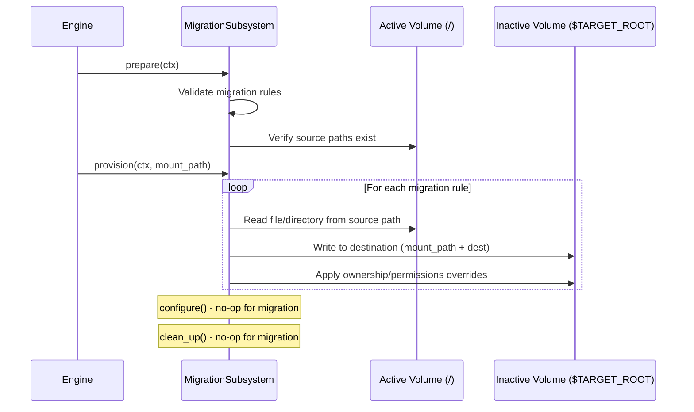
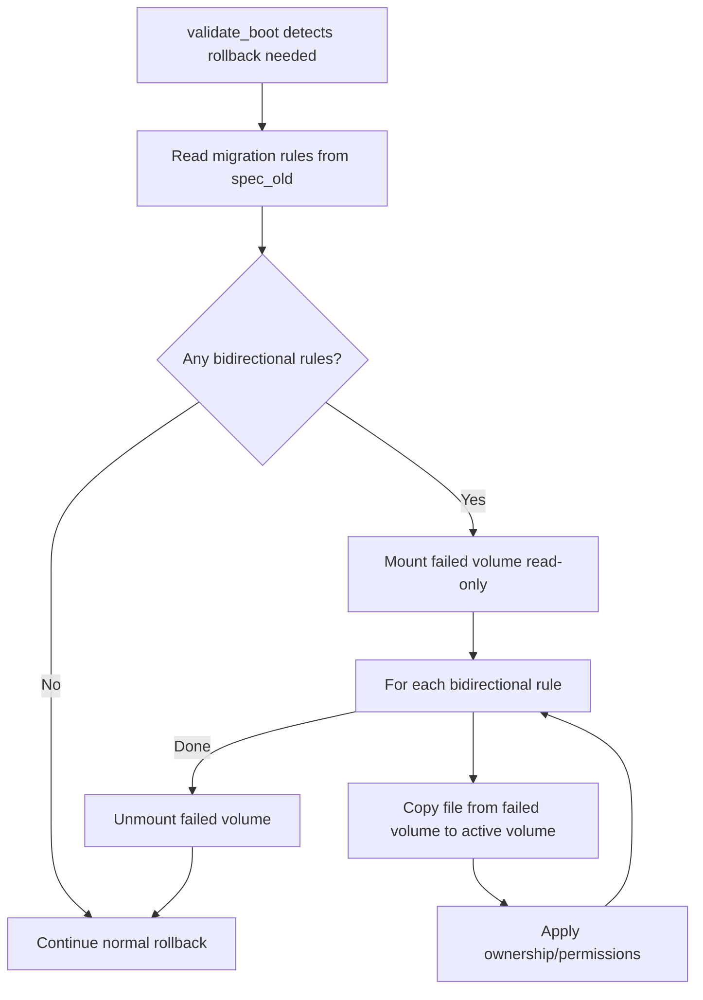

# 0000 Keep Files Migration API

- Date: 2026-03-09
- RFC PR: [microsoft/trident#0000](https://github.com/microsoft/trident/pull/0000)
- Issue: [microsoft/trident#287](https://github.com/microsoft/trident/issues/287)

## Summary

This RFC proposes a new declarative `migration` API in the Host Configuration
that allows users to specify files and directories that should be preserved
across A/B updates. Today, the only way to migrate state between the active and
inactive volumes during an A/B update is through imperative postProvision or
postConfigure scripts. This is error-prone, non-declarative, and opaque to
Trident. The proposed API replaces this pattern with a structured, validated
configuration that Trident can understand, enforce, and—critically—reverse
during rollback.

## Motivation and Goals

### The Problem

When Trident performs an A/B update, it provisions a completely new filesystem on
the inactive volume from the OS image. Any state that existed on the previously
active volume—application credentials, certificates, runtime configuration,
database files—is not carried over automatically unless it resides on a shared
partition. Shared partitions (e.g., a dedicated `/var` or `/data` partition that
is mounted on both the A and B volumes) do preserve state across updates, but
they are a coarse-grained tool: making all of `/etc` a shared partition would
preserve credentials but also carry over every other configuration file, which
may not be desired when the new OS image ships updated defaults. Creating many
small shared partitions for individual sub-paths (e.g., `/etc/myapp`,
`/etc/pki`) avoids this over-sharing problem but introduces partition management
complexity that becomes unwieldy as the number of preserved paths grows.

For users who need fine-grained control over which files are preserved, the only
option today is to write postProvision or postConfigure scripts that manually
copy files between volumes:

```yaml
scripts:
  postProvision:
    - name: migrate-credentials
      runOn: [ab-update]
      content: |
        cp -a ${TARGET_ROOT}/etc/myapp/credentials /etc/myapp/credentials
        cp -a ${TARGET_ROOT}/etc/pki/tls/certs/app.pem /etc/pki/tls/certs/app.pem
```

This approach has several drawbacks:

- **Imperative and opaque**: Trident has no understanding of what files are being
  migrated. It cannot validate, report on, or reason about the migration. The
  migration logic is buried inside shell scripts that Trident treats as black
  boxes.
- **No rollback support**: If the update fails and the system rolls back, any
  files that were migrated are not automatically restored. For bidirectional
  state like credentials that may have been rotated on the new volume before
  rollback, the old volume now has stale copies and no mechanism to recover the
  new ones.
- **Error handling is manual**: If a `cp` fails (missing source, permission
  denied, disk full), the script either silently continues or aborts the entire
  update. There is no structured error reporting and no way for Trident to
  distinguish "migration failed" from "script had a bug."
- **Duplication across configs**: Every host configuration that needs file
  migration must include the same boilerplate script logic. Different users
  implement slightly different versions with varying levels of robustness.
- **No validation**: Trident cannot validate migration paths at configuration
  time. Typos in paths, conflicting destinations, or attempts to migrate files
  to read-only locations are only discovered at update time.

### Goals

1. Provide a declarative API for specifying files and directories that should be
   preserved across A/B updates.
2. Enable Trident to automatically handle bidirectional migration for rollback
   scenarios where migrated state must be restored.
3. Validate migration rules at configuration time (path validity, conflict
   detection) rather than at update time.
4. Provide structured logging and error reporting for migration operations.
5. Integrate cleanly with the existing subsystem lifecycle, executing at the
   appropriate phase (provision) of the A/B update.
6. Support optional overrides for file ownership, group, and permissions on the
   destination.

### Use Cases

| Use Case | Migration Rule |
| --- | --- |
| Preserve application credentials across updates | `path: /etc/myapp/credentials` |
| Migrate TLS certificates to a new location | `path: /etc/pki/tls/certs/app.pem`, `destination: /etc/ssl/certs/app.pem` |
| Keep a runtime status file | `path: /var/lib/myapp/state.db` |
| Preserve and restore credentials on rollback | `path: /etc/myapp/credentials`, `strategy: bidirectional` |
| Migrate config directory with ownership change | `path: /etc/myapp/`, `owner: appuser`, `group: appgroup` |

## Scope

### Requirements

1. A new `migration` top-level field in the Host Configuration.
2. Support for both individual files and directories.
3. Two migration strategies: `copy` (one-way, default) and `bidirectional`
   (restored on rollback).
4. Optional destination path override (defaults to same as source path).
5. Optional ownership, group, and permissions overrides.
6. Configuration-time validation of migration rules.
7. Structured error reporting when migration operations fail.
8. Implementation as a new `MigrationSubsystem` in the engine.
9. Integration with the existing rollback mechanism for bidirectional
   migrations.

### Out of Scope

- Migrating files during runtime updates (runtime updates modify the live
  filesystem in place; there is no second volume to migrate between).
- Migrating files during clean installs (there is no prior state to preserve).
- Conflict resolution when source and destination both exist with different
  content (the source always wins).
- Encryption or transformation of migrated files.
- Migration of files between different OS images with incompatible filesystem
  layouts (e.g., migrating from ext4 to btrfs—this is handled by the storage
  subsystem).

### Exit Criteria

- The `migration` field is accepted and validated in the Host Configuration.
- Files and directories listed in `migration` are copied from the active volume
  to the inactive volume during A/B update provisioning.
- Bidirectional migrations are restored during rollback.
- Ownership, group, and permissions overrides are applied correctly.
- Validation rejects invalid configurations (duplicate destinations, invalid
  paths).
- Unit tests cover all migration strategies and error cases.
- At least one E2E test demonstrates file migration across an A/B update and
  rollback.

## Dependencies

- The existing A/B update engine and subsystem lifecycle.
- The rollback mechanism in `engine/rollback.rs`.

## Implementation

### Where Migration Fits in the Update Lifecycle

During an A/B update, Trident runs subsystems through four lifecycle phases:
prepare, provision, configure, and clean up. Migration is fundamentally a
**provision-phase** operation: it copies state from the active volume (mounted
at `/`) to the inactive volume (mounted at `$TARGET_ROOT` before chroot).



The migration subsystem runs **before** user-defined postProvision scripts. This
ensures that migrated files are available for scripts that may need to
post-process them (e.g., fix up a configuration file that references migrated
paths).

### Subsystem Ordering

The `MigrationSubsystem` must run:

- **After** the `OsImageSubsystem` (the new filesystem must be provisioned
  before files can be written to it).
- **Before** the `HooksSubsystem` (so postProvision scripts can access migrated
  files).
- **Before** the `AdditionalFilesSubsystem` conceptually (though additional
  files are written during configure, not provision, so there is no strict
  ordering conflict).

### Rollback: Bidirectional Migration

When a migration rule has `strategy: bidirectional`, Trident must restore the
migrated files to the active volume if a rollback occurs. This handles the case
where credentials or certificates were rotated on the new volume during the
update window.

The rollback restoration happens during the `validate_boot` phase in
`engine/rollback.rs`. If the boot validation determines that a rollback is
needed (wrong boot device or health check failure):



Key design decisions for rollback:

1. **Best-effort restoration**: If a bidirectional file cannot be restored (e.g.,
   it was deleted on the failed volume), the rollback logs a warning but
   continues. The rollback itself must not fail due to migration restoration
   failures.
2. **Failed volume mounted read-only**: The volume that failed validation is
   mounted read-only to prevent any accidental modifications.
3. **Migration rules come from `spec_old`**: During rollback, the system is
   reverting to the previous configuration. The migration rules that were active
   during the update are stored in the host status's `spec_old` field.

### Handling Edge Cases

#### Source File Does Not Exist

If a migration source path does not exist on the active volume:

- **On first provision** (no previous update): This is expected—there is no
  prior state to migrate. The migration rule is skipped with a debug log.
- **On subsequent updates**: This may indicate a configuration error. The
  migration rule is skipped with a warning log. The update continues.

This permissive behavior is intentional. It allows users to define migration
rules in advance, before the files they reference are created. A strict "fail
if source is missing" policy would break first-install scenarios where the
host configuration is shared between clean install and updates.

#### Destination Already Exists

If the destination path already exists on the inactive volume (e.g., the OS
image already ships a default configuration file), the migrated file
**overwrites** the destination. This is the expected behavior: the user is
explicitly declaring that the active volume's version should take precedence.

#### Directory Migration

When migrating a directory, the entire directory tree is copied recursively.
Symbolic links within the directory are preserved as symlinks (not
dereferenced). If the destination directory already exists, the contents are
merged: existing files in the destination that are not present in the source
are preserved, and files present in both are overwritten by the source.

#### Root-Verity Environments

In root-verity configurations, the root filesystem is read-only with a dm-verity
layer. Files that need to be migrated in these environments must reside on
writable partitions (e.g., `/var`, `/etc` via overlay). The migration subsystem
operates during the provision phase, before the verity layer is sealed, so
writing to the inactive volume is always possible.

However, during **rollback restoration** (bidirectional strategy), writing back
to the active volume's `/etc` requires the etc overlay to be writable. The
`MigrationSubsystem` should declare `writable_etc_overlay() -> true` to ensure
this is the case.

## Public API Design

### Host Configuration Schema

The `migration` field is a new top-level field in the Host Configuration:

```yaml
migration:
  - path: /etc/myapp/credentials
    strategy: bidirectional

  - path: /etc/pki/tls/certs/app.pem
    destination: /etc/ssl/certs/app.pem
    permissions: "0644"
    owner: root
    group: ssl-cert

  - path: /var/lib/myapp/state.db
```

### Full API Specification

```yaml
# Top-level field in Host Configuration.
# List of migration rules defining files/directories to preserve across
# A/B updates.
migration:
    # Absolute path to the file or directory on the active volume to migrate.
    # Required.
  - path: /path/to/source

    # Absolute path on the inactive volume where the file/directory will be
    # placed. Optional; defaults to the same as `path`.
    destination: /path/to/destination

    # Migration strategy. Optional; defaults to "copy".
    # - "copy": File is copied from active to inactive volume. On rollback,
    #   the file is not restored.
    # - "bidirectional": File is copied from active to inactive volume. On
    #   rollback, the file is copied back from the failed volume to the
    #   active volume, preserving any changes made during the update window.
    strategy: copy | bidirectional

    # File ownership override. Optional; if not specified, the original
    # ownership is preserved.
    owner: username-or-uid

    # File group override. Optional; if not specified, the original group
    # is preserved.
    group: groupname-or-gid

    # File permissions override in octal notation. Optional; if not specified,
    # the original permissions are preserved.
    permissions: "0644"
```

### Rust Types

```rust
/// A single file or directory migration rule.
#[derive(Serialize, Deserialize, Debug, Default, Clone, PartialEq, Eq)]
#[serde(rename_all = "camelCase", deny_unknown_fields)]
pub struct MigrationRule {
    /// Absolute path to the source file or directory on the active volume.
    pub path: PathBuf,

    /// Absolute path on the target volume where the file will be placed.
    /// Defaults to the same as `path`.
    #[serde(default, skip_serializing_if = "Option::is_none")]
    pub destination: Option<PathBuf>,

    /// Migration strategy.
    #[serde(default)]
    pub strategy: MigrationStrategy,

    /// Override the file owner on the destination.
    #[serde(default, skip_serializing_if = "Option::is_none")]
    pub owner: Option<String>,

    /// Override the file group on the destination.
    #[serde(default, skip_serializing_if = "Option::is_none")]
    pub group: Option<String>,

    /// Override the file permissions on the destination (octal string).
    #[serde(default, skip_serializing_if = "Option::is_none")]
    pub permissions: Option<String>,
}

#[derive(Serialize, Deserialize, Debug, Default, Clone, PartialEq, Eq)]
#[serde(rename_all = "kebab-case")]
pub enum MigrationStrategy {
    /// Copy the file from active to inactive volume. No rollback restoration.
    #[default]
    Copy,

    /// Copy the file in both directions: active → inactive on update,
    /// inactive → active on rollback.
    Bidirectional,
}
```

The `HostConfiguration` struct gains a new field:

```rust
pub struct HostConfiguration {
    // ... existing fields ...

    /// Migration rules for preserving files across A/B updates.
    #[serde(default, skip_serializing_if = "Vec::is_empty")]
    pub migration: Vec<MigrationRule>,
}
```

### Validation Rules

The following validations are performed when the Host Configuration is loaded:

| Rule | Error |
| --- | --- |
| `path` must be an absolute path | `"migration rule path must be absolute: '{path}'"` |
| `destination` (if specified) must be absolute | `"migration rule destination must be absolute: '{destination}'"` |
| `permissions` (if specified) must be valid octal | `"invalid permissions format: '{permissions}'"` |
| No two rules may have the same effective destination | `"duplicate migration destination: '{destination}'"` |
| `path` must not be a root-level system directory (`/`, `/bin`, `/usr`, `/lib`, `/sbin`, `/boot`) | `"migration of system directory '{path}' is not allowed"` |

## Testing and Metrics

### Unit Tests

| Test | Description |
| --- | --- |
| `test_migration_rule_defaults` | Verify default strategy is `copy` and destination defaults to path. |
| `test_migration_rule_validation_absolute_paths` | Reject relative paths in `path` and `destination`. |
| `test_migration_rule_validation_duplicate_destinations` | Reject configs with two rules targeting the same destination. |
| `test_migration_rule_validation_system_directories` | Reject migration of protected system directories. |
| `test_migration_rule_validation_permissions` | Reject non-octal permission strings. |
| `test_migration_copy_file` | Verify a single file is copied from source to destination during provision. |
| `test_migration_copy_directory` | Verify a directory tree is recursively copied. |
| `test_migration_destination_override` | Verify files are placed at the specified destination path. |
| `test_migration_ownership_override` | Verify owner/group are applied to destination. |
| `test_migration_permissions_override` | Verify permissions are applied to destination. |
| `test_migration_source_missing_skipped` | Verify missing source files are skipped with a warning. |
| `test_migration_destination_overwritten` | Verify existing destination files are overwritten. |
| `test_migration_bidirectional_rollback` | Verify bidirectional files are restored during rollback. |
| `test_migration_rollback_best_effort` | Verify rollback continues even if a bidirectional file cannot be restored. |
| `test_migration_symlinks_preserved` | Verify symlinks in migrated directories are preserved. |

### E2E Tests

| Test | Description |
| --- | --- |
| `test_ab_update_with_migration` | Perform an A/B update with migration rules. Verify files are present on the new volume after update. |
| `test_ab_update_with_bidirectional_rollback` | Perform an A/B update with bidirectional migration, trigger a rollback, and verify files are restored to the original volume. |
| `test_migration_with_additional_files` | Verify migration rules and additional files do not conflict when targeting different paths. |

## Servicing

### Backwards Compatibility

The `migration` field defaults to an empty list (`[]`), so existing Host
Configurations are unaffected. No migration behavior is introduced unless the
user explicitly adds `migration` rules.

### Forwards Compatibility

If a Host Configuration containing `migration` rules is used with an older
version of Trident that does not support the field, the `deny_unknown_fields`
serde attribute will cause a deserialization error. This is the standard
behavior for all new fields and is the desired outcome: the user should be
informed that their configuration requires a newer version of Trident.

### Interaction with Existing Features

- **`additionalFiles`**: The `additionalFiles` mechanism writes files from
  inline content or a source path *within the servicing OS* to the target OS.
  `migration` copies files *from the active volume* to the inactive volume.
  The two features serve different purposes and do not conflict. If both
  target the same destination path, `additionalFiles` wins because it runs
  during the configure phase (after provision).
- **`postProvision` scripts**: Users who currently use postProvision scripts
  for file migration can replace those scripts with `migration` rules. The
  migration subsystem runs before postProvision scripts, so scripts can
  reference migrated files.
- **`postConfigure` scripts**: Scripts that reference migrated files from within
  the chroot continue to work. The migrated files are available at their
  destination paths since the chroot maps the inactive volume to `/`.

## Implementation Plan

### Phase 1: Core Migration

1. Add `MigrationRule` and `MigrationStrategy` types to `trident_api`.
2. Add the `migration` field to `HostConfiguration`.
3. Implement validation for migration rules.
4. Implement `MigrationSubsystem` with provision-phase file copying.
5. Register the subsystem in the engine's subsystem list.
6. Unit tests for all validation and copy operations.

### Phase 2: Bidirectional Rollback

1. Extend the rollback path in `engine/rollback.rs` to check for bidirectional
   migration rules in `spec_old`.
2. Implement rollback restoration logic (mount failed volume read-only, copy
   files back).
3. Unit and E2E tests for rollback restoration.

### Phase 3: Documentation and Schema

1. Add `migration` to the Host Configuration API reference docs.
2. Update the JSON Schema for Host Configuration.
3. Add a how-to guide for migrating files during A/B updates.
4. Update existing script-hook documentation to reference the migration API as
   the preferred alternative for file preservation.

## Counter-Arguments

### Drawbacks

- **Increased surface area**: A new top-level field in the Host Configuration
  adds complexity to the schema and documentation.
- **Overlapping with scripts**: Users can already achieve file migration through
  scripts. The new API is strictly a convenience and safety improvement, not a
  new capability.
- **Rollback complexity**: The bidirectional strategy adds logic to the rollback
  path, which is a critical and sensitive code path.

### Alternatives

#### Extend `additionalFiles` with a `sourceVolume` Field

Instead of a new top-level `migration` field, extend `additionalFiles` to
support copying from the active volume:

```yaml
os:
  additionalFiles:
    - destination: /etc/myapp/credentials
      sourceVolume: active
      source: /etc/myapp/credentials
```

**Rejected because**: `additionalFiles` runs during the configure phase (inside
chroot), where the active volume may not be directly accessible. It would also
conflate two distinct concepts (deploying new files vs. preserving existing
state), making the API harder to reason about. Additionally, `additionalFiles`
does not support rollback semantics.

#### Use a `scripts.migration` Hook

Add a dedicated migration hook type alongside preServicing, postProvision, and
postConfigure:

```yaml
scripts:
  migration:
    - name: preserve-credentials
      source: /etc/myapp/credentials
      destination: /etc/myapp/credentials
      strategy: bidirectional
```

**Rejected because**: Nesting a declarative, structured operation under
`scripts` creates a misleading association with imperative scripting. The
`scripts` section's contract is "run these programs"; the migration operation is
"preserve these files." The conceptual models are different and should not share
a namespace.

#### Top-level `keepFiles` Instead of `migration`

Use a simpler name and flatter structure:

```yaml
keepFiles:
  - /etc/myapp/credentials
  - /etc/pki/tls/certs/app.pem
```

**Rejected because**: While simpler, this does not support destination overrides,
ownership changes, or strategy selection. It could serve as a shorthand syntax
in the future (where a bare string is equivalent to `{ path: "...", strategy:
copy }`), but the initial implementation should support the full feature set.

## Open Questions

1. **Should `migration` support glob patterns?** For example,
   `path: /etc/myapp/*.conf` to migrate all configuration files matching a
   pattern. This would add flexibility but also complexity to validation and
   error reporting. **Recommendation**: defer to a future iteration.

2. **Should there be a `runOn` field for migration rules?** Similar to scripts,
   this would allow rules to be scoped to specific servicing types. Currently,
   migration only makes sense for A/B updates, so this may be unnecessary.
   **Recommendation**: omit for now; migration is implicitly A/B-update-only
   since the provision phase is not called for runtime updates.

3. **Should Trident snapshot bidirectional files before the update?** Instead of
   copying files back from the failed volume during rollback, Trident could
   snapshot the files on the active volume before the update begins. This would
   protect against the case where the failed volume is corrupted and the files
   cannot be read. **Recommendation**: implement the simpler copy-back approach
   first; snapshots can be added later if needed.

## Future Possibilities

- **Glob pattern support**: Allow `path: /etc/myapp/*.conf` to migrate multiple
  files matching a pattern.
- **Conditional migration**: Support conditions like "only migrate if the file
  has been modified since the last update."
- **Migration hooks**: Allow running a transformation script on the migrated file
  (e.g., schema migration for a configuration file that changed format between
  OS versions).
- **Shorthand syntax**: Support bare string paths as a shorthand for
  `{ path: "...", strategy: copy }` for the common case.
- **gRPC integration**: Expose migration status and history through the gRPC API
  for orchestrator visibility.
