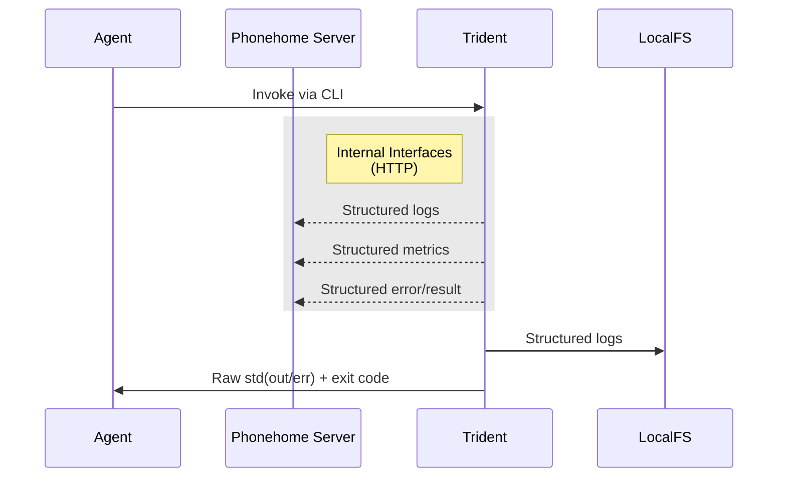
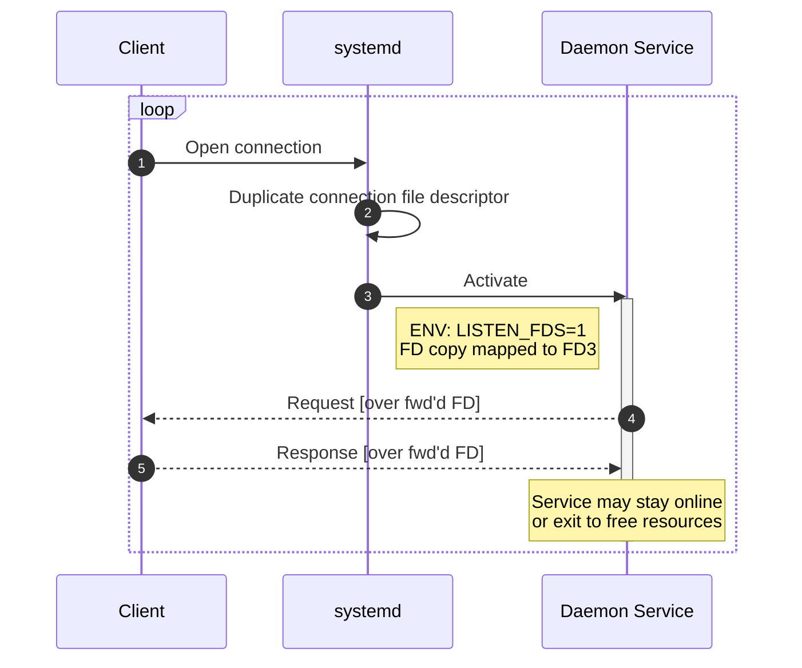
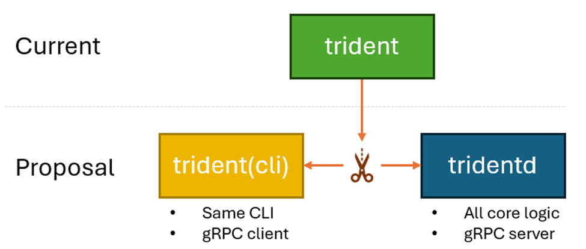
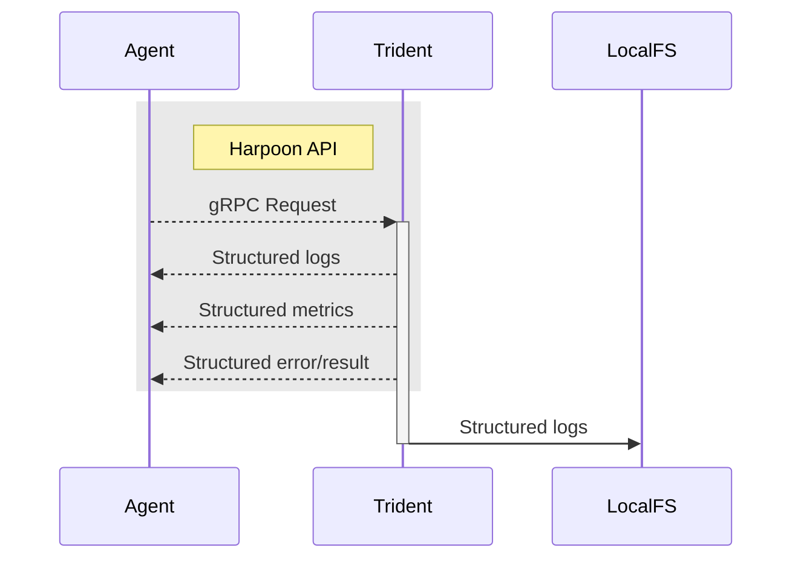
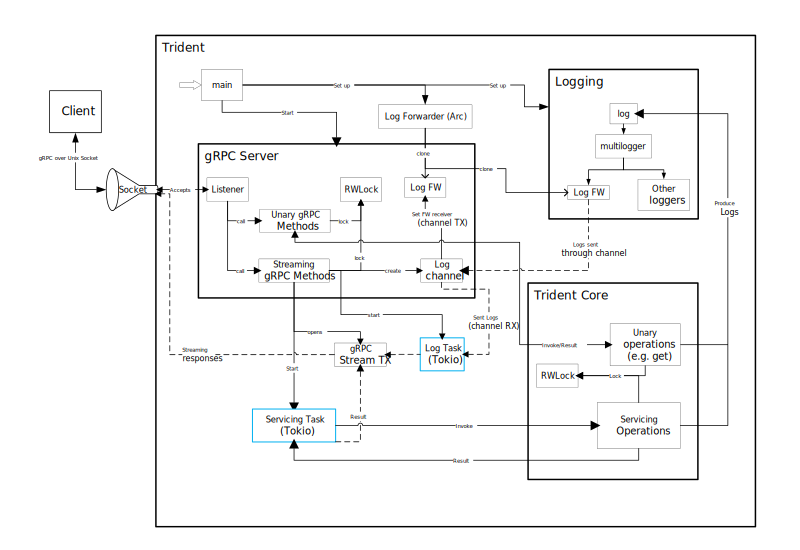
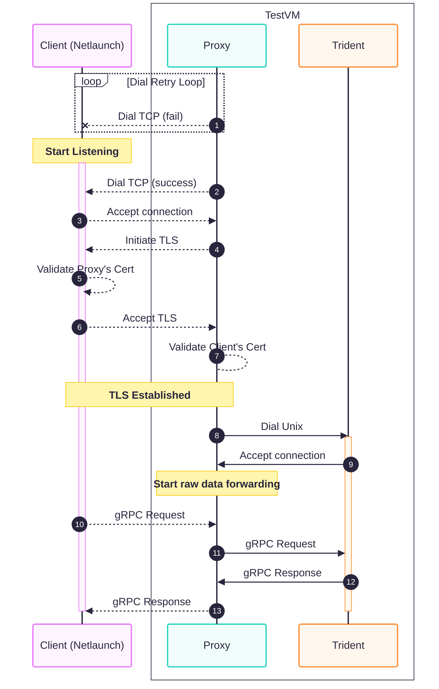

# 0379 gRPC API

- Date: 2025-09-22
- RFC PR: [microsoft/trident#379](https://github.com/microsoft/trident/pull/379)
- Issue: [microsoft/trident#0000](https://github.com/microsoft/trident/issues/0000)

## Summary

In its current form, interaction with Trident is limited to its CLI and the
various reporting features that have been built over time primarily for
debugging purposes. The CLI is great for user interaction and simple automation,
but as complexity around Trident grows, the CLI can become cumbersome. This
document proposes a new standard gRPC-based API for more advanced bi-directional
communication with Trident meant to be used by complex orchestrators. 

## Motivation and Goals

The ultimate goal of this proposal is to enable a new way for agents to interact
with Trident that is fully programmatic and structured. This is achieved via a
new gRPC-based API that exposes all of Trident's functionality and adds new
capabilities such as structured progress reporting.

This new gRPC API would be useful for multiple scenarios where gRPC is the
standard such as modern cloud-native environments, scenarios where binary
execution becomes inconvenient, or applications where advanced integration is
required.

### CLI Interface Limitations

While the existing binary and CLI interface is sufficient for many use cases,
invoking Trident as a binary directly comes with some limitations because it
will generally mean it starts as a child process of the agent, which requires
the agent to already be running in the proper environment and permission level.
This is not a big problem for agents already running as root, but following the
principle of least privilege, it may be undesirable to have Trident’s caller
also running as root, since this process may have more networking needs. If the
agent is not running as root, then it becomes challenging to execute Trident; we
currently have no good answer for how to achieve this. It is possible to start
trident via a systemd service, but that also requires enough privilege to invoke
and makes obtaining the logs and result less direct.

Running Trident via the CLI also means that passing any big blob of data, such
as a Host Configuration file, needs to happen via the filesystem, which adds an
extra layer of complication. In simple scenarios, this is trivial, but in
complex deployments it means the file must be placed carefully so as not to
place it in a read-only location, or an ephemeral one.

Running Trident when it is distributed as a sysext is functionally equivalent to
distributing it as a regular RPM package in terms of how it is invoked, with the
extra advantage that its easier to service.

Running Trident in a containerized environment may alleviate many of these
limitation because it is possible to create a privileged container with
sufficient access to the system, and that can be done by any agent with
sufficient access to Docker. However, creating such a container requires a very
specific configuration to guarantee all components will be working as expected.
Running Trident in a container mildly complicates the process of providing a
Host Configuration file, generally requiring another volume mount to the host.
Containerized runtimes for Trident also increase the complexity of crafting
precise SELinux policies to allow Trident to operate correctly, which may be a
deterrent for some use cases.

### Structured Observability and Reporting

Another motivation for this proposal is to establish an official programmatic and structured
mechanism for getting information out of Trident. Currently, an agent executing Trident
as a child process can only get unstructured stdout/stderr output and an exit code.



Because the Phonehome server is currently an internal-only interface, a calling
agent only has the raw output of the trident process to know what Trident is
doing. It may also access the full log, which is structured, but this has proven
to be challenging in some scenarios as the file may not always be easily
accessible. For errors, the agent needs to parse the logs or use the dedicated
“get last-error” subcommand, although this does not seem to be a common
practice.

### Systemd Socket Activation

Socket activation is a foundational feature of systemd. In a traditional
approach, a daemon would need to be already running and listening to process an
incoming request, with socket activation, systemd can listen on a specific
socket and only start a service once a request is received.



Once a connection is received, systemd will forward the file descriptor of the
incoming connection to the new process’s file descriptor #3 and let the child
process know about this by setting the environment variables:

- `LISTEN_FDS` [int]: number of sockets forwarded to the service.
- `LISTEN_FD_NAMES` [string]: Comma-separated list of names of the sockets
  forwarded to the service.

When using the default settings, systemd will start a single instance of the
service and the process is expected to deal with the challenges of handling
multiple incoming connections.

When using Unix sockets, systemd will create, own, and control the socket file[^1].
It allows for setting specific permissions and ownership of the socket file.
This can be useful for security as the caller may not need to be the root user,
but any specific user or member of a particular group. For example, the
ownership and mode “root:trident 660” would allow for any user in the group
“trident” to invoke trident, without the user requiring sudo or root access.

[^1]: Network sockets do not have an associated file in the same way, so these
    concepts of ownership do not apply there.

## Scope

### Requirements

1. Preserve security model: root access is a prerequisite.
2. Implement a programmatic API to invoke Trident with support for all existing
   features.
3. The API must be as easy as possible for a customer to use.
4. Preserve all current CLI functionality in a client tool. No changes for CLI
   users.
5. Live progress reporting.
6. Replace remote reporting mechanisms (phonehome, logstream, and tracestream)
   with new API.


### Out of Scope

- Trident servicing. (It is briefly discussed but not a main topic of this
  document)
- Rust/Go Trident gRPC client SDK (See 
  [Future Possibilities](#future-possibilities))
- Specific recommendations for customers (Left for future documentation effort)
- Any variation of Trident as a gRPC client. (See 
  [Future Possibilities](#future-possibilities))
- Streaming images through gRPC.
- Remote access. It is discussed for internal testing purposes but not a main
  topic of this document. (See [Future Possibilities](#future-possibilities))
- Additional authorization mechanisms.


### Exit Criteria

- The API has been implemented with all features usable through it.
- A new CLI client binary has been made available.
- Netlaunch & automation has been updated to leverage the new API.
- Remote reporting mechanisms are replaced by the new API.
- Systemd unit files updated to use new API.


## Dependencies

N/A

## Implementation

<!-- (DELETE ME)
Describe the technical design and implementation plan for the proposed change.
This should include architectural diagrams, API draft and examples, and
relevant code snippets to better explain your design.
-->

### Structure Refactor

The current trident binary will be split into two separate binaries:



All the existing features and interfaces would be preserved, but functionality
will be split between two binaries: trident(the cli) and tridentd (the actual
agent).

### Harpoon API (HAPI)

The Harpoon API (dev name, it will eventually just be the `tridentd` gRPC API)
is the only way in which `tridentd` will take instructions. The reason for this
self-imposed limitation is to decrease the number of entry points and code paths
that can invoke Trident and grow our confidence that the core logic is working
correctly. If this is the case, then client code should become relatively
trivial and interchangeable. 

The Harpoon API will be defined as a protobuf file that is accessible to
customers. We may ship it as a standalone RPM or simply provide it along with a
release. The goal is to make it trivially simple for a customer to pick up the
trident daemon RPM and set up a client for it.



### `tridentd` Runtime Daemon

`tridentd` would support two modes of execution:

1.	Systemd socket activated: Tridentd runs as a systemd service activated by a socket.
2.	Manual: Tridentd can also be executed directly.

Most scenarios would use option #1, that way trident can be always ready but
only running when needed. For specific scenarios, such as running in a
container, tridentd can be executed directly and receive a path to the socket
file to create or use the default:

```text
/run/trident/listen.sock
```

#### Security Model

Trident is a very powerful agent; therefore, access to it should be extremely
limited. Today, Trident’s approach to this issue is to invariably enforce that
it be run with root privileges. For another process to be able to start Trident,
it must already be running as root or have sudo privilege.

`tridentd` will have similar restrictions: it can only be started with root
privileges and will produce an error otherwise.

However, the proposed gRPC interface exposed over a Unix socket opens a new door
to interact with Trident. Fortunately, the socket is a file subject to standard
linux access permissions. Regardless of who creates the socket file, systemd or
`tridentd` itself, it will always belong to the root user and be configured to
block all read/write attempts from other non-root users.

#### Systemd Socket Activation Implementation

A socket-activated service is inactive by default. When a client makes a request
on the socket, systemd will activate the service and clone the socket to file
descriptor #3 in the service process. `tridentd` will determine if it is being
executed by systemd, and if so, listen on the file descriptor. After the request
is finished, `tridentd` will stand by for a specific period (TBD, 5 minutes?)
and shut down gracefully if no other connections are received. The shutdown
timer is reset after every connection finishes. This graceful shutdown is meant
to free resources as calls into trident should generally look like infrequent
groups of sequential calls in short succession. There is no need for Trident to
stay active in between updates.

#### Connection Persistence

Once a client starts a servicing, it may stay online listening on streaming
events until the operation is finished, or it may disconnect and poll for
updates. In the future, the client may also reconnect to an ongoing operation to
receive live updates again.

#### Connection Management

The daemon can be invoked in two ways: 

1.	As a systemd service linked to a systemd socket.
2.	Direct binary execution e.g. `bash –c 'trident'` or `exec("trident", ...)`

To properly support both invocation types, management of incoming connections
will be internal to the daemon.

The gRPC server will contain a Read-Write Lock to be used for each incoming
connection. Data retrieval operations such as “get status/config/error” will
lock in read mode, permitting multiple simultaneous read connections. Servicing
operations, such as `update` or `install`, will lock in write mode, effectively
enforcing a maximum of 1 connection at a time to avoid activities happening in
parallel.

Furthermore, listening on a socket that only one instance can hold at a time
enforces that at most ONE instance of `tridentd` be operating at the same time.

#### Servicing Lock

On top of the connection lock, `tridentd` will also keep a global servicing lock
as an extra layer of guarantee that at most ONE servicing operation is happening
at the same time.

The main reason for this extra layer is to avoid scenarios where a servicing is
started, the client disconnects, freeing the connection lock, and another
servicing is started while the first one is still ongoing. This lock will
prevent the second servicing from starting until the first one is fully
finished.

#### Local vs. Remote Connections

For security and compartmentalization reasons, Trident should only listen on
local Unix sockets with very restricted permissions. This should significantly
simplify Trident's security model.


Remote access could still be achieved in two ways:

- **SSH socket forwarding**: A remote client would need SSH access to a local user
  with access to the local socket.
- **Reverse Proxy**: A remote client could establish a connection via a reverse
  proxy running on the host which forwards incoming TCP connections to the local
  Unix socket connection.
- **Reverse-connect Proxy**: (RCP) This is an agent running on the host that tries
  to open a connection to some external endpoint. Once the connection is
  established, it acts as a regular reverse proxy by forwarding incoming data
  from the remote connection to the local endpoint. (See more in 
  [E2E Test Infrastructure Changes](#e2e-test-infrastructure-changes))

#### Proposed Code Architecture

To reduce the number of changes needed, most of the core logic would remain
as-is. The outer layers will need some adjustments to get called by the gRPC
methods as opposed to the existing main/CLI structure.



Sample implementation of this architecture:
[rust_grpc](https://dev.azure.com/mariner-org/dev-sandbox/_git/frhuelsz-sandbox?path=/rust_grpc&version=GBfrhuelsz/rust_grpc&_a=contents)
(internal only).

### Trident CLI Client

The existing CLI interface will be ported to a standalone binary. The CLI will
remain the same. Internally, the client will just be a wrapper to invoke the
corresponding gRPC interfaces and receive and surface logs and status as the
current CLI does today.

The expected consequence of this is that this change will be completely
transparent for a user that has always used the existing CLI as the sole means
of interacting with Trident.

### Offline Initialize

The offline initialize command will be moved to be a native feature of the CLI
binary, without needing to invoke the daemon. That way, the external API remains
as:

```bash
trident offline-initialize
```

### Autonomous Services

Trident currently has three service files that when enabled perform automated
actions:

- **Installation**: used in test ISOs to automatically start a trident
  installation process.
- **Network initialization**: setup network in live/unconfigured/early-state
  scenarios.
- **Commit**: used on boot to commit an AB update.

These will continue to exist by invoking the Trident CLI, but their use may
dwindle.


## Running in a Container
The current way Trident runs inside of a container is quite simple; Trident is
the entry point of the container, and all arguments get passed directly to
Trident.

A separate daemon and CLI make this no longer possible. Depending on the needs
and context, Trident containers will exist in two flavors:

1. **A pure daemon container**: <br/> The trident daemon (tridentd) is the entry
   point of the container. To interact with it, a volume MUST be mounted on the
   location of the socket file. This way, an agent external to the container,
   such as another container or a host process, may use the gRPC interface to
   interact with Trident.

2. **A combined container**: <br/> Both tridentd and trident (cli) are part of the
   container. The entry point is a wrapper that executes tridentd in the
   background and then forwards all arguments to trident (cli). No volumes for
   the socket are needed or used. This would be the functional equivalent of the
   current container.

## Running in a System Extension (sysext)

Packaging `tridentd` and `trident` (CLI) in a sysext would not hinder their
usability, on the contrary, this may be the most powerful packaging decision. If
Trident is distributed via sysext, then it becomes easy to service Trident
itself while also getting the advantages of running directly in the host.

## Public API Design

<!-- (DELETE ME)
If your feature includes an external facing API, produce an API Design document
with details and sample usage. Include a summary of the feature, example usage
covering all optional features, and the API specification. Highlight any
differences if the API is meant to be compatible with existing APIs. For simple
APIs, include inline in this document. For complex APIs, link bidirectionally
between the two documents.
-->

The full gRPC API specification is available in the PR:
[microsoft/trident#386: engineering: Harpoon gRPC Protobuf](https://github.com/microsoft/trident/pull/386)

## Testing and Metrics

<!-- (DELETE ME)
Document how the feature will be tested - list out each test we need to write,
capturing any relevant test environments and test infrastructure changes that
might be needed. Also capture how we will monitor the feature.
-->

### Unit Testing

Separating the client and the server means that we can test the interfaces
thoroughly and mostly independently. We should be able to implement extensive
unit testing on the CLI-client by setting up a mock backend, and we should be
able to test the server’s interfaces by setting up a mock front end.

Furthermore, the server interfaces will ultimately be utilized during end-to-end
testing as well.


### E2E Test Infrastructure Changes

The feature will require some changes to our infrastructure to properly support
it. Notably, most of our current infrastructure currently depends on the
phonehome/logstream features as well as executing trident as a regular binary.
In the initial stages of development will keep this intact. Until the full stack
can be replaced, CLI invocation and logstream will remain in use. See
Development Plan for more details.

Phonehome is so important to us because it is the only mechanism we have to know
when the test host has started and what its IP address is. Phonehome give us
this because our test images start Trident on boot, which will then start the
phonehome process. The gRPC makes Trident totally passive, meaning we need a new
component to start this active connection. The proposed component to do this is
a reverse-connect proxy (see Local vs. Remote Access). 

The reverse-connect proxy (RCP) is a lightweight service running on the test
host that will read the target IP address injected by netlaunch into the ISO and
continuously attempt to establish a TCP connection to that address. On the
listening side, netlaunch starts listening on a given port for incoming TCP
connections. Once the connection is accepted, both parties will perform a mutual
TLS handshake to authenticate each other. On success, a secure channel is
established, and the RCP begins forwarding all incoming data over to Trident’s
local Unix socket. This way, we get the outgoing signal from the test host that
we were depending on, and we also now have a mechanism for netlaunch to
communicate directly with Trident.




- Sample implementation of the RCP:
  [main.go](https://dev.azure.com/mariner-org/dev-sandbox/_git/frhuelsz-sandbox?path=/harpoon2/cmd/superproxy/main.go&version=GBmain&_a=contents)
  (internal only).
- Sample implementation of the client:
  [main.go](https://dev.azure.com/mariner-org/dev-sandbox/_git/frhuelsz-sandbox?path=/harpoon2/cmd/superclient/main.go&version=GBmain&_a=contents)
  (internal only).

### Testing Exit Criteria

- Unit tests for the client end-to-end.
- Unit tests for server’s gRPC interface.
- Usage in E2E tests, potentially with multiple clients.


## Servicing

<!-- (DELETE ME)
When applicable, discuss how the new feature will be introduced into the
customer environments.

Elaborate on any impacts to backwards and forwards compatibility, and any 
mitigations.
-->

The changes should be fully transparent for CLI users. Future updates to add
features to Trident will change to the protobuf file in a backwards compatible
manner. Breaking changes may be evaluated as part of major Trident releases.

## Implementation Plan

<!-- (DELETE ME)
[OPTIONAL]
When needed or appropriate, outline a phased implementation plan for the proposal.
-->

1. Merge API Protos.
2. Create a new CLI crate implementing gRPC client. (with UTs)
3. Merge gRPC server logic.
4. Create a new trident subcommand to start daemon. (with UTs)
5. Refactor Trident so that the gRPC server can perform servicing operations.
6. Merge new systemd unit files.
3. Update container tests to use the wrapper strategy from Running in a Container.
7. Rename trident binary to tridentd, deprecate existing CLI from tridentd. Start using the new trident CLI binary.
8. Merge reverse-connect proxy (RCP) (see Local vs. Remote Access)
9. Update Netlaunch to use RCP.
10. Migrate all tests to Netlaunch+RCP.
11. Deprecate phonehome & logstream.


## Counter-Arguments

### Drawbacks

<!-- (DELETE ME)
Explain any reasons why this shoul *not* be implemented.
-->

1. Complexity: Introducing a gRPC API adds complexity to the Trident codebase,
   which may increase maintenance overhead.
2. Learning Curve: Customers may need to learn how to use gRPC, which could be
   a barrier for some users.
3. Performance Overhead: While gRPC is generally efficient, there may be some
   performance overhead compared to direct CLI invocation, especially for simple
   tasks.
4. Security Considerations: Exposing a gRPC API may introduce new security
   considerations that need to be addressed, such as authentication and
   authorization mechanisms.
5. Initial Development Effort: Implementing the gRPC API will require a
   significant initial development effort, which may divert resources from other
   important features or bug fixes.
6. Existing adequacy of CLI: For many users, the existing CLI may be sufficient
   for their needs, and the added complexity of a gRPC API may not provide
   enough value to justify its implementation.

### Alternatives

<!-- (DELETE ME)
Describe alternative designs or approaches considered. Explain why the proposed design was chosen
over these alternatives.
-->

- Pure CLI: (current) Continue using Trident as a CLI-only tool. This approach has
  limitations as described in the Motivation section.
- HTTP: Implement an HTTP REST API instead of gRPC. This approach would be more
  familiar and easier to use for customers, but it would require more work to
  implement and maintain. gRPC provides better performance and built-in support
  for streaming, which is beneficial for progress reporting, as well as schema
  definition via protobufs.
- WebSockets: Implement a WebSocket-based API. This approach would allow for
  bi-directional communication and streaming, but it would be more complex to
  implement and maintain compared to gRPC. gRPC provides a more structured way
  to define the API and handle communication.

## Open Questions

<!-- (DELETE ME)
[OPTIONAL]
List any open questions that need to be resolved before the proposal can be
implemented. Ideally these would be addressed and resolved during the RFC
review process.
-->

## Future Possibilities

<!-- (DELETE ME)
[OPTIONAL]
Describe any future work that could build on this proposal.
-->

- Trident CLI could become a portable go-base binary, there is no need for it to
  be rust and it could allow us to easily run it in most Linux systems.
- Trident could eventually be configured to act as a client when establishing
  the connection to the orchestrator, so that a central orchestrator could
  manage multiple Trident instances remotely without necessarilly knowing how to
  reach out to them.