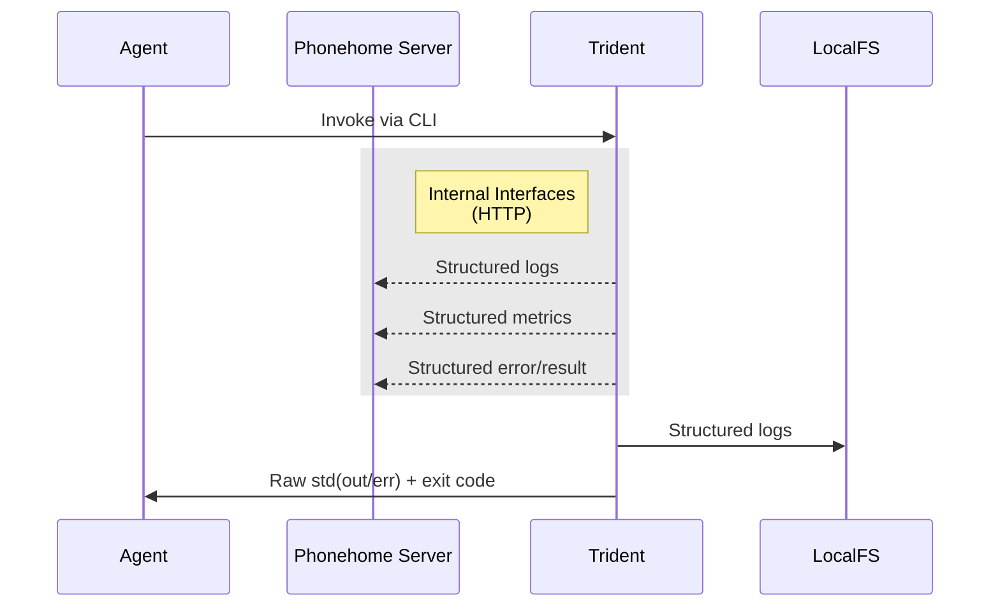
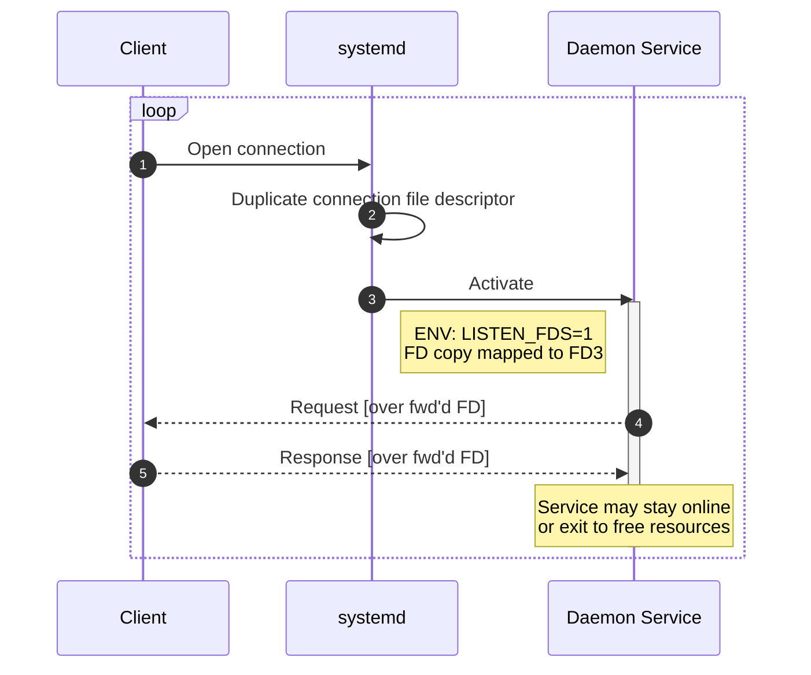
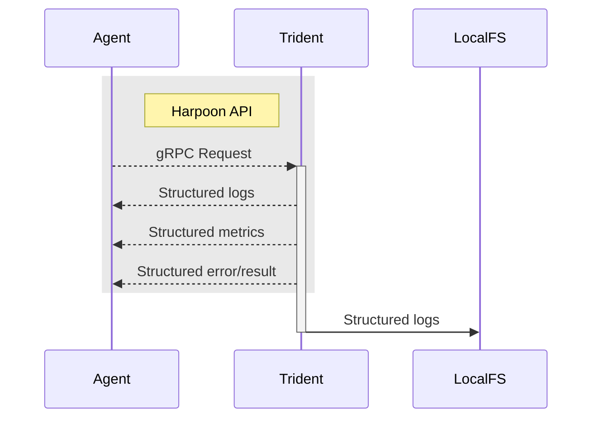
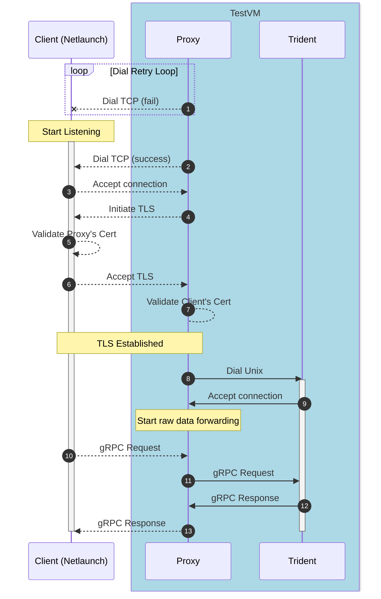

# 0379 gRPC API

- Date: 2025-09-22
- RFC PR: [microsoft/trident#379](https://github.com/microsoft/trident/pull/379)
- Issue: [microsoft/trident#0000](https://github.com/microsoft/trident/issues/0000)

# Summary

In its current form, interaction with Trident is limited to its CLI and the
various reporting features that have been built over time primarily for
debugging purposes. The CLI is great for user interaction and simple automation,
but as complexity around Trident grows, the CLI can become cumbersome. This
document proposes a new standard gRPC-based API for more advanced bi-directional
communication with Trident meant to be used by complex orchestrators. 

# Motivation and Goals

The ultimate goal of this proposal is to enable a new way for agents to interact
with Trident that is fully programmatic and structured. This is achieved via a
new gRPC-based API that exposes all of Trident's functionality and adds new
capabilities such as structured progress reporting.

This new gRPC API would be useful for multiple scenarios where gRPC is the
standard such as modern cloud-native environments, scenarios where binary
execution becomes inconvenient, or applications where advanced integration is
required.

## CLI Interface Limitations

While the existing binary and CLI interface is sufficient for many use cases,
invoking Trident as a binary directly comes with some limitations because it
will generally mean it starts as a child process of the agent, which requires
the agent to already be running in the proper environment and permission level.
This is not a big problem for agents already running as root, but following the
principle of least privilege, it may be undesirable to have Trident’s caller
also running as root, since this process may have more networking needs. If the
agent is not running as root, then it becomes challenging to execute Trident; we
currently have no good answer for how to achieve this. It is possible to start
trident via a systemd service, but that also requires enough privilege to invoke
and makes obtaining the logs and result less direct.

Running Trident via the CLI also means that passing any big blob of data, such
as a Host Configuration file, needs to happen via the filesystem, which adds an
extra layer of complication. In simple scenarios, this is trivial, but in
complex deployments it means the file must be placed carefully so as not to
place it in a read-only location, or an ephemeral one.

Running Trident when it is distributed as a sysext is functionally equivalent to
distributing it as a regular RPM package in terms of how it is invoked, with the
extra advantage that its easier to service.

Running Trident in a containerized environment may alleviate many of these
limitation because it is possible to create a privileged container with
sufficient access to the system, and that can be done by any agent with
sufficient access to Docker. However, creating such a container requires a very
specific configuration to guarantee all components will be working as expected.
Running Trident in a container mildly complicates the process of providing a
Host Configuration file, generally requiring another volume mount to the host.
Containerized runtimes for Trident also increase the complexity of crafting
precise SELinux policies to allow Trident to operate correctly, which may be a
deterrent for some use cases.

## Structured Observability and Reporting

Another motivation for this proposal is to establish an official programmatic and structured
mechanism for getting information out of Trident. Currently, an agent executing Trident
as a child process can only get unstructured stdout/stderr output and an exit code.



Because the Phonehome server is currently an internal-only interface, a calling
agent only has the raw output of the trident process to know what Trident is
doing. It may also access the full log, which is structured, but this has proven
to be challenging in some scenarios as the file may not always be easily
accessible. For errors, the agent needs to parse the logs or use the dedicated
“get last-error” subcommand, although this does not seem to be a common
practice.

## Systemd Socket Activation

Socket activation is a foundational feature of systemd. In a traditional
approach, a daemon would need to be already running and listening to process an
incoming request, with socket activation, systemd can listen on a specific
socket and only start a service once a request is received.



Once a connection is received, systemd will forward the file descriptor of the
incoming connection to the new process’s file descriptor #3 and let the child
process know about this by setting the environment variables:

- `LISTEN_FDS` [int]: number of sockets forwarded to the service.
- `LISTEN_FD_NAMES` [string]: Comma-separated list of names of the sockets
  forwarded to the service.

When using the default settings, systemd will start a single instance of the
service and the process is expected to deal with the challenges of handling
multiple incoming connections.

When using Unix sockets, systemd will create, own, and control the socket file[^1].
It allows for setting specific permissions and ownership of the socket file.
This can be useful for security as the caller may not need to be the root user,
but any specific user or member of a particular group. For example, the
ownership and mode “root:trident 660” would allow for any user in the group
“trident” to invoke trident, without the user requiring sudo or root access.

[^1]: Network sockets do not have an associated file in the same way, so these
    concepts of ownership do not apply there.

# Scope

## Requirements

1. Preserve security model: root access is a prerequisite.
2. Implement a programmatic API to invoke Trident with support for all existing
   features.
3. The API must be as easy as possible for a customer to use.
4. Preserve all current CLI functionality in a client tool. No changes for CLI
   users.
5. Live progress reporting.
6. Replace remote reporting mechanisms (phonehome, logstream, and tracestream)
   with new API.


## Out of Scope

- Trident servicing. (It is briefly discussed but not a main topic of this
  document)
- Rust/Go Trident gRPC client SDK (See 
  [Future Possibilities](#future-possibilities))
- Specific recommendations for customers (Left for future documentation effort)
- Any variation of Trident as a gRPC client. (See 
  [Future Possibilities](#future-possibilities))
- Streaming images through gRPC.
- Remote access. It is discussed for internal testing purposes but not a main
  topic of this document. (See [Future Possibilities](#future-possibilities))
- Additional authorization mechanisms.


## Exit Criteria

- The API has been implemented with all features usable through it.
- A new CLI client binary has been made available.
- Netlaunch & automation has been updated to leverage the new API.
- Remote reporting mechanisms are replaced by the new API.
- Systemd unit files updated to use new API.


# Dependencies

N/A

# Implementation

<!-- (DELETE ME)
Describe the technical design and implementation plan for the proposed change.
This should include architectural diagrams, API draft and examples, and
relevant code snippets to better explain your design.
-->

## Structure Refactor

The current trident binary will be split into two separate binaries:


All the existing features and interfaces would be preserved, but functionality
will be split between two binaries: trident(the cli) and tridentd (the actual
agent).

## Harpoon API (HAPI)

The Harpoon API (dev name, it will eventually just be the `tridentd` gRPC API)
is the only way in which `tridentd` will take instructions. The reason for this
self-imposed limitation is to decrease the number of entry points and code paths
that can invoke Trident and grow our confidence that the core logic is working
correctly. If this is the case, then client code should become relatively
trivial and interchangeable. 

The Harpoon API will be defined as a protobuf file that is accessible to
customers. We may ship it as a standalone RPM or simply provide it along with a
release. The goal is to make it trivially simple for a customer to pick up the
trident daemon RPM and set up a client for it.



## `tridentd` Runtime Daemon

`tridentd` would support two modes of execution:

1.	Systemd socket activated: Tridentd runs as a systemd service activated by a socket.
2.	Manual: Tridentd can also be executed directly.

Most scenarios would use option #1, that way trident can be always ready but
only running when needed. For specific scenarios, such as running in a
container, tridentd can be executed directly and receive a path to the socket
file to create or use the default:

```text
/run/trident/listen.sock
```

## Security Model

Trident is a very powerful agent; therefore, access to it should be extremely
limited. Today, Trident’s approach to this issue is to invariably enforce that
it be run with root privileges. For another process to be able to start Trident,
it must already be running as root or have sudo privilege.

`tridentd` will have similar restrictions: it can only be started with root
privileges and will produce an error otherwise.

However, the proposed gRPC interface exposed over a Unix socket opens a new door
to interact with Trident. Fortunately, the socket is a file subject to standard
linux access permissions. Regardless of who creates the socket file, systemd or
`tridentd` itself, it will always belong to the root user and be configured to
block all read/write attempts from other non-root users.


# Public API Design

<!-- (DELETE ME)
If your feature includes an external facing API, produce an API Design document
with details and sample usage. Include a summary of the feature, example usage
covering all optional features, and the API specification. Highlight any
differences if the API is meant to be compatible with existing APIs. For simple
APIs, include inline in this document. For complex APIs, link bidirectionally
between the two documents.
-->

The full gRPC API specification is available in the PR:
[microsoft/trident#386: engineering: Harpoon gRPC Protobuf](https://github.com/microsoft/trident/pull/386)

# Testing and Metrics

<!-- (DELETE ME)
Document how the feature will be tested - list out each test we need to write,
capturing any relevant test environments and test infrastructure changes that
might be needed. Also capture how we will monitor the feature.
-->

## E2E Test Infrastructure Changes



# Servicing

<!-- (DELETE ME)
When applicable, discuss how the new feature will be introduced into the
customer environments.

Elaborate on any impacts to backwards and forwards compatibility, and any 
mitigations.
-->

# Implementation Plan

<!-- (DELETE ME)
[OPTIONAL]
When needed or appropriate, outline a phased implementation plan for the proposal.
-->

# Counter-Arguments

## Drawbacks

<!-- (DELETE ME)
Explain any reasons why this shoul *not* be implemented.
-->

## Alternatives

<!-- (DELETE ME)
Describe alternative designs or approaches considered. Explain why the proposed design was chosen
over these alternatives.
-->

# Open Questions

<!-- (DELETE ME)
[OPTIONAL]
List any open questions that need to be resolved before the proposal can be
implemented. Ideally these would be addressed and resolved during the RFC
review process.
-->

# Future Possibilities

<!-- (DELETE ME)
[OPTIONAL]
Describe any future work that could build on this proposal.
-->

- Trident CLI could become a portable go-base binary, there is no need for it to
  be rust and it could allow us to easily run it in most Linux systems.
- Trident could eventually be configured to act as a client when establishing
  the connection to the orchestrator, so that a central orchestrator could
  manage multiple Trident instances remotely without necessarilly knowing how to
  reach out to them.