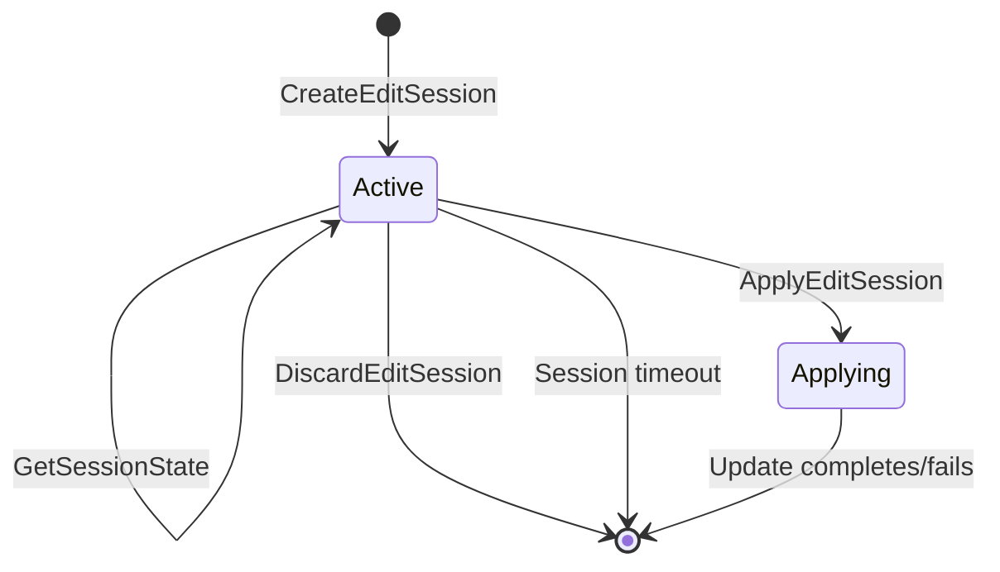
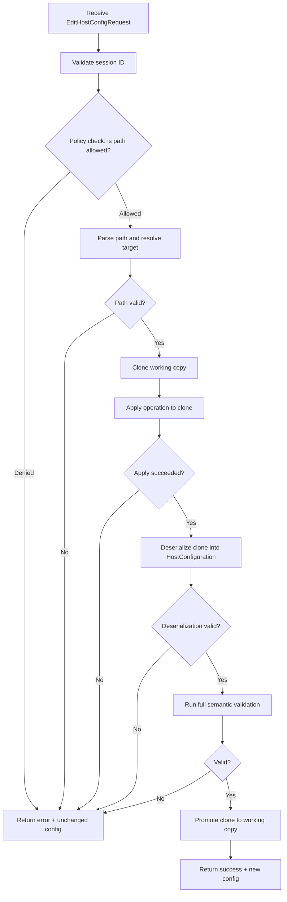
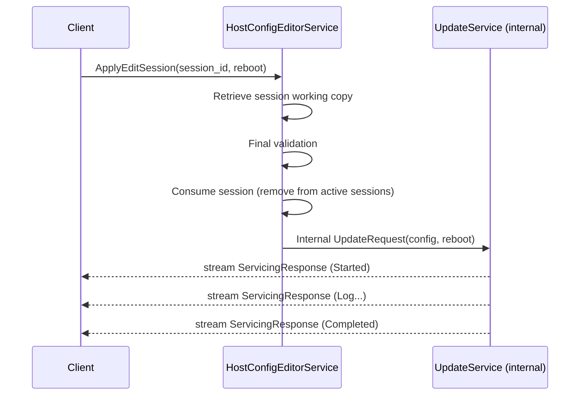

# 0580 Host Configuration Live Editing API

- Date: 2026-03-09
- RFC PR: [microsoft/trident#580](https://github.com/microsoft/trident/pull/580)
- Issue: [microsoft/trident#0000](https://github.com/microsoft/trident/issues/0000)

## Summary

This RFC proposes a new gRPC service for live, session-based editing of the Host
Configuration file on a provisioned system. The service allows clients to open
an editing session backed by a temporary copy of the current host configuration,
perform a series of precise modifications through a structured editing API,
validate each change incrementally, and finally apply the resulting configuration
as an update operation. The core design challenge—and focus of this
document—is the editing API itself: it must be generic enough to modify any
part of a YAML document, ergonomic for the host configuration's specific
structure, and structured enough for server-side policy enforcement.

## Motivation and Goals

### The Problem

Today, performing an update to a provisioned system's host configuration
requires the client to:

1. Retrieve the current host configuration (via `StatusService.GetProvisionedConfig`).
2. Deserialize the full YAML document.
3. Make the desired changes in client-side code.
4. Re-serialize the entire document.
5. Submit the whole configuration to `UpdateService.Update` (or
   `UpdateStage`/`UpdateFinalize`).

This workflow is functional but has several drawbacks:

- **Full document ownership**: The client must understand and carry the entire
  host configuration, even when making a single-field change such as updating
  the image URL for an A/B update. This is the most common update scenario in
  practice—tests and automation pipelines overwhelmingly only change
  `image.url` and `image.sha384`. For this specific case, the `Update` API
  offers a fixed shortcut that accepts only the image section, but the client
  must still construct a valid YAML document with the correct structure, and
  this shortcut does not generalize to other sections of the configuration.
- **No incremental validation**: The client has no way to validate individual
  changes before submitting the complete configuration. Errors are only
  discovered at submission time.
- **No server-side policy enforcement**: The server cannot inspect what
  *changed* between the current and new configurations. It can only validate
  the new configuration in its entirety. This makes it impossible to enforce
  policies like "storage modifications are not permitted during updates."
- **No structured audit trail**: There is no record of what specific changes
  were made to a configuration, only a before and after state.
- **Client complexity**: Every client (orchestrator, automation tool, test
  harness) must implement its own YAML manipulation logic, leading to
  duplicated effort and potential inconsistencies.

### Goals

1. Enable clients to make targeted, surgical edits to a host configuration
   without manipulating the full YAML document.
2. Provide incremental validation after each edit, with clear error messages.
3. Allow the server to enforce edit policies (e.g., denying storage
   modifications).
4. Provide a session-based workflow so that multiple edits can be composed before
   being applied.
5. Design an editing API that is generic enough for any YAML structure but
   ergonomic for the host configuration's common patterns.
6. Integrate cleanly with the existing `UpdateService` two-phase update model.

### Common Use Cases

| Use Case                    | Edits Required                                     |
| --------------------------- | -------------------------------------------------- |
| A/B update with new image   | Set `image.url` and `image.sha384`                 |
| Add an SSH key to a user    | Append to `os.users[name="my-user"].sshPublicKeys` |
| Add a health check script   | Append to `health.checks`                          |
| Change SELinux mode         | Set `os.selinux.mode`                              |
| Add a post-configure script | Append to `scripts.postConfigure`                  |
| Add a sysext                | Append to `os.sysexts`                             |
| Modify kernel command line  | Set `os.kernelCommandLine.extraCommandLine`        |

## Scope

### Requirements

1. A new `HostConfigEditorService` gRPC service in `trident.v1preview`.
2. Session lifecycle management: create, edit, inspect, discard, and apply.
3. A structured editing API supporting: set, delete, and append operations on
   any path in the host configuration.
4. Incremental validation of changes (syntactic and semantic).
5. Server-side policy enforcement hooks for restricting edits to certain
   sections.
6. Each edit response returns the full updated configuration state (on success)
   or the unchanged state with error details (on failure).
7. An "apply" RPC that consumes the session and initiates an update operation,
   reusing the existing `UpdateService` streaming response pattern.
8. Session expiry/cleanup for abandoned sessions.

### Out of Scope

- Concurrent editing (multiple clients editing the same session).
- Undo/redo within a session (the client can discard and start over).
- Real-time collaborative editing.
- Editing the host configuration of a *non-provisioned* system (use
  `InstallService` for initial provisioning).
- Modifications to the storage section (explicitly denied by policy in the
  initial implementation, as storage changes during updates are not supported).

### Exit Criteria

- The `HostConfigEditorService` is implemented with all RPCs.
- The editing API supports set, delete, and append operations on all non-storage
  sections of the host configuration.
- Server-side policy enforcement correctly rejects storage modifications.
- Incremental validation catches both syntactic and semantic errors.
- The "apply" RPC successfully triggers an update operation.
- Unit tests cover all edit operations and error cases.
- At least one E2E test uses the editing API to perform an A/B update by
  changing only the image URL.

## Dependencies

- [0379 gRPC API](0379-grpc-api.md): The gRPC daemon infrastructure must be in
  place.
- `UpdateService`: The apply RPC delegates to the existing update flow.
- `ValidationService`: Reuses the existing `HostConfiguration` validation logic.

## Implementation

### Session Lifecycle



When a session is created, the server reads the currently provisioned host
configuration and creates an in-memory working copy. All subsequent edits
operate on this copy. The session is identified by an opaque session ID returned
to the client.

Sessions have a configurable inactivity timeout (default: 10 minutes). If no
RPCs are received within the timeout, the session is automatically discarded.
Only one active edit session is permitted at a time to avoid conflicts with
concurrent servicing operations.

### Proto Definition

```protobuf
// Proto file defining the HostConfigEditorService.

syntax = "proto3";

package trident.v1preview;

import "trident/v1/error.proto";
import "trident/v1/servicing.proto";
import "trident/v1preview/host_config.proto";

// HostConfigEditorService provides methods for live, session-based editing of
// the host configuration on a provisioned system.
service HostConfigEditorService {
  // CreateEditSession creates a new editing session backed by a working copy
  // of the currently provisioned host configuration.
  rpc CreateEditSession(CreateEditSessionRequest)
      returns (CreateEditSessionResponse);

  // EditHostConfig applies a single edit operation to the working copy of
  // the host configuration within the given session. The full validation
  // pipeline runs for every edit. On failure, the working copy remains
  // unchanged.
  rpc EditHostConfig(EditHostConfigRequest)
      returns (EditHostConfigResponse);

  // GetSessionState returns the current working copy of the host
  // configuration and session metadata.
  rpc GetSessionState(GetSessionStateRequest)
      returns (GetSessionStateResponse);

  // DiscardEditSession discards the editing session and its working copy.
  rpc DiscardEditSession(DiscardEditSessionRequest)
      returns (DiscardEditSessionResponse);

  // ApplyEditSession consumes the editing session and initiates an update
  // operation using the edited host configuration as the target. Returns a
  // streaming response identical to UpdateService.Update.
  rpc ApplyEditSession(ApplyEditSessionRequest)
      returns (stream trident.v1.ServicingResponse);
}
```

### Session Management Messages

```protobuf
message CreateEditSessionRequest {
  // Optional base configuration override. If not provided, the currently
  // provisioned host configuration is used as the base.
  optional HostConfiguration base_config = 1;
}

message CreateEditSessionResponse {
  // The unique identifier for this editing session.
  string session_id = 1;
  // The initial state of the host configuration (the base copy).
  HostConfiguration config = 2;
}

message GetSessionStateRequest {
  string session_id = 1;
}

message GetSessionStateResponse {
  // The current working copy of the host configuration.
  HostConfiguration config = 1;
  // Number of successful edits applied to this session.
  uint32 edit_count = 2;
}

message DiscardEditSessionRequest {
  string session_id = 1;
}

message DiscardEditSessionResponse {}

message ApplyEditSessionRequest {
  // The session whose edited configuration should be applied.
  string session_id = 1;
  // Reboot handling configuration for the update operation.
  trident.v1.RebootManagement reboot = 2;
}
```

### The Editing API

This is the most critical part of the design. The editing API must balance
generality, ergonomics, and server-side inspectability. Three approaches are
evaluated below; the recommended approach is **Option A: Path-Based Operations**.

---

#### Option A: Path-Based Operations (Recommended)

This approach uses a dot-separated path notation with array indexing to address
any location in the YAML document, combined with a small set of typed
operations.

##### Path Syntax

Paths use dot-separated segments to navigate the YAML structure:

| Pattern            | Meaning                            | Example                    |
| ------------------ | ---------------------------------- | -------------------------- |
| `field.subfield`   | Nested object access               | `image.url`                |
| `field[N]`         | Array index (0-based)              | `os.users[0]`              |
| `field[key=value]` | Array element match by field value | `os.users[name="my-user"]` |
| `field[-]`         | Append to array (used with `SET`)  | `os.users[-]`              |

##### Operations

```protobuf
message EditHostConfigRequest {
  string session_id = 1;
  // A single edit operation to apply.
  EditOperation operation = 2;
}

message EditHostConfigResponse {
  // Whether the operation was applied successfully.
  bool ok = 1;
  // The host configuration state after the edit. On success, reflects the
  // new state with the edit applied. On failure, reflects the unchanged
  // state prior to the attempted edit.
  HostConfiguration config = 2;
  // Structured error details. Present when ok is false.
  optional EditError error = 3;
}

// Machine-readable error returned when an edit operation fails.
message EditError {
  // The category of the error.
  EditErrorCode code = 1;
  // The path that was being edited when the error occurred.
  string path = 2;
  // A human-readable explanation of why the edit failed.
  string message = 3;
  // Optional: the underlying validation error, when the failure is due to
  // semantic validation of the resulting configuration.
  optional trident.v1.TridentError validation_error = 4;
}

enum EditErrorCode {
  EDIT_ERROR_CODE_UNSPECIFIED = 0;
  // The specified session ID does not exist or has expired.
  SESSION_NOT_FOUND = 1;
  // The edit targets a section that is restricted by policy.
  POLICY_DENIED = 2;
  // The path syntax is malformed or could not be parsed.
  INVALID_PATH = 3;
  // The path is syntactically valid but does not resolve to a node in
  // the current configuration (e.g., index out of bounds, no matching
  // array element).
  PATH_NOT_FOUND = 4;
  // The provided value could not be parsed as valid YAML or does not
  // match the expected type for the target field.
  INVALID_VALUE = 5;
  // The edit was applied syntactically but the resulting configuration
  // failed semantic validation (e.g., referencing a nonexistent device ID).
  VALIDATION_FAILED = 6;
}

message EditOperation {
  // The type of edit to perform.
  EditOperationType type = 1;
  // Dot-separated path to the target field.
  // Examples: "image.url", "os.users[0].sshPublicKeys", "health.checks[-]"
  string path = 2;
  // The value to set or append. Encoded as a YAML string.
  // For SET on a scalar: the new value (e.g., "http://new-image.cosi").
  // For SET on an object/array element: a YAML fragment.
  // For APPEND: the element to add, as a YAML fragment.
  // Ignored for DELETE.
  optional string value = 3;
}

enum EditOperationType {
  EDIT_OPERATION_TYPE_UNSPECIFIED = 0;
  // Set a field to a new value. If the path points to an array element
  // using the [-] notation, the value is appended to the array.
  SET = 1;
  // Delete a field or array element. Removing a required field will cause
  // a validation error.
  DELETE = 2;
}
```

##### Examples

**Update image URL (most common operation):**

```yaml
# Operations:
- type: SET
  path: "image.url"
  value: "http://new-registry/updated-image.cosi"
- type: SET
  path: "image.sha384"
  value: "abc123..."
```

**Add a new user:**

```yaml
# Operations:
- type: SET
  path: "os.users[-]"
  value: |
    name: new-admin
    sshPublicKeys:
      - "ssh-ed25519 AAAA..."
    sshMode: key-only
```

**Add an SSH key to an existing user:**

```yaml
# Operations:
- type: SET
  path: 'os.users[name="my-custom-user"].sshPublicKeys[-]'
  value: "ssh-ed25519 AAAA..."
```

**Delete a health check:**

```yaml
# Operations:
- type: DELETE
  path: 'health.checks[name="sample-commit-script"]'
```

**Change SELinux mode:**

```yaml
# Operations:
- type: SET
  path: "os.selinux.mode"
  value: "enforcing"
```

**Add a post-configure script:**

```yaml
# Operations:
- type: SET
  path: "scripts.postConfigure[-]"
  value: |
    name: my-new-script
    runOn:
      - ab-update
    content: echo 'hello world'
```

##### Advantages

- **Ergonomic**: Paths are concise and intuitive for the host configuration
  structure.
- **Inspectable**: The server can parse the path to determine *what section* is
  being modified, enabling policy enforcement (e.g., reject any path starting
  with `storage.`).
- **Minimal operations**: Only SET and DELETE are needed. Append is a natural
  extension of SET via the `[-]` array syntax.
- **Standard-adjacent**: The path syntax is inspired by JSONPath/JMESPath but
  simplified for this use case.
- **Value encoding**: Using YAML strings as values means clients can express
  complex nested structures naturally, and the server can parse them using the
  same YAML parser it uses for the full config.

##### Disadvantages

- Custom path syntax requires documentation and server-side parsing.
- The `[key=value]` array matching syntax only supports single-field equality,
  which is sufficient for the host configuration but may not generalize to all
  YAML structures.

---

#### Option B: JSONPatch (RFC 6902)

[JSON Patch](https://datatracker.ietf.org/doc/html/rfc6902) is a well-known
standard for describing modifications to a JSON document. Since YAML is a
superset of JSON, it can be adapted.

```protobuf
message EditOperation {
  // JSON Patch operation: "add", "remove", "replace", "move", "copy", "test"
  string op = 1;
  // JSON Pointer (RFC 6901) to the target location.
  // e.g., "/image/url", "/os/users/0/sshPublicKeys/-"
  string path = 2;
  // The value for add/replace operations. JSON-encoded.
  optional string value = 3;
  // Source path for move/copy operations.
  optional string from = 4;
}
```

##### Example: Update image URL

```json
[
  {"op": "replace", "path": "/image/url", "value": "\"http://new.cosi\""},
  {"op": "replace", "path": "/image/sha384", "value": "\"abc123...\""}
]
```

##### Example: Add a user

```json
[
  {"op": "add", "path": "/os/users/-", "value": "{\"name\":\"new-admin\",\"sshPublicKeys\":[\"ssh-ed25519 AAAA...\"],\"sshMode\":\"key-only\"}"}
]
```

##### Advantages

- Industry standard (RFC 6902/6901).
- Well-defined semantics for add, remove, replace, move, copy, and test.
- Existing libraries in most languages.

##### Disadvantages

- **Ergonomics**: JSON Pointer uses `/`-separated paths with `~0`/`~1`
  escaping, which is less readable than dot notation.
- **Array addressing**: JSON Pointer only supports numeric indices (`/os/users/0`)
  or the append token (`/-`). There is no equivalent to
  `users[name="my-user"]`, forcing clients to know the numeric index of array
  elements ahead of time.
- **Value encoding**: Values are JSON-encoded, creating friction when the source
  document is YAML. Clients would need to convert YAML fragments to JSON.
- **Over-featured**: Operations like `move`, `copy`, and `test` add complexity
  without clear value for this use case.
- **Policy enforcement**: The `/`-separated path is still inspectable, but the
  format is less intuitive for log messages and error reporting in a
  YAML-centric context.

---

#### Option C: Section-Level Replacement

Rather than path-based editing, this approach lets clients replace entire
top-level sections of the host configuration.

```protobuf
message EditOperation {
  // The top-level section to replace.
  HostConfigSection section = 1;
  // The new content for the section, as a YAML string.
  string content = 2;
}

enum HostConfigSection {
  HOST_CONFIG_SECTION_UNSPECIFIED = 0;
  IMAGE = 1;
  OS = 2;
  SCRIPTS = 3;
  HEALTH = 4;
  TRIDENT = 5;
  // STORAGE intentionally omitted - not editable
}
```

##### Example: Update image

```yaml
section: IMAGE
content: |
  url: http://new-registry/updated-image.cosi
  sha384: abc123...
```

##### Advantages

- Very simple to implement.
- Natural policy enforcement (just omit restricted sections from the enum).
- No path parsing needed.

##### Disadvantages

- **Not surgical**: Replacing the entire `os` section to change SELinux mode
  means the client must reconstruct the entire `os` block. This negates the
  primary motivation for this RFC.
- **Loss of merge semantics**: If the server adds defaults or inferred values to
  a section, the client may accidentally override them when replacing the whole
  section.
- **No array manipulation**: Cannot append to or remove from arrays without
  replacing the entire containing section.

---

#### Option D: Hybrid (Path-Based with Typed Shortcuts)

This extends Option A with optional strongly-typed shortcut messages for the
most common operations.

```protobuf
message EditOperation {
  oneof operation {
    // Generic path-based edit (works for any field).
    PathEdit path_edit = 1;
    // Typed shortcut: update the OS image.
    SetImageEdit set_image = 2;
    // Typed shortcut: add/remove a user.
    UserEdit user_edit = 3;
    // Typed shortcut: add/remove a health check.
    HealthCheckEdit health_check_edit = 4;
  }
}

message PathEdit {
  EditOperationType type = 1;
  string path = 2;
  optional string value = 3;
}

message SetImageEdit {
  string url = 1;
  string sha384 = 2;
}
```

##### Advantages

- Common operations are trivially simple and fully typed.
- Generic path-based fallback for anything not covered by shortcuts.
- Server can optimize validation for known shortcut types.

##### Disadvantages

- **Dual API surface**: Clients need to decide which interface to use, and
  documentation must cover both.
- **Maintenance**: Every new shortcut requires proto changes, server-side
  handling, and client updates.
- **Inconsistency risk**: Behavior differences between path-based and shortcut
  edits could cause confusion.

---

### Recommendation

**Option A (Path-Based Operations)** is the recommended approach. It provides
the best balance of:

- **Generality**: Can address any field in any YAML structure.
- **Ergonomics**: Dot-separated paths with `[key=value]` matching are concise
  and readable.
- **Inspectability**: Paths are trivially parseable for policy enforcement.
- **Simplicity**: Only two operation types (SET, DELETE) with append as a
  natural extension.

Option B (JSONPatch) was considered as the most standards-compliant choice, but
its ergonomic shortcomings—particularly the inability to address array elements
by field value and the JSON-in-YAML friction—make it a poor fit for the host
configuration's structure. Option D (Hybrid) is a potential future evolution
if specific high-frequency operations prove cumbersome with the path-based
approach, but starting with Option A keeps the API surface small and
consistent.

### Edit Processing Pipeline

Each `EditHostConfig` request carries exactly **one** edit operation. When the
server receives a request, it runs the full validation pipeline for that single
edit. The client receives an immediate, definitive answer: either the edit
succeeded and the response contains a fully valid host configuration ready to
be applied, or the edit failed and the response contains the unchanged
configuration along with a machine-readable error explaining why.



Key properties:

1. **One edit per request**: Each RPC call carries a single `EditOperation`.
   This ensures the client gets clear, unambiguous feedback for every change.
   Clients that need to make multiple changes issue multiple sequential
   `EditHostConfig` calls.
2. **Full pipeline on every edit**: Every single edit goes through the complete
   chain: policy check → path resolution → application → deserialization →
   semantic validation. There are no shortcuts or deferred checks.
3. **Clone-then-promote**: The operation is applied to a *clone* of the working
   copy. Only if the clone passes all validation is it promoted to become the
   new working copy. On any failure, the session's working copy is untouched.
4. **Always-valid invariant**: After every successful edit, the session's
   working copy is a fully valid `HostConfiguration` that could be applied
   immediately. The client never needs to wonder whether the session is in a
   half-valid state.
5. **Machine-readable errors**: Failures return a structured `EditError`
   message with an error code enum, the offending path, and a human-readable
   message. This allows clients to programmatically handle errors (e.g., retry
   with a corrected value, skip and continue with other edits, or surface the
   error to a user).

### Policy Enforcement

The server maintains an `EditPolicy` that defines which paths are writable. The
initial policy for updates is:

| Path Prefix        | Policy     | Rationale                                                     |
| ------------------ | ---------- | ------------------------------------------------------------- |
| `storage.*`        | **Denied** | Storage modifications during updates are not supported.       |
| `managementOs.*`   | **Denied** | Management OS settings are only applicable for clean install. |
| `internalParams.*` | **Denied** | Internal parameters are not user-configurable.                |
| `image.*`          | Allowed    | Image updates are the primary use case.                       |
| `os.*`             | Allowed    | OS configuration changes are common.                          |
| `scripts.*`        | Allowed    | Script modifications are common.                              |
| `health.*`         | Allowed    | Health check modifications are common.                        |
| `trident.*`        | Allowed    | Trident agent settings may be updated.                        |

Policy is enforced at the path prefix level. The policy configuration is
internal to the server and not exposed to clients. Denied operations return a
clear error message indicating which section is restricted and why.

### Apply Operation

The `ApplyEditSession` RPC bridges the editing workflow to the existing update
infrastructure:



The apply operation:

1. Retrieves the session's working copy.
2. Performs a final validation pass.
3. Consumes (deletes) the session—it cannot be reused after apply.
4. Delegates to the internal update logic (same code path as
   `UpdateService.Update`), streaming progress back to the client.

The RPC is named `ApplyEditSession` rather than "commit" to avoid confusion
with `CommitService.Commit`, which refers to the post-reboot commit of a
staged servicing operation.

### Implementation Strategy

The editing engine operates on two parallel representations of the host
configuration, kept in sync within the session:

1. **`serde_yaml::Value` tree** — the mutable working copy. All path-based
   edit operations navigate and mutate this untyped YAML tree.
2. **`HostConfiguration` struct** — the last validated typed representation.
   After every successful edit, the Value tree is deserialized into this struct
   to confirm the result is a valid host configuration.

```text
Session State:
┌─────────────────────────────────────────────────────────┐
│  value_tree: serde_yaml::Value    (mutable, for edits)  │
│  validated:  HostConfiguration    (immutable snapshot)   │
│  edit_count: u32                                        │
└─────────────────────────────────────────────────────────┘

Edit Pipeline (per request):
  1. Clone value_tree → candidate
  2. Navigate candidate using parsed path segments (camelCase keys)
  3. Apply SET/DELETE to candidate
  4. serde_yaml::from_value::<HostConfiguration>(candidate) → parse check
  5. HostConfiguration::validate() → semantic check
  6. On success: candidate becomes value_tree, parsed struct becomes validated
  7. On failure: candidate is discarded, session state unchanged
```

This approach is consistent with existing patterns in the codebase. The
`fix_host_config()` function in `status.rs` already performs dynamic field
manipulation on `serde_yaml::Value::Mapping` using `.get()`, `.insert()`,
`.remove()`, and `.get_mut()`, and the `InternalParams` type stores free-form
YAML as `HashMap<String, serde_yaml::Value>` with `serde_yaml::from_value()`
for typed extraction.

Because all host configuration structs use `#[serde(rename_all = "camelCase")]`,
paths in the edit API use the camelCase names that appear in the YAML document
(e.g., `abUpdate`, `kernelCommandLine`, `additionalFiles`). This means path
segments map directly to `serde_yaml::Value::Mapping` keys with no translation.

#### Path Schema Derivation via `EditPaths` Macro

A key concern with path-based editing is **early detection of invalid paths**.
Without upfront validation, a typo like `image.ulr` would only be caught when
serde deserialization fails at step 4 of the pipeline—producing a confusing
error about a missing or unknown field rather than a clear "path `image.ulr` is
not a valid field; did you mean `image.url`?" message.

To solve this, a `#[derive(EditPaths)]` procedural macro generates a
compile-time **path schema** from the `HostConfiguration` struct hierarchy. The
macro walks the struct tree and emits a static registry of all valid paths,
their types, and their capabilities:

```rust
#[derive(Serialize, Deserialize, EditPaths)]
#[serde(rename_all = "camelCase", deny_unknown_fields)]
pub struct HostConfiguration {
    pub storage: Storage,
    pub os: Os,
    pub image: Option<OsImage>,
    pub health: Health,
    // ...
}
```

The macro would produce:

```rust
impl HostConfiguration {
    /// Returns the schema describing all valid edit paths.
    pub fn edit_path_schema() -> &'static PathSchema {
        // Generated at compile time
    }
}
```

Where `PathSchema` is a tree structure:

```rust
/// Describes a node in the host configuration path tree.
pub struct PathNode {
    /// The camelCase field name as it appears in YAML.
    pub name: &'static str,
    /// What kind of value this node holds.
    pub kind: PathNodeKind,
    /// Child nodes (for struct types).
    pub children: &'static [PathNode],
}

pub enum PathNodeKind {
    /// A scalar field (String, bool, number, enum).
    Scalar,
    /// A nested struct with named children.
    Struct,
    /// A Vec<T> — supports indexing and append.
    Array { element: &'static PathNode },
    /// An Option<T> — wraps an inner node.
    Optional { inner: &'static PathNode },
    /// A HashMap — supports key-based access.
    Map,
}
```

For a struct like `OsImage`:

```rust
#[derive(Serialize, Deserialize, EditPaths)]
#[serde(deny_unknown_fields)]
pub struct OsImage {
    pub url: Url,
    pub sha384: ImageSha384,
}
```

The macro generates a node with two scalar children: `url` and `sha384`. The
parent `HostConfiguration` knows that `image` is `Optional { inner: OsImage }`.

The generated schema enables several capabilities:

1. **Path validation before mutation**: Before touching the Value tree, the
   server validates the path against the schema. A path like `image.ulr` is
   rejected immediately with `INVALID_PATH` and a suggestion (`did you mean
   'image.url'?`), computed via edit-distance on the schema's known children.
2. **Type checking**: The schema knows that `image.url` is a scalar and
   `os.users` is an array. A SET with `[-]` on a scalar, or a SET without
   `[-]` on an array, can be rejected with a clear type mismatch error before
   deserialization.
3. **Policy enforcement**: The schema tree enables precise policy rules. The
   server can walk the schema to determine that `storage.disks[0].device` is
   under the `storage` subtree, regardless of how deeply nested the path is.
4. **Path autocomplete** (future): The schema can be exposed to clients (e.g.,
   via a `GetEditPathSchema` RPC) for client-side autocompletion and
   documentation.

##### Macro Considerations

The macro must handle several serde attributes that affect the path namespace:

| Serde Attribute                      | Macro Behavior                                                                                                                                                           |
| ------------------------------------ | ------------------------------------------------------------------------------------------------------------------------------------------------------------------------ |
| `#[serde(rename_all = "camelCase")]` | Use the camelCase name in the schema, not the Rust field name.                                                                                                           |
| `#[serde(rename = "...")]`           | Use the explicit rename.                                                                                                                                                 |
| `#[serde(flatten)]`                  | Inline the flattened type's children into the parent. (e.g., `Script.source: ScriptSource` is flattened, so `content` and `path` appear as direct children of `Script`.) |
| `#[serde(skip)]`                     | Omit from the schema entirely.                                                                                                                                           |
| `#[serde(default)]`                  | Mark as optional in the schema (DELETE is safe).                                                                                                                         |

For types that use custom `Deserialize` implementations (e.g., `Check` in
`health.rs`, `NetworkConfig` for netplan), the macro cannot automatically
derive children. These types would implement the `EditPaths` trait manually
or be treated as opaque scalars (editable only by full replacement).

### Error Reporting

Every `EditHostConfig` response that fails (`ok = false`) returns a structured
`EditError` message designed to be both machine-readable and human-friendly.
The error carries an `EditErrorCode` enum for programmatic handling, the path
that triggered the error, and a descriptive message.

#### Error Codes and Semantics

Each error code corresponds to a specific stage in the edit pipeline. They are
ordered to reflect the sequence in which checks occur:

| Code | Name                | Pipeline Stage      | Meaning                                                                                                                                                                                                                                                                                             |
| ---- | ------------------- | ------------------- | --------------------------------------------------------------------------------------------------------------------------------------------------------------------------------------------------------------------------------------------------------------------------------------------------- |
| `1`  | `SESSION_NOT_FOUND` | Session lookup      | The `session_id` does not correspond to an active session. It may have expired, been discarded, or been consumed by `ApplyEditSession`.                                                                                                                                                             |
| `2`  | `POLICY_DENIED`     | Policy check        | The path targets a section that is restricted by the current edit policy (e.g., `storage.*`). The `message` field includes which policy rule matched.                                                                                                                                               |
| `3`  | `INVALID_PATH`      | Path parsing        | The path string is syntactically malformed (e.g., unmatched brackets, empty segments) or references a field name that does not exist in the host configuration schema.                                                                                                                              |
| `4`  | `PATH_NOT_FOUND`    | Path resolution     | The path is syntactically valid and exists in the schema, but does not resolve to a node in the current document. For example: an array index is out of bounds, or a `[key=value]` selector matches no element.                                                                                     |
| `5`  | `INVALID_VALUE`     | Value application   | The provided `value` string could not be parsed as valid YAML, or the parsed YAML does not match the expected type for the target field (e.g., setting a string field to a YAML mapping).                                                                                                           |
| `6`  | `VALIDATION_FAILED` | Semantic validation | The edit was syntactically applied to the Value tree and the result deserialized into a `HostConfiguration` struct, but the struct-level semantic validation (`HostConfiguration::validate()`) rejected it. The `validation_error` field carries the full `TridentError` from the validation logic. |

#### Error Message Quality

The `message` field in `EditError` is a human-readable string that provides
actionable context. The server should follow these guidelines:

- **`INVALID_PATH` with unknown field**: Include the nearest valid alternatives
  using edit-distance matching against the path schema.
  ```
  "Field 'ulr' does not exist under 'image'. Valid fields: 'url', 'sha384'."
  ```

- **`INVALID_PATH` with type mismatch**: Explain the expected path form.
  ```
  "Path 'os.users' points to an array. Use 'os.users[N]' to address an
  element by index, 'os.users[name=\"...\"]' to match by field, or
  'os.users[-]' to append."
  ```

- **`PATH_NOT_FOUND` with out-of-bounds index**: Include the array length.
  ```
  "Index 5 is out of bounds for 'os.users' which has 2 elements (valid
  indices: 0..1)."
  ```

- **`PATH_NOT_FOUND` with no matching element**: Include the selector and
  available values.
  ```
  "No element in 'health.checks' matches [name=\"nonexistent\"]. Existing
  names: 'sample-commit-script', 'systemd-networkd'."
  ```

- **`POLICY_DENIED`**: State the rule and rationale.
  ```
  "Modifications to 'storage' are denied: storage layout changes are not
  supported during update operations."
  ```

- **`INVALID_VALUE`**: Include the YAML parse error or type mismatch detail.
  ```
  "Value for 'os.selinux.mode' could not be parsed: expected a string
  (one of: 'enforcing', 'permissive', 'disabled'), got a mapping."
  ```

- **`VALIDATION_FAILED`**: Summarize the semantic error and reference the full
  `validation_error` field.
  ```
  "The resulting configuration is invalid: filesystem references device ID
  'nonexistent' which is not defined in any disk or RAID configuration.
  See 'validation_error' for details."
  ```

#### Error Response Examples

**Unknown field (with suggestion):**

```text
→ EditHostConfig({
    session_id: "ed-a1b2c3",
    operation: { type: SET, path: "image.ulr", value: "http://new.cosi" }
  })
← {
    ok: false,
    config: { config: "<unchanged YAML>" },
    error: {
      code: INVALID_PATH,
      path: "image.ulr",
      message: "Field 'ulr' does not exist under 'image'. Valid fields: 'url', 'sha384'."
    }
  }
```

**Array index out of bounds:**

```text
→ EditHostConfig({
    session_id: "ed-a1b2c3",
    operation: { type: DELETE, path: "os.users[5]" }
  })
← {
    ok: false,
    config: { config: "<unchanged YAML>" },
    error: {
      code: PATH_NOT_FOUND,
      path: "os.users[5]",
      message: "Index 5 is out of bounds for 'os.users' which has 2 elements (valid indices: 0..1)."
    }
  }
```

**No matching array element:**

```text
→ EditHostConfig({
    session_id: "ed-a1b2c3",
    operation: { type: SET, path: "os.users[name=\"ghost\"].sshMode", value: "password" }
  })
← {
    ok: false,
    config: { config: "<unchanged YAML>" },
    error: {
      code: PATH_NOT_FOUND,
      path: "os.users[name=\"ghost\"].sshMode",
      message: "No element in 'os.users' matches [name=\"ghost\"]. Existing names: 'my-custom-user'."
    }
  }
```

**Policy denial:**

```text
→ EditHostConfig({
    session_id: "ed-a1b2c3",
    operation: { type: SET, path: "storage.disks[0].device", value: "/dev/sdb" }
  })
← {
    ok: false,
    config: { config: "<unchanged YAML>" },
    error: {
      code: POLICY_DENIED,
      path: "storage.disks[0].device",
      message: "Modifications to 'storage' are denied: storage layout changes are not supported during update operations."
    }
  }
```

**Type mismatch in value:**

```text
→ EditHostConfig({
    session_id: "ed-a1b2c3",
    operation: { type: SET, path: "os.selinux.mode", value: "enabled: true\nlevel: s0" }
  })
← {
    ok: false,
    config: { config: "<unchanged YAML>" },
    error: {
      code: INVALID_VALUE,
      path: "os.selinux.mode",
      message: "Value for 'os.selinux.mode' could not be parsed: expected a string (one of: 'enforcing', 'permissive', 'disabled'), got a mapping."
    }
  }
```

**Semantic validation failure:**

```text
→ EditHostConfig({
    session_id: "ed-a1b2c3",
    operation: {
      type: SET,
      path: "os.sysexts[-]",
      value: "name: my-ext\nurl: http://example.com/ext.raw\nsha384: abc123\nmountAt: /opt/ext\ndeviceId: nonexistent-device"
    }
  })
← {
    ok: false,
    config: { config: "<unchanged YAML>" },
    error: {
      code: VALIDATION_FAILED,
      path: "os.sysexts[-]",
      message: "The resulting configuration is invalid: extension 'my-ext' references device ID 'nonexistent-device' which is not defined. See 'validation_error' for details.",
      validation_error: {
        kind: UNSUPPORTED_CONFIGURATION_ERROR,
        message: "Extension image location validation failed: ..."
      }
    }
  }
```

## Public API Design

### Full Proto Specification

The complete proto file would be placed at
`proto/trident/v1preview/host_config_editor_service.proto`:

```protobuf
syntax = "proto3";

package trident.v1preview;

import "trident/v1/error.proto";
import "trident/v1/servicing.proto";
import "trident/v1preview/host_config.proto";

service HostConfigEditorService {
  rpc CreateEditSession(CreateEditSessionRequest)
      returns (CreateEditSessionResponse);

  rpc EditHostConfig(EditHostConfigRequest)
      returns (EditHostConfigResponse);

  rpc GetSessionState(GetSessionStateRequest)
      returns (GetSessionStateResponse);

  rpc DiscardEditSession(DiscardEditSessionRequest)
      returns (DiscardEditSessionResponse);

  rpc ApplyEditSession(ApplyEditSessionRequest)
      returns (stream trident.v1.ServicingResponse);
}

// --- Session Management ---

message CreateEditSessionRequest {
  optional HostConfiguration base_config = 1;
}

message CreateEditSessionResponse {
  string session_id = 1;
  HostConfiguration config = 2;
}

message GetSessionStateRequest {
  string session_id = 1;
}

message GetSessionStateResponse {
  HostConfiguration config = 1;
  uint32 edit_count = 2;
}

message DiscardEditSessionRequest {
  string session_id = 1;
}

message DiscardEditSessionResponse {}

message ApplyEditSessionRequest {
  string session_id = 1;
  trident.v1.RebootManagement reboot = 2;
}

// --- Edit Operations ---

message EditHostConfigRequest {
  string session_id = 1;
  EditOperation operation = 2;
}

message EditHostConfigResponse {
  bool ok = 1;
  HostConfiguration config = 2;
  optional EditError error = 3;
}

message EditError {
  EditErrorCode code = 1;
  string path = 2;
  string message = 3;
  optional trident.v1.TridentError validation_error = 4;
}

enum EditErrorCode {
  EDIT_ERROR_CODE_UNSPECIFIED = 0;
  SESSION_NOT_FOUND = 1;
  POLICY_DENIED = 2;
  INVALID_PATH = 3;
  PATH_NOT_FOUND = 4;
  INVALID_VALUE = 5;
  VALIDATION_FAILED = 6;
}

message EditOperation {
  EditOperationType type = 1;
  string path = 2;
  optional string value = 3;
}

enum EditOperationType {
  EDIT_OPERATION_TYPE_UNSPECIFIED = 0;
  SET = 1;
  DELETE = 2;
}
```

### Usage Example: A/B Update via Image URL Change

```text
# 1. Create an editing session from the provisioned config
→ CreateEditSession({})
← { session_id: "ed-a1b2c3", config: { config: "<current YAML>" } }

# 2. Update the image URL
→ EditHostConfig({
    session_id: "ed-a1b2c3",
    operation: { type: SET, path: "image.url", value: "http://new-registry/v2.cosi" }
  })
← { ok: true, config: { config: "<updated YAML>" } }

# 3. Update the image hash
→ EditHostConfig({
    session_id: "ed-a1b2c3",
    operation: { type: SET, path: "image.sha384", value: "deadbeef..." }
  })
← { ok: true, config: { config: "<updated YAML>" } }

# 4. Apply the changes as an update
→ ApplyEditSession({ session_id: "ed-a1b2c3", reboot: { handling: CALLER_HANDLES_REBOOT } })
← stream: Started → Log... → Completed(SUCCESS, REBOOT_REQUIRED)
```

### Usage Example: Add a User and Health Check

```text
# 1. Create session
→ CreateEditSession({})
← { session_id: "ed-x9y8z7", config: { ... } }

# 2. Add a new user
→ EditHostConfig({
    session_id: "ed-x9y8z7",
    operation: {
      type: SET,
      path: "os.users[-]",
      value: "name: ops-admin\nsshPublicKeys:\n  - \"ssh-ed25519 AAAA...\"\nsshMode: key-only"
    }
  })
← { ok: true, config: { ... } }

# 3. Add a health check
→ EditHostConfig({
    session_id: "ed-x9y8z7",
    operation: {
      type: SET,
      path: "health.checks[-]",
      value: "name: connectivity\nrunOn:\n  - ab-update\ncontent: ping -c1 gateway"
    }
  })
← { ok: true, config: { ... } }

# 4. Inspect the full state before applying
→ GetSessionState({ session_id: "ed-x9y8z7" })
← { config: { ... }, edit_count: 2 }

# 5. Apply
→ ApplyEditSession({ session_id: "ed-x9y8z7", reboot: { ... } })
← stream: ...
```

### Error Example: Policy Denial

```text
→ EditHostConfig({
    session_id: "ed-a1b2c3",
    operation: { type: SET, path: "storage.disks[0].device", value: "/dev/sdb" }
  })
← {
    ok: false,
    config: { config: "<unchanged YAML>" },
    error: {
      code: POLICY_DENIED,
      path: "storage.disks[0].device",
      message: "Modifications to 'storage' are denied: storage layout changes are not supported during update operations."
    }
  }
```

### Path Syntax Formal Grammar

```text
path       := segment ("." segment)*
segment    := field_name index?
field_name := [a-zA-Z_][a-zA-Z0-9_]*
index      := "[" index_expr "]"
index_expr := integer          # numeric index (0-based)
            | "-"              # append (only valid with SET)
            | key "=" value    # match by field value
integer    := [0-9]+
key        := field_name
value      := quoted_string
quoted_string := '"' [^"]* '"'
```

## Testing and Metrics

### Unit Tests

1. **Path parser**: Test all path syntax variants, including edge cases
   (nested arrays, special characters in values, invalid paths).
2. **Edit operations**: Test SET (scalar, object, array append), DELETE
   (field, array element by index, array element by key match) on sample
   host configurations.
3. **Edit failure isolation**: Verify that a failed edit leaves the session's
   working copy completely unchanged (the always-valid invariant holds).
4. **Error codes**: Verify that each `EditErrorCode` is returned for the
   correct failure scenario (INVALID_PATH, PATH_NOT_FOUND, POLICY_DENIED,
   INVALID_VALUE, VALIDATION_FAILED, SESSION_NOT_FOUND).
5. **Error message quality**: Verify that INVALID_PATH errors include
   suggestions for similar valid field names.
6. **Policy enforcement**: Verify that edits to `storage`, `managementOs`,
   and `internalParams` are rejected with `POLICY_DENIED`.
5. **Validation integration**: Verify that edits producing an invalid
   configuration (e.g., referencing a nonexistent device ID) are rejected with
   a meaningful error.
6. **Session lifecycle**: Test create, edit, get state, discard, and apply
   flows. Test session timeout. Test that applying a session prevents reuse.
7. **Concurrent session rejection**: Verify that creating a second session
   while one is active returns an error.

### E2E Tests

1. **A/B update via editing API**: Create session → set image URL and hash →
   apply → verify update staged → finalize → verify active volume changed.
2. **Multi-edit workflow**: Create session → add user → add health check →
   add script → apply → verify all changes are present in provisioned config.
3. **Error recovery**: Create session → attempt invalid edit → verify config
   unchanged → apply valid edit → verify success.

### Metrics

- Session creation count and duration.
- Edit operation count by type (SET, DELETE) and path prefix.
- Policy denial count by path prefix.
- Validation failure count after edit.
- Apply success/failure count.

## Servicing

### Backwards Compatibility

This is a purely additive feature. The new `HostConfigEditorService` does not
modify any existing services or protos. Existing clients using
`UpdateService.Update` directly are unaffected.

### Forwards Compatibility

The path-based editing API is designed to be forward-compatible with host
configuration schema changes. New fields added to the host configuration are
automatically addressable via paths without any changes to the editing API
itself. New restricted sections can be added to the policy without client
changes.

### Rollout

The service will be placed in the `v1preview` package, consistent with other
preview APIs. It may be promoted to `v1` after sufficient production usage and
feedback.

## Implementation Plan

1. **Path parser library**: Implement the path syntax parser and resolver as a
   reusable Rust module in `trident_api` or a new crate. This is the
   foundational component.
2. **Edit engine**: Implement the core edit logic (SET, DELETE) operating on the
   serde YAML representation. Include policy enforcement.
3. **Session manager**: Implement session lifecycle (create, timeout, discard)
   with the single-session constraint.
4. **gRPC service**: Implement the `HostConfigEditorService` proto and server
   handlers, delegating to the edit engine and session manager.
5. **Apply bridge**: Connect `ApplyEditSession` to the existing internal update
   code path.
6. **CLI integration**: Add `trident edit` subcommands to the CLI client for
   interactive and scripted use.
7. **E2E tests**: Add editing API tests to the test suite.

## Counter-Arguments

### Drawbacks

1. **Added complexity**: A new service with session state management, a custom
   path syntax, and policy enforcement adds non-trivial complexity to the
   Trident daemon.
2. **State management**: In-memory sessions mean that if `tridentd` restarts
   (e.g., due to the inactivity timeout), all sessions are lost. This is
   acceptable because sessions are short-lived and the client can recreate
   them.
3. **Custom path syntax**: While inspired by standards, the path syntax is
   custom and requires its own documentation and parser. This was chosen over
   JSONPatch for ergonomic reasons, but it does mean clients cannot use
   off-the-shelf JSONPatch libraries.
4. **Single session limit**: Only one editing session at a time may be too
   restrictive for some orchestration scenarios. However, this matches the
   existing single-servicing constraint and avoids complex conflict resolution.

### Alternatives

1. **JSONPatch (RFC 6902)**: Discussed in detail as Option B. Rejected due to
   poor ergonomics for YAML documents and inability to address array elements
   by field value.
2. **Section-level replacement (Option C)**: Too coarse-grained; defeats the
   purpose of surgical editing.
3. **Client-side diff**: The server could accept two full configurations and
   compute a diff. This would simplify the client but shifts all manipulation
   complexity to the client (no improvement over the status quo) and makes
   policy enforcement much harder (the server must diff to find what changed).
4. **YAML merge keys**: YAML's native `<<:` merge syntax could be used for
   overlays, but it is deprecated in YAML 1.2 and has inconsistent library
   support.

## Open Questions

1. **Should the edit API support `MERGE` as a third operation type?** A MERGE
   would recursively combine an object value with the existing object at a
   path, rather than replacing it entirely. This would be useful for adding
   fields to a nested object without specifying all existing fields. It adds
   complexity to the edit engine but could significantly improve ergonomics
   for partial object updates.
2. **Should session state be persisted to disk?** Currently proposed as
   in-memory only, which means sessions are lost on daemon restart. Persisting
   to disk would allow sessions to survive restarts but adds I/O complexity.
3. **Should the path syntax support wildcards?** For example,
   `os.users[*].sshMode` to set the SSH mode for all users. This could be
   powerful but makes policy enforcement more complex.
4. **Should `ApplyEditSession` support staged-only mode?** The current design
   delegates to the full `Update` flow, but it may be useful to support
   `ApplyEditSessionStaged` and `ApplyEditSessionFinalize` for two-phase
   updates, consistent with the existing `UpdateStage`/`UpdateFinalize` split.

## Future Possibilities

- **Typed shortcuts (Option D)**: If specific edit patterns (e.g., image URL
  update) prove to be overwhelmingly common, strongly-typed shortcut messages
  can be added alongside the generic path-based API without breaking changes.
- **Edit history and audit**: Each edit operation could be logged with
  timestamps and client metadata, providing a full audit trail of configuration
  changes.
- **Dry-run mode**: An `EditHostConfig` variant that returns what the
  configuration *would* look like without actually modifying the working copy.
- **Config diffing**: A `GetSessionDiff` RPC that returns a structured diff
  between the base configuration and the current working copy.
- **Multi-session support**: If orchestration patterns require it, the
  single-session constraint could be relaxed with conflict detection.
- **Watch/subscribe**: Clients could subscribe to session state changes for
  multi-step automation pipelines.
