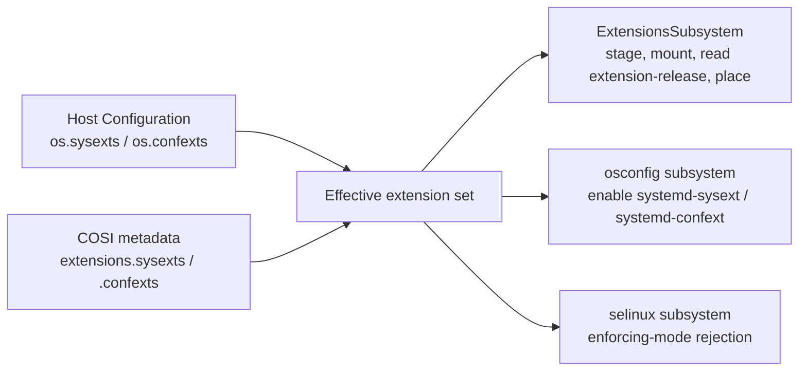

# 0789 COSI Extension Images

- Date: 2026-10-08
- RFC PR: [microsoft/trident#789](https://github.com/microsoft/trident/pull/789)
- Issue: [microsoft/trident#0000](https://github.com/microsoft/trident/issues/0000)

## Summary

COSI files cannot carry systemd system extension (sysext) or configuration
extension (confext) images. This RFC stores them as ZSTD-compressed members of
the COSI tar, alongside partition images, and adds an optional `extensions`
section to the metadata. Each entry reuses the existing
[`ImageFile`](../../Reference/Composable-OS-Image.md#imagefile-object) object and
carries an optional destination path, mirroring the
[`Extension`](../../Reference/Host-Configuration/API-Reference/Extension.md)
object in the Host Configuration.

## Motivation and Goals

Extensions are configured today through `os.sysexts` and `os.confexts`, each
entry a URL and a SHA-384. That makes an extension a second artefact with a
separate lifecycle:

- Hosted separately, for as long as any host may re-run the flow.
- Fetched from a second endpoint at deploy time, with its own network, proxy and
  authentication failure modes.
- Integrity anchored by whoever wrote the Host Configuration, not by
  `os.image.sha384`.
- Changed by a Runtime Update, distinct from the A/B update that ships the OS,
  so content that must land with a new OS requires two operations.

Bundled, an extension is delivered and activated in the same A/B update and the
same reboot as the OS, reusing the existing rollout, health-gating and rollback
machinery. Rollback needs no extra work; see [Rollback](#rollback).

### Why Not Place the Files in the Root Filesystem Image

The builder could place `my-tool.raw` in `/var/lib/extensions/` before the COSI
is built. That works in some configurations, but:

1. Under root or usr verity, modifying the protected filesystem changes the root
   hash and requires re-signing.
2. Extension destinations are commonly on a separate volume, which may be
   created empty rather than written from a partition image.
3. Filesystem image contents are invisible to tooling that reads COSI metadata.
4. Trident enables the merge units, validates placement and reads
   `extension-release` only for extensions it knows about.

### Goals

- Deploy extensions from a COSI without a second artefact, endpoint or update.
- Reuse existing metadata objects and the shape of the Host Configuration API.
- Leave the Host Configuration API unchanged.

## Scope

### Requirements

- An optional `extensions` object in the metadata root, holding `sysexts` and
  `confexts` arrays.
- Each entry identifies its payload with an `ImageFile` and may specify a
  destination path.
- Payloads are ZSTD-compressed tar members under the existing compression and
  integrity rules.
- Trident deploys bundled extensions on Clean Install and A/B Update.
- A change confined to the extension set is applicable as a Runtime Update. See
  [Extension-Only Updates](#extension-only-updates).
- Bundled and Host Configuration extensions coexist; conflicts are an error.
- COSI metadata validation covers the new section.

### Out of Scope

- Changes to the Host Configuration `Extension` object.
- Extension-only COSI files, carrying extensions and no partition images. See
  [Extension-Only Updates](#extension-only-updates).
- Bundled extensions under [disk streaming](../../Explanation/Disk-Streaming.md),
  which cannot enable the merge units. Streaming such a COSI is refused.
- Signing or attestation beyond the SHA-384 chain COSI already provides.
- SELinux compatibility, which is unchanged. See [SELinux](#selinux).
- Producing the DDIs.

### Exit Criteria

- COSI revision 1.3 published with the section, `cosi-metadata-v1.3.schema.json`
  and samples under `tests/cosi/metadata_samples/v1.3/`.
- Trident deploys a COSI carrying a sysext and a confext on Clean Install and
  A/B Update, both merged after reboot. Streaming such a COSI is refused.
- A/B rollback restores the previous extension set with no extra servicing.
- An extension-only change is applied as a Runtime Update without rewriting
  partitions or rebooting, and refused when anything else differs.
- Conflicts between bundled and Host Configuration extensions are a structured
  error.

## Dependencies

A COSI writer that emits the section.
[Image Customizer](https://github.com/microsoft/azure-linux-image-tools) is the
reference writer.

[Extension-Only Updates](#extension-only-updates) additionally require:

- A writer mode that copies an existing COSI's region images verbatim while
  replacing its extension set. Without it, bundled extensions still work, but
  every extension change is an A/B update.
- A surface for requesting a servicing type: a `trident update` flag, an
  internal parameter alongside `forceAbUpdate`, or a Host Configuration field.
  None exists. It must define precedence against `forceAbUpdate` and whether the
  request survives separate stage and finalize invocations.

Three existing defects must be fixed first. All are reachable today with Host
Configuration extensions; bundling makes the first two routine.

1. **In-place replacement deletes the new image.** When an extension keeps its
   ID and destination but changes content, `set_up_extensions` schedules the ID
   for both addition and removal. The addition renames the new image over the
   destination; the removal then deletes that path, because the old entry's
   `temp_path` is its destination. The guard assumes the paths differ.
2. **Staged payloads do not survive the operation.** Runtime finalize and
   rollback construct their `EngineContext` with `image: None`, so the COSI is
   gone after stage. Payloads must be staged durably, and the superseded image
   retained until the operation completes.
3. **Placement is validated against the Host Configuration only, before the COSI
   is read.** `validate_extension_images_locations` is static validation over
   `os.sysexts` and `os.confexts`. See
   [Destination Validation](#destination-validation).

## Implementation

### Tar Layout

Payloads are ZSTD-compressed DDIs under `images/extensions/`, for example
`images/extensions/my-tool.rawzst`.

They stay under `images/`: the specification already permits subdirectories
there and requires readers to handle them. Relaxing `ImageFile.path`'s
`^images/.+` pattern would produce a 1.3 `ImageFile` that fails the 1.0–1.2
schemas and break any validator with that definition compiled in, buying only a
shorter path.

Two existing ordering rules apply. The primary GPT image must immediately follow
`metadata.json` since revision 1.2, so payloads must not sit between them.
Region images must appear in the physical order of the regions on disk;
payloads are not regions, but interleaving them obscures that ordering and hurts
sparse-read locality, so they should be written after all region images.

Writers must account for payloads in the root `compression.maxWindowLog`.

Older readers are unaffected: the specification requires them to ignore unknown
files, and Trident's orphan-image check
(`V1_2ImageFileHasNoCorrespondingPartition`) is driven by the `images[]` and
`disk.gptRegions[]` arrays rather than by walking tar entries.

### Metadata Schema

A new optional root field:

| Field        | Type                             | Added in | Required | Description                                 |
| ------------ | -------------------------------- | -------- | -------- | ------------------------------------------- |
| `extensions` | [Extensions](#extensions-object) | 1.3      | No       | Extension images carried by this COSI file. |

#### `Extensions` Object

| Field      | Type                                       | Added in | Required | Description                     |
| ---------- | ------------------------------------------ | -------- | -------- | ------------------------------- |
| `sysexts`  | [ExtensionImage](#extensionimage-object)[] | 1.3      | No       | System extension images.        |
| `confexts` | [ExtensionImage](#extensionimage-object)[] | 1.3      | No       | Configuration extension images. |

#### `ExtensionImage` Object

| Field   | Type                                                                 | Added in | Required        | Description                                                  |
| ------- | -------------------------------------------------------------------- | -------- | --------------- | ------------------------------------------------------------ |
| `image` | [ImageFile](../../Reference/Composable-OS-Image.md#imagefile-object) | 1.3      | Yes (since 1.3) | Details of the compressed extension image in the tar file.   |
| `path`  | string                                                                | 1.3      | No              | Absolute destination path of the extension on the target OS. |

```json
{
  "properties": {
    "extensions": {
      "description": "Extension images carried by this COSI file.",
      "$ref": "#/$defs/Extensions"
    }
  },
  "$defs": {
    "Extensions": {
      "type": "object",
      "properties": {
        "sysexts": {
          "description": "System extension images to place on the target OS.",
          "type": "array",
          "items": { "$ref": "#/$defs/ExtensionImage" }
        },
        "confexts": {
          "description": "Configuration extension images to place on the target OS.",
          "type": "array",
          "items": { "$ref": "#/$defs/ExtensionImage" }
        }
      }
    },
    "ExtensionImage": {
      "type": "object",
      "required": ["image"],
      "properties": {
        "image": {
          "description": "Details of the compressed extension image file in the tar file.",
          "$ref": "#/$defs/ImageFile"
        },
        "path": {
          "description": "Absolute path of the extension image on the target OS. The file name MUST be `{name}.raw`, where `{name}` matches the suffix of the `extension-release.{name}` file inside the image. When omitted, the reader places the image in its default directory for the extension kind.",
          "type": "string",
          "pattern": "^/.+\\.raw$"
        }
      }
    }
  }
}
```

Example:

```json
{
  "version": "1.3",
  "osArch": "x86_64",
  "osRelease": "NAME=\"Microsoft Azure Linux\"\nID=azurelinux\nVERSION_ID=\"3.0\"\n",
  "images": [
    // Filesystem objects, unchanged.
  ],
  "disk": {
    // Disk object, unchanged.
  },
  "osPackages": [
    // OsPackage objects, unchanged.
  ],
  "bootloader": {
    // Bootloader object, unchanged.
  },
  "compression": { "maxWindowLog": 22 },
  "extensions": {
    "sysexts": [
      {
        "image": {
          "path": "images/extensions/gpu-driver.rawzst",
          "compressedSize": 41943040,
          "uncompressedSize": 134217728,
          "sha384": "3a1f9c0d4e5b6a7c8d9e0f1a2b3c4d5e6f708192a3b4c5d6e7f8091a2b3c4d5e6f708192a3b4c5d6e7f8091a2b3c4d5e"
        },
        "path": "/var/lib/extensions/gpu-driver.raw"
      },
      {
        "image": {
          "path": "images/extensions/debug-tools.rawzst",
          "compressedSize": 8388608,
          "uncompressedSize": 33554432,
          "sha384": "b2c3d4e5f60718293a4b5c6d7e8f90a1b2c3d4e5f60718293a4b5c6d7e8f90a1b2c3d4e5f60718293a4b5c6d7e8f90a1"
        }
      }
    ],
    "confexts": [
      {
        "image": {
          "path": "images/extensions/fleet-config.rawzst",
          "compressedSize": 262144,
          "uncompressedSize": 1048576,
          "sha384": "c3d4e5f60718293a4b5c6d7e8f90a1b2c3d4e5f60718293a4b5c6d7e8f90a1b2c3d4e5f60718293a4b5c6d7e8f90a1b2"
        },
        "path": "/var/lib/confexts/fleet-config.raw"
      }
    ]
  }
}
```

#### Two Arrays Rather Than One With a `kind` Field

Sysexts and confexts have disjoint permitted directories
(`VALID_SYSEXT_DIRECTORIES`, `VALID_CONFEXT_DIRECTORIES`), different defaults,
different `extension-release` locations, different identity fields (`SYSEXT_ID`,
`CONFEXT_ID`) and different activation units. Every downstream rule branches on
the kind. Two arrays make it structural, so it cannot be omitted or wrong, and
match the Host Configuration.

#### Entry Contents

`image` and an optional `path`. Everything else is derivable from the payload,
and each derivable field is a second source of truth.

- **`path`** is kept: the destination is not derivable. Optional, because
  `Extension.path` is optional and defaults to `/var/lib/extensions/{name}.raw`
  or `/var/lib/confexts/{name}.raw`. The existing rules apply — absolute,
  ending in `.raw`, in a permitted directory for its kind, file name matching the
  `extension-release` suffix.
- **Extension name** is rejected: derived from the `extension-release.{name}`
  file name, and the destination file name must already match it.
- **`kind`** is rejected: structural.
- **Extension ID** is rejected: read from `extension-release`, and already the
  identity Trident keys A/B state on.
- **Enable-on-first-boot** is rejected: systemd merges everything in the
  extension directories, and the Host Configuration has no equivalent switch.
- **Version and compatibility metadata** is rejected: `ID`, `VERSION_ID`,
  `SYSEXT_LEVEL`, `CONFEXT_LEVEL`, `ARCHITECTURE` and `SYSEXT_SCOPE` are in the
  DDI and enforced by systemd. Copying them would let a COSI claim compatibility
  the payload lacks.

#### `sha384` Semantics

`ImageFile.sha384` covers the compressed image; `Extension.sha384` covers the
raw file. For integrity this matches partition images — Trident hashes the
compressed stream as it decompresses — so a second hash of the DDI would add
nothing.

`ExtensionData.sha384` is a single field serving both as change detector and as
the key matching a processed extension to its Host Configuration entry, so the
effective entry must record the hash with its source and compare only within a
source. A compressed hash against a raw hash is always unequal and would report
every extension as changed.

Within one source the comparison is sound but imprecise: compressed hashes are
unstable across recompressions, so identical DDIs at different ZSTD levels
appear to differ. The result is a redundant copy, never a missed update.

### Versioning

COSI revision 1.3. `extensions` is optional; absent equals empty.

A newer Trident reading a 1.0–1.2 COSI sees no bundled extensions and behaves as
today.

An older Trident reading a 1.3 COSI accepts it — the version check rejects only
`major != 1`, and unknown fields must be ignored — deploys the OS correctly, and
omits the extensions silently. This cannot be corrected in-band, since any
tripwire field is one such a reader must ignore. Nor does it self-heal: the old
reader records the new COSI as deployed, so after upgrading Trident the same
Host Configuration is no longer an image change and the skipped extensions are
never installed. Recovery needs a forced redeployment or a republished COSI.

Mitigations:

1. Document that bundled extensions require a reader that understands 1.3.
2. Warn in `validate_cosi_metadata_version` when `minor` exceeds the highest
   known revision. This makes future minor bumps diagnosable from the log.
3. Where the target's Trident version cannot be controlled, gate the update on a
   [health check](../../Reference/Host-Configuration/API-Reference/Health.md)
   asserting the extension is merged, so the A/B update fails and rolls back.
   Given that the omission does not self-heal, this is the only real safeguard.

### Trident-Side Consumption

Trident computes an **effective extension set**, the union of the Host
Configuration and COSI entries, and the code reading `ctx.spec.os.sysexts` and
`ctx.spec.os.confexts` reads that instead. Each entry carries its source, which
determines where a resolved path is written back.


```mermaid
flowchart LR
    HC["Host Configuration<br/>os.sysexts / os.confexts"] --> Eff
    COSI["COSI metadata<br/>extensions.sysexts / .confexts"] --> Eff
    Eff["Effective extension set"] --> Ext["ExtensionsSubsystem<br/>stage, mount, read extension-release, place"]
    Eff --> Osc["osconfig subsystem<br/>enable systemd-sysext / systemd-confext"]
    Eff --> Sel["selinux subsystem<br/>enforcing-mode rejection"]
```

Three consumers:

- **`ExtensionsSubsystem`.** `populate_extensions` downloads each entry over
  `Extension.url`, verifies the hash and mounts the DDI to read
  `extension-release`. For a bundled entry only the source changes: the image
  streaming pipeline decompresses the tar member into the same staging directory
  and verifies `ImageFile.sha384` over the compressed stream. The rest is
  unchanged. `update_host_configuration` fails when a processed extension has no
  Host Configuration entry matching by hash, so it must write back resolved
  paths for Host-Configuration-sourced entries only.
- **`osconfig`.** The merge units are enabled only when `ctx.spec.os.sysexts` or
  `confexts` are non-empty, so a COSI-only host would never have them enabled
  and its extensions would sit unused. This check must read the effective set.
- **`selinux`.** The validation raising `ExtensionImagesAndSelinuxUnsupported`
  must read the effective set too, or a bundled extension with an enforcing-mode
  Host Configuration passes and produces a mislabelled `/usr`, `/opt` or `/etc`.
  That alone is insufficient: the check runs inside `configure`, which returns
  early for Runtime Updates, and `SelinuxSubsystem` inherits
  `runs_on = REQUIRES_REBOOT`. It must move to a hook running on every servicing
  type, or [Extension-Only Updates](#extension-only-updates) bypass it.

[Disk streaming](../../Explanation/Disk-Streaming.md) is excluded. The effective
set needs no synthesis from `derive_host_configuration`, but `osconfig` returns
early when `is_stream_image` is set, so the units are never enabled and the
extensions would be placed and never merged. Trident refuses to stream a COSI
carrying extensions rather than produce that state. Lifting the exclusion means
giving streaming a way to enable the units, which is separable work.

#### Deployed Extension Inventory

The Host Configuration records what an operator asked for, so `ctx.spec_old`
does not describe what is deployed. Without a second record Trident cannot
determine which bundled extensions to remove, detect collisions against the
deployed set, compare sets for servicing selection, or rebuild its state when
finalize runs separately from stage.

Trident records a deployed extension inventory in the Host Status, alongside the
[deployed image summary](#deployed-image-summary): per entry, kind, extension
ID, name, resolved destination, source, and the hash under that source's
semantics. `extensions_old` is populated from it rather than from
`ctx.spec_old`.

Inventory and summary follow the discipline already applied to `spec` and
`spec_old`: a staged operation records a pending record while the deployed one
is retained, and resetting a staged operation reverts to the deployed one.
Promotion follows the servicing type rather than the finalize step. Runtime
Update and `ManualRollbackRuntime` promote on completion, transitioning straight
to `Provisioned`. Clean Install, A/B Update and manual A/B rollback only reach a
`*Finalized` state before rebooting and commit after booting the expected root,
so their pending record must survive the reboot, be promoted at commit, and be
discarded when the boot check fails and `spec_old` is restored.

`ManualRollbackChainItem` carries only kind, `spec`, active volume and install
index, so it must carry the historical inventory and summary as well. Even then,
metadata alone is insufficient for a manual runtime rollback: the context is
built with `image: None` and the superseded payload is retained only for the
operation that replaced it. Either payloads are kept in a content-addressed
store for as long as the rollback chain references them, with the inventory
holding the reference, or manual runtime rollback across a bundled extension
change is refused. Refusing is the safe default; silently restoring nothing is
not.

#### Destination Validation

`validate_extension_images_locations` rejects destinations not on an A/B volume
when A/B is configured, but it is static validation over the Host Configuration
lists and runs before the COSI is read.

The equivalent check for the effective set runs after the COSI loads, as dynamic
validation against the storage graph, rejecting a destination that is shared
when A/B is configured. It must resolve the filesystem that actually backs the
destination for the servicing type, not the image's nominal layout: under
root-verity the engine mounts a writable `/etc` overlay during provision, backed
by `/var/lib/trident-overlay` on an A/B volume, so `/etc/extensions/` is
writable and rolls back with the slot. Rejecting verity-backed destinations
outright would reject that supported case. The same destination has no such
backing on a Runtime Update and must be rejected there.

#### Where Images Are Written

On Clean Install and A/B Update, `provision()` runs with the target root at
`mount_path`, and extensions are staged and moved to their destination inside
it. For A/B that is the inactive slot, so the running system is untouched until
reboot. Staging currently uses a fixed `/var/lib/extensions/.staging` with a
non-atomic copy when the rename crosses a filesystem boundary, which assumes
`/var` is writable and makes placement non-atomic for `/etc/extensions/` or
`/usr/lib/confexts/`. It should use a temporary file on the destination's own
filesystem.

On Runtime Update `provision()` is not called, so partitions are never touched
and extensions are placed in the running root. See
[Extension-Only Updates](#extension-only-updates).

#### Rollback

Extension images are files in the slot's own filesystem. Where every destination
is on an A/B volume, the previous slot retains the previous set, an A/B rollback
boots it, `systemd-sysext` merges what it finds, and the extension set reverts
with the OS.

That guarantee depends on the placement check covering bundled destinations; see
[Destination Validation](#destination-validation). A bundled extension on a
shared volume changes the running slot immediately and cannot be rolled back.

#### Extension-Only Updates

`ab_update_required()` returns true whenever `os.image.sha384` differs, before
any subsystem is consulted, and the metadata hash covers the `extensions`
section. Changing only a bundled extension would therefore force a full A/B
update, making bundling strictly more disruptive than the status quo.

An extension-only COSI is the wrong shape for this. The metadata root requires
`images`, `disk` with at least one `gptRegions` entry, `bootloader` and
`osPackages`, and every consumer of `os.image` — filesystem source resolution,
`derive_host_configuration`, ESP detection, verity setup — assumes a complete
OS. The distinction is drawn on content equality, not absent content.

##### Deployed Image Summary

Trident retains only the URL and metadata hash of the applied image, and
re-fetching the previous COSI to diff it is not dependable, so it must record
what it deployed.

The summary holds, for each entry in `images[]` and `disk.gptRegions[]`, the
`image.sha384`, `uncompressedSize` and the entry's identity (partition number,
mount point, `fsType`, `fsUuid`, `partType`, verity root hash); plus `osArch`,
`osRelease`, `disk` geometry and `bootloader`. Excluded:

- `extensions`, the subject of the comparison.
- `osPackages`, which Trident validates but never acts on.
- `compression.maxWindowLog`, which governs decompression rather than content
  and which a new extension may legitimately raise.
- `id`, which identifies the file rather than its content.

A record rather than a digest: the digest is derivable from it, and the record
also lets Trident report which partition differs.

The summary is versioned. Where it is absent or unrecognised, Trident falls back
to comparing `os.image.sha384`, so existing hosts are unaffected until their
next deployment.

| Summary | Extension set | Image requires    |
| ------- | ------------- | ----------------- |
| Equal   | Equal         | Nothing.          |
| Equal   | Differs       | A Runtime Update. |
| Differs | Any           | An A/B update.    |

This is the image's requirement, not the outcome. `select_servicing_type` still
takes the maximum across subsystems, so a concurrent change to users, modules or
the kernel command line can independently require an A/B update.

The no-op row is new: `os.image.sha384` changes whenever any part of the
metadata changes, including `id` and the ordering of `osPackages`, so a
materially identical image currently forces an A/B update.

##### Constructing an Extension-Only Update

Summary equality requires byte-identical region images, and filesystem images
are not reproducible: filesystem UUIDs, inode timestamps, superblock creation
and mount times and allocation order vary between builds, and ZSTD output varies
with level and library version.

So the build operation is not "rebuild the image identically with a different
extension set", it is "copy an existing COSI, replacing its extension set".
Region images and their metadata entries are copied verbatim; nothing is rebuilt
or recompressed. Only the extension tar members, the `extensions` section,
`compression.maxWindowLog` where a larger window is needed, and `id` change.
Equality then holds by construction, and the operation is a tar rewrite rather
than an image build.

A COSI rebuilt from source instead will differ, and Trident will select an A/B
update. The failure mode of an unreproducible build is a redundant A/B update,
never a skipped one.

##### Requested and Verified, Never Inferred

An extension-only update proceeds when all of:

1. A Runtime Update is explicitly requested.
2. The recorded summary equals the summary computed from the new COSI.
3. The recorded image is the deployed one: servicing completed, no A/B update
   pending, active volume matching the Host Status.
4. No other subsystem requires an A/B update.

If a Runtime Update is requested and any of 2 to 4 fails, Trident fails with a
structured error naming what differs. It must not promote the operation to an
A/B update, and must not apply the extension change while leaving other changes
unapplied.

A no-op must still record the accepted image and summary.
`select_servicing_type` returning `NoActiveServicing` causes `update` to return
without persisting anything, so a metadata-only status transition is needed or
every subsequent invocation repeats the comparison.

##### Rollback on This Path

A Runtime Update replaces files in the running slot, because
`set_up_extensions` skips removal of the superseded image only on Clean Install
and A/B Update. Rollback re-runs the subsystem with the specs reversed and must
restore the previous image, but cannot re-fetch it: finalize and rollback build
their `EngineContext` with `image: None`, and auto-rollback runs unconditionally
after a finalize failure. The superseded image must be retained for the duration
of the operation.

Rollback is therefore bounded by the retained payload surviving, rather than by
booting an untouched slot. That is why the path is requested rather than
inferred: it trades a rollback guarantee for the absence of a reboot, and the
operator should make that trade.

#### Interaction With Host Configuration `sysexts` and `confexts`

The sets are merged, and a collision is an error.

Both are valid at once and express different intents: bundled extensions are
content the image author considers part of the OS, Host Configuration entries
are content the operator adds at deploy time. An image shipping one sysext and
an operator adding another is the expected case. Silent precedence is rejected,
since an override would run software the image author never validated with no
visible symptom.

A collision is either:

1. **The same destination path**, detectable from metadata when both sides
   specify `path`, extending the existing `DuplicateExtensionImagePath` rule.
2. **The same extension ID** within a kind, detectable only after mounting. ID
   uniqueness is documented but unenforced today; the merged set makes
   collisions likelier, so it should become an enforced check.

Two entries identical in every respect are still a collision; an exception would
introduce hash-comparison subtleties when the operator can simply drop their
entry. A per-extension override, if needed, belongs on the Host Configuration
side as an opt-in. See [Open Questions](#open-questions).

### Validation

#### COSI Metadata Validation

New `CosiMetadataErrorKind` variants, following the existing `V1_<minor>`
prefix:

| Variant                                           | Condition                                                                                       |
| ------------------------------------------------- | ----------------------------------------------------------------------------------------------- |
| `V1_3ExtensionDestinationPathNotAbsolute`          | `path` is present and not absolute.                                                              |
| `V1_3ExtensionDestinationPathInvalidFileExtension` | `path` is present and does not end in `.raw`.                                                    |
| `V1_3ExtensionDestinationPathInvalidDirectory`     | `path`'s parent is not in `VALID_SYSEXT_DIRECTORIES` or `VALID_CONFEXT_DIRECTORIES` for the kind. |
| `V1_3DuplicateExtensionDestinationPath`            | Two entries both specify `path` and specify the same one.                                        |
| `V1_3DuplicateExtensionImagePath`                  | Two entries reference the same tar member.                                                       |
| `V1_3ExtensionImagePathCollidesWithRegionImage`    | An entry's `image.path` is also referenced by `images[]` or `disk.gptRegions[]`.                  |

Directory and file-extension rules reuse the logic behind
`Extension::validate_sysext` and `validate_confext`.

Destination collisions are only partly detectable here: an entry omitting `path`
resolves using the `{name}` inside the DDI, so two omitted paths may collide
invisibly. That case is caught after mounting.

Member existence is not checked at load. `Cosi::new` scans tar entries only as
far as `metadata.json` and discovers the rest on demand, so a missing member
surfaces when it is read. Checking up front would require scanning the whole
archive, which conflicts with sparse reads.

#### Deploy-Time Validation

After the DDI is mounted:

- **File name matches the `extension-release` suffix.** Already enforced by
  `read_extension_release`.
- **Exactly one `extension-release` file, with `SYSEXT_ID` or `CONFEXT_ID`.**
  Already enforced.
- **SHA-384 agreement**, verified over the compressed stream as the payload is
  decompressed. A mismatch aborts servicing.
- **Resolved destination collisions** across the effective set, covering the
  omitted-`path` cases.
- **Extension ID uniqueness** across the effective set, per kind.
- **Destination placement** against the storage graph. See
  [Destination Validation](#destination-validation).
- **`extension-release` OS compatibility.** Warn when a bundled extension
  declares `ID=<distro>` that does not match the COSI's `osRelease`: systemd will
  refuse to merge it and the host will come up without it. Warn on `ID` alone —
  systemd accepts a `VERSION_ID` mismatch when `SYSEXT_LEVEL` or `CONFEXT_LEVEL`
  matches, so warning on version would flag valid extensions.

#### `ID=_any`

Trident should not warn or refuse when an `ID=_any` extension is bundled. `_any`
describes what the extension is compatible with, not how it should be delivered,
and bundling a portable extension is how an air-gapped or single-artefact
deployment is achieved. The useful check is the inverse one above.

### SELinux

Unchanged. Extensions remain incompatible with SELinux in enforcing mode on
systemd 255, because merging the overlays mislabels `/usr`, `/opt` and `/etc`,
and carrying the image in a COSI does not affect labelling.

What changes is where the check looks and when it runs: the validation raising
`ExtensionImagesAndSelinuxUnsupported` inspects the Host Configuration lists only
and runs inside `configure`, which returns early for anything but Clean Install
and A/B Update. It must read the effective set and run on every servicing type.

## Public API Design

The COSI metadata format is a public contract with its own
[specification](../../Reference/Composable-OS-Image.md) and published schemas, so
the additions above are the public API change. They are additive and optional.

The Host Configuration API does not change. The observable difference is that a
host may end up with more extensions than its Host Configuration lists, and that
specifying an extension the image already carries is now an error.

## Testing and Metrics

- **Schema.** Add `cosi-metadata-v1.3.schema.json` and samples under
  `tests/cosi/metadata_samples/v1.3/{valid,invalid}/`; the existing workflow
  picks up a new revision automatically. Invalid samples cover what the schema
  can express: `image.path` outside `images/`, a non-absolute destination, and a
  destination not ending in `.raw`. The permitted-directory allow-list is Trident
  policy rather than a property of the format — systemd searches directories
  Trident does not accept — so it stays out of the schema, and the
  kind-specific directory and duplicate-destination rules are covered by Rust
  tests.
- **Unit.** Each new error variant; effective set computation including
  collisions and the source discriminator; default-path resolution; replacement
  of an extension keeping its ID and destination but changing content.
- **Functional.** A COSI carrying a sysext and a confext: Clean Install places
  both, enables the merge units, and both merge after boot.
- **Servicing.** A/B update from extension set A to B, asserting the new slot has
  B, the old retains A, and rollback restores A. An extension-only Runtime Update
  between a COSI and a copy with a different extension set, asserting partitions
  are untouched. Finalize and rollback of that update as distinct processes,
  asserting the previous image is restored without access to either COSI. A
  pending inventory surviving an A/B reboot, promoted at commit and discarded
  when the boot check fails.
- **Negative.** Streaming a COSI carrying extensions is refused; the same
  extension in both sources is a structured error; a bundled extension with
  SELinux `enforcing` is rejected on A/B update and on extension-only Runtime
  Update; a bundled destination on a shared volume is rejected when A/B is
  configured; a Runtime Update between differing image summaries is refused
  rather than promoted or partially applied.

## Servicing

Additive at every layer.

- A 1.2 COSI, and a 1.3 COSI without `extensions`, behave identically.
- A 1.3 COSI with extensions read by an older Trident deploys the OS and omits
  the extensions. See [Versioning](#versioning).
- Hosts using `os.sysexts` or `os.confexts` are unaffected unless they move to an
  image carrying the same extension, which is now an explicit error.
- Existing hosts have no recorded image summary, so servicing type selection is
  unchanged until their next deployment.

## Implementation Plan

0. Prerequisites from [Dependencies](#dependencies). The in-place replacement fix
   is a standalone bug and should land independently.
1. COSI revision 1.3: the `extensions` section, the schema and samples.
2. Trident reader: parse `extensions`, metadata validation and the new error
   variants, and the minor-version warning.
3. Effective extension set with its source discriminator and the deployed
   extension inventory; plumbed into the extensions, `osconfig` and `selinux`
   subsystems, including the collision errors and the move of the SELinux check.
4. Stream a tar member into the staging directory, replacing the URL fetch for
   bundled entries. Dynamic destination validation.
5. Deployed image summary and the extension-only Runtime Update path.
6. Tests, then documentation updates to
   [Sysexts](../../Explanation/Sysexts.md),
   [Confexts](../../Explanation/Confexts.md) and
   [How Trident Consumes COSI](../../Explanation/How-Trident-Consumes-COSI.md).

Steps 1 and 2 are independently useful: a reader that parses and validates the
section but ignores it is a safe intermediate state. Steps 3 and 4 deliver
bundled extensions on Clean Install and A/B Update and are shippable without
step 5, but step 5 is required for this RFC to be complete — without it every
extension change is an A/B update.

## Counter-Arguments

### Drawbacks

- **Cadence coupling.** A new version of the extension requires a new COSI.
  [Extension-Only Updates](#extension-only-updates) remove the reboot and reduce
  the build to a copy, but a new COSI must still be published. For content that
  must match the OS, such as kernel modules or GPU drivers, this costs nothing.
  For content versioned independently it is a real loss of agility, and the Host
  Configuration route stays correct.
- **Size.** COSI files grow, and every host pays for every bundled extension,
  including those it does not use.
- **No opt-out.** A host wanting the image but not one of its extensions cannot
  say so. See [Open Questions](#open-questions).
- **Two sources.** Merging and its collision rules are more complexity in the
  extensions subsystem than exists today.
- **Forward compatibility.** An older reader produces a host without the
  extensions and reports nothing.

### Alternatives

**Host Configuration only (status quo).** Maximum decoupling: the extension is
versioned, hosted and updated independently, and a change is a Runtime Update
with no reboot. Remains fully supported, and is wrong only when the extension
must land in lockstep with a new OS.

**Place the `.raw` files in the root filesystem image.** No specification change.
See
[Why Not Place the Files in the Root Filesystem Image](#why-not-place-the-files-in-the-root-filesystem-image).

**Relax `ImageFile.path` to allow a top-level `extensions/` prefix.** Rejected in
[Tar Layout](#tar-layout).

**One array with a `kind` discriminator.** Rejected in
[Two Arrays Rather Than One With a `kind` Field](#two-arrays-rather-than-one-with-a-kind-field).

#### Prior Art

Flatcar's sysext-bakery pattern pairs pre-built DDIs with
[`systemd-sysupdate`](https://www.freedesktop.org/software/systemd/man/latest/systemd-sysupdate.html):
artefacts hosted over HTTP with a `SHA256SUMS` manifest, staged against a
transfer definition, activated by a refresh or reboot. It suits content with its
own cadence and is close in spirit to `os.sysexts`, except that
`systemd-sysupdate` has no OCI transport whereas `Extension.url` accepts
`oci://`. Both optimise for extensions that move independently of the OS;
bundling optimises for extensions that must move with it, at the cost of cadence.
`ID=_any` against `ID=<distro>` indicates which a given extension belongs in.

## Open Questions

- **What does the deployed image summary cover?** Excluding too much permits a
  Runtime Update between images differing in ways Trident does not model;
  including too much rejects legitimate cases. `version` is currently excluded,
  on the basis that a revision bump with identical images deploys identical
  bytes.
- **A structured record or a digest?** A record is proposed, so Trident can
  report which partition differs. A digest is smaller and simpler.
- **Does the no-op outcome belong here?** It needs a metadata-only status
  transition recording an accepted image without a rollbackable operation — a
  behavioural change independent of extensions.
- **Where does the retained superseded image live, and for how long?** The
  staging directory covers only the operation itself; a content-addressed store
  bounded by the rollback chain also covers manual runtime rollback, at the cost
  of disk. The alternative is refusing that rollback.
- **Should an override escape hatch exist?** An opt-in on the Host Configuration
  side would permit pinning a hotfixed extension without rebuilding the image,
  and equally permit running a combination the image author did not validate.
  Recommendation: ship strict, add the hatch if a need appears.
- **Should a bundled extension be suppressible?** A deny list has no analogue in
  the current API and no concrete requester.
- **Should `path` be required?** Optional with defaults is proposed for symmetry
  with the Host Configuration.
- **Naming.** `extensions` containing `sysexts` and `confexts`, against two
  top-level arrays. The nested form keeps the root object small; the flat form
  is a closer match to `os.sysexts`.
- **Should Host Configuration extension ID uniqueness be enforced independently
  of this work?** Documented but unenforced; arguably a pre-existing gap.
- **Must writers place payloads after all region images, or is SHOULD enough?**

## Future Possibilities

- **Portable service images.** DDIs with the same shape and placement problem.
- **Per-extension selection at deploy time**, keyed on extension ID, if one
  image must serve hosts with different extension sets.
- **Initrd-scoped extensions.** `SYSEXT_SCOPE=initrd` is parsed by
  `ExtensionRelease` but not acted on. A bundled payload suits initrd scope,
  being available before the root filesystem.
- **Bundled extensions under disk streaming**, which needs a way to enable the
  merge units on a streamed install.
- **Reporting the extension inventory** through the CLI and gRPC API, making the
  running extension set answerable without inspecting the filesystem.
