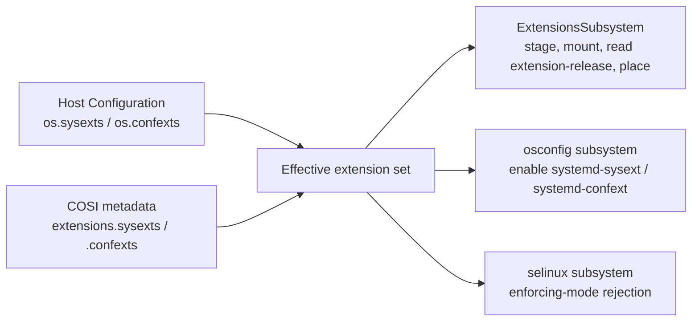

# 0789 COSI Extension Images

- Date: 2026-09-08
- RFC PR: [microsoft/trident#789](https://github.com/microsoft/trident/pull/789)
- Issue: [microsoft/trident#0000](https://github.com/microsoft/trident/issues/0000)

## Summary

COSI files cannot carry systemd system extension (sysext) or configuration
extension (confext) images. This RFC stores extension images as ZSTD-compressed
members of the COSI tar, alongside partition images, and adds an optional
`extensions` section to the COSI metadata to describe them. Each entry reuses
the existing [`ImageFile`](../../Reference/Composable-OS-Image.md#imagefile-object)
object and carries an optional destination path, mirroring the
[`Extension`](../../Reference/Host-Configuration/API-Reference/Extension.md)
object in the Host Configuration. Trident deploys bundled extensions as part of
the image, in the same operation as the rest of the OS.

## Motivation and Goals

Extensions are configured today through `os.sysexts` and `os.confexts` in the
Host Configuration, where each entry is a URL and a SHA-384. This makes an
extension a second artefact with a separate lifecycle:

- It must be hosted separately, for as long as any host may re-run the flow.
- It is fetched in full from a second endpoint at deploy time, with its own
  network, proxy and authentication failure modes.
- Its integrity is anchored by whoever wrote the Host Configuration, not by
  `os.image.sha384`.
- Changing it is a Runtime Update, distinct from the A/B update that ships the
  OS. Content that must land with a new OS requires two operations.

### A/B Updates

A bundled extension is delivered and activated in the same A/B update and the
same reboot as the OS, and reuses the existing rollout, health-gating and
rollback machinery.

Rollback requires no additional work: extension images are files in the target
slot's filesystem, so the previous slot retains the previous set. See
[Rollback](#rollback).

### Why Not Place the Files in the Root Filesystem Image

The image builder could place `my-tool.raw` in `/var/lib/extensions/` before the
COSI is built. This works in some configurations, but:

1. With root or usr verity, modifying the protected filesystem changes the root
   hash and requires re-signing.
2. Extension destinations are commonly on a separate volume, which may be
   created empty rather than written from a partition image.
3. Contents of a filesystem image are not visible to tooling that reads COSI
   metadata.
4. Trident enables `systemd-sysext.service` and `systemd-confext.service`,
   validates placement, and reads `extension-release` only for extensions it
   knows about.

### Goals

- Carry extension images in a COSI file and deploy them without a second
  artefact, endpoint or update.
- Reuse existing metadata objects and match the shape of the Host Configuration
  API.
- Leave the Host Configuration API unchanged.

## Scope

### Requirements

- An optional `extensions` object in the COSI metadata root, containing
  `sysexts` and `confexts` arrays.
- Each entry identifies its payload with an `ImageFile` object and may specify a
  destination path on the target OS.
- Extension payloads are ZSTD-compressed tar members, subject to the existing
  compression and integrity rules.
- Trident deploys bundled extensions on Clean Install and A/B Update, reusing
  the extensions subsystem.
- A change confined to the extension set is applicable as a Runtime Update,
  without rewriting partitions or rebooting. See
  [Extension-Only Updates](#extension-only-updates).
- Bundled and Host Configuration extensions coexist; conflicts are an error.
- COSI metadata validation covers the new section.

### Out of Scope

- Changes to the Host Configuration `Extension` object.
- Extension-only COSI files, meaning a COSI carrying extensions and no partition
  images. See [Extension-Only Updates](#extension-only-updates).
- Signing or attestation beyond the SHA-384 chain COSI already provides.
- SELinux compatibility. That limitation is unchanged; see [SELinux](#selinux).
- Producing the DDIs. This RFC specifies how a COSI carries an extension image,
  not how the image is built.

### Exit Criteria

- COSI revision 1.3 published with the `extensions` section,
  `cosi-metadata-v1.3.schema.json`, and samples under
  `tests/cosi/metadata_samples/v1.3/`.
- Trident deploys a COSI carrying a sysext and a confext on Clean Install and on
  A/B Update, and both are merged after reboot.
- A/B rollback restores the previous extension set with no additional servicing.
- Conflicts between bundled and Host Configuration extensions produce a
  structured error.

## Dependencies

A COSI writer that emits the section.
[Image Customizer](https://github.com/microsoft/azure-linux-image-tools) is the
reference writer.

[Extension-Only Updates](#extension-only-updates) additionally require:

- A writer mode that copies an existing COSI's region images verbatim while
  replacing its extension set. Without it, bundled extensions still work, but
  every extension change is an A/B update.
- A surface for requesting a servicing type: a `trident update` flag, an
  internal parameter alongside `forceAbUpdate`, or a Host Configuration field.
  None exists today. This is a prerequisite rather than an optional refinement,
  because the path is never inferred, and it must define precedence against
  `forceAbUpdate` and whether the request persists across separate stage and
  finalize invocations.

Three defects in the existing extensions subsystem must be fixed first. All are
reachable today with Host Configuration extensions; bundling makes the first two
the common case rather than the exception.

1. **In-place replacement deletes the new image.** When an extension keeps its
   ID and destination but changes content, `set_up_extensions` schedules the ID
   for both addition and removal. The addition renames the new image over the
   destination; the removal then deletes that same path, because the old
   entry's `temp_path` is its destination. The guard assumes the two paths
   differ. A bundled extension updated in place hits this on every Runtime
   Update.
2. **Staged payloads do not survive the operation.** Runtime finalize and
   rollback construct their `EngineContext` with `image: None`, so the COSI is
   unavailable after stage. Bundled payloads must be staged durably, and the
   superseded image must be retained until the operation completes.
3. **Extension placement is validated against the Host Configuration only, and
   before the COSI is read.** `validate_extension_images_locations` is static
   validation over `os.sysexts` and `os.confexts`. Bundled destinations need
   the same check after the COSI is loaded. See
   [Destination Validation](#destination-validation).

## Implementation

### Tar Layout

Extension payloads are ZSTD-compressed DDI files under `images/extensions/`,
for example `images/extensions/my-tool.rawzst`.

They remain under `images/`. The specification already permits subdirectories of
`images/` and requires readers to handle them, so no new tar-layout rule is
needed. `ImageFile.path` is constrained by `"pattern": "^images/.+"` in every
published schema; relaxing it would produce a revision 1.3 `ImageFile` that
fails validation against the 1.0–1.2 schemas and break any validator with an
`ImageFile` definition compiled in, for no benefit beyond a shorter path.

Two existing ordering constraints apply:

- Since revision 1.2 the primary GPT image must immediately follow
  `metadata.json`. Extension payloads must not be placed between them.
- Region images must appear in the physical order of the regions on the source
  disk. Extension payloads are not regions, but interleaving them complicates
  verification of that ordering and hurts sparse-read locality. Extension
  payloads should be written after all region images.

Writers must account for extension payloads when computing the existing root
`compression.maxWindowLog`.

Older readers are unaffected by the additional tar members. The specification
requires readers to ignore unknown files, and Trident's orphan-image check
(`V1_2ImageFileHasNoCorrespondingPartition`) is driven by the `images[]` and
`disk.gptRegions[]` arrays rather than by walking tar entries.

### Metadata Schema

A new optional root field:

| Field        | Type                             | Added in | Required | Description                                 |
| ------------ | -------------------------------- | -------- | -------- | ------------------------------------------- |
| `extensions` | [Extensions](#extensions-object) | 1.3      | No       | Extension images carried by this COSI file. |

#### `Extensions` Object

| Field      | Type                                       | Added in | Required | Description                     |
| ---------- | ------------------------------------------ | -------- | -------- | ------------------------------- |
| `sysexts`  | [ExtensionImage](#extensionimage-object)[] | 1.3      | No       | System extension images.        |
| `confexts` | [ExtensionImage](#extensionimage-object)[] | 1.3      | No       | Configuration extension images. |

#### `ExtensionImage` Object

| Field   | Type                                                                 | Added in | Required        | Description                                                  |
| ------- | -------------------------------------------------------------------- | -------- | --------------- | ------------------------------------------------------------ |
| `image` | [ImageFile](../../Reference/Composable-OS-Image.md#imagefile-object) | 1.3      | Yes (since 1.3) | Details of the compressed extension image in the tar file.   |
| `path`  | string                                                                | 1.3      | No              | Absolute destination path of the extension on the target OS. |

```json
{
  "properties": {
    "extensions": {
      "description": "Extension images carried by this COSI file.",
      "$ref": "#/$defs/Extensions"
    }
  },
  "$defs": {
    "Extensions": {
      "type": "object",
      "properties": {
        "sysexts": {
          "description": "System extension images to place on the target OS.",
          "type": "array",
          "items": { "$ref": "#/$defs/ExtensionImage" }
        },
        "confexts": {
          "description": "Configuration extension images to place on the target OS.",
          "type": "array",
          "items": { "$ref": "#/$defs/ExtensionImage" }
        }
      }
    },
    "ExtensionImage": {
      "type": "object",
      "required": ["image"],
      "properties": {
        "image": {
          "description": "Details of the compressed extension image file in the tar file.",
          "$ref": "#/$defs/ImageFile"
        },
        "path": {
          "description": "Absolute path of the extension image on the target OS. The file name MUST be `{name}.raw`, where `{name}` matches the suffix of the `extension-release.{name}` file inside the image. When omitted, the reader places the image in its default directory for the extension kind.",
          "type": "string",
          "pattern": "^/.+\\.raw$"
        }
      }
    }
  }
}
```

Example:

```json
{
  "version": "1.3",
  "osArch": "x86_64",
  "osRelease": "NAME=\"Microsoft Azure Linux\"\nID=azurelinux\nVERSION_ID=\"3.0\"\n",
  "images": [
    // Filesystem objects, unchanged.
  ],
  "disk": {
    // Disk object, unchanged.
  },
  "osPackages": [
    // OsPackage objects, unchanged.
  ],
  "bootloader": {
    // Bootloader object, unchanged.
  },
  "compression": { "maxWindowLog": 22 },
  "extensions": {
    "sysexts": [
      {
        "image": {
          "path": "images/extensions/gpu-driver.rawzst",
          "compressedSize": 41943040,
          "uncompressedSize": 134217728,
          "sha384": "3a1f9c0d4e5b6a7c8d9e0f1a2b3c4d5e6f708192a3b4c5d6e7f8091a2b3c4d5e6f708192a3b4c5d6e7f8091a2b3c4d5e"
        },
        "path": "/var/lib/extensions/gpu-driver.raw"
      },
      {
        "image": {
          "path": "images/extensions/debug-tools.rawzst",
          "compressedSize": 8388608,
          "uncompressedSize": 33554432,
          "sha384": "b2c3d4e5f60718293a4b5c6d7e8f90a1b2c3d4e5f60718293a4b5c6d7e8f90a1b2c3d4e5f60718293a4b5c6d7e8f90a1"
        }
      }
    ],
    "confexts": [
      {
        "image": {
          "path": "images/extensions/fleet-config.rawzst",
          "compressedSize": 262144,
          "uncompressedSize": 1048576,
          "sha384": "c3d4e5f60718293a4b5c6d7e8f90a1b2c3d4e5f60718293a4b5c6d7e8f90a1b2c3d4e5f60718293a4b5c6d7e8f90a1b2"
        },
        "path": "/var/lib/confexts/fleet-config.raw"
      }
    ]
  }
}
```

#### Two Arrays Rather Than One With a `kind` Field

Sysexts and confexts have disjoint sets of permitted destination directories
(`VALID_SYSEXT_DIRECTORIES` and `VALID_CONFEXT_DIRECTORIES`), different
defaults, different `extension-release` locations
(`/usr/lib/extension-release.d/` and `/etc/extension-release.d/`), different
identity fields (`SYSEXT_ID` and `CONFEXT_ID`) and different activation units.
Every downstream rule branches on the kind.

With two arrays the kind is structural, so no `kind` field is required and it
cannot be omitted or incorrect. It is also the shape the Host Configuration
already uses.

#### Entry Contents

An entry carries `image` and an optional `path`. Everything else considered is
derivable from the payload, and each derivable field adds a second source of
truth.

- **`path`** is retained. It is the destination on the target OS and is not
  derivable. It is optional because `Extension.path` is optional and defaults to
  `/var/lib/extensions/{name}.raw` or `/var/lib/confexts/{name}.raw`. When
  present it must be absolute, must end in `.raw`, must be in a permitted
  directory for its kind, and its file name must match the `extension-release`
  suffix. These rules already exist.
- **Extension name** is rejected. Trident derives it from the
  `extension-release.{name}` file name inside the DDI and already requires the
  destination file name to match. A `name` field would be a third copy of the
  same string.
- **`kind`** is rejected; it is structural.
- **Extension ID** (`SYSEXT_ID`, `CONFEXT_ID`) is rejected. It is read from
  `extension-release` and is the identity Trident keys A/B state on.
- **Enable-on-first-boot** is rejected. systemd merges everything in the
  extension directories, and the Host Configuration has no per-extension switch.
  Adding one here would create semantics the Host Configuration cannot express.
- **Version and compatibility metadata** is rejected. `ID`, `VERSION_ID`,
  `SYSEXT_LEVEL`, `CONFEXT_LEVEL`, `ARCHITECTURE` and `SYSEXT_SCOPE` are in the
  DDI's `extension-release`, and systemd enforces them at merge time. Copying
  them into metadata would allow a COSI to claim compatibility the payload does
  not have.

#### `sha384` Semantics

`ImageFile.sha384` covers the compressed image; `Extension.sha384` covers the
raw extension image file. Reusing `ImageFile` therefore changes what the hash
covers.

For integrity this is equivalent to partition images: Trident hashes the
compressed stream as it decompresses, and a match proves the payload is intact.
A second hash of the uncompressed DDI would add nothing.

One consequence must be handled. `ExtensionData.sha384` is a single field used
both as the change detector and as the key matching a processed extension back
to its Host Configuration entry. It cannot hold two different meanings at once,
so the effective entry must record the hash together with its source, and
comparisons must only be made between hashes of the same kind. Comparing a
compressed hash against a raw-file hash is always unequal and would report
every extension as changed.

Within one source the comparison is sound but imprecise: compressed hashes are
not stable across recompressions, so two COSIs built from identical DDIs at
different ZSTD levels appear to differ. The result is a redundant copy of an
identical file, never a missed update.

### Versioning

This lands in COSI revision 1.3. `extensions` is optional; absent is equivalent
to empty.

**Newer Trident, older COSI (1.0–1.2).** No `extensions` field, no bundled
extensions, current behaviour.

**Older Trident, newer COSI (1.3 with extensions).** Trident's version check
rejects only `major != 1`, and both the specification and the metadata parser
require unknown fields to be ignored. An existing Trident will accept a 1.3
COSI, deploy the OS correctly, and omit the extensions without reporting
anything.

This cannot be corrected in-band for readers that already exist: any tripwire
field is a field they are required to ignore. Three partial mitigations:

1. Document that consuming bundled extensions requires a reader that understands
   revision 1.3.
2. Have `validate_cosi_metadata_version` warn when `minor` exceeds the highest
   revision the binary knows. This does not help existing binaries, but makes
   future minor bumps diagnosable from the log.
3. Where the Trident version on the target cannot be controlled, add a
   [health check](../../Reference/Host-Configuration/API-Reference/Health.md)
   asserting the extension is merged, so an A/B update onto a too-old Trident
   fails its gate and rolls back.

The omission does not self-heal. An old reader records the new COSI's URL and
hash as deployed, so after Trident is upgraded the same Host Configuration no
longer represents an image change and the skipped extensions are never
installed. Recovery requires a forced redeployment or a republished COSI. This
is the strongest argument for the health check above rather than a documented
caveat alone.

### Trident-Side Consumption

The extensions subsystem gains a second source. Trident computes an **effective
extension set**, the union of the Host Configuration entries and the COSI
entries, and the code that reads `ctx.spec.os.sysexts` and
`ctx.spec.os.confexts` reads the effective set instead.


```mermaid
flowchart LR
    HC["Host Configuration<br/>os.sysexts / os.confexts"] --> Eff
    COSI["COSI metadata<br/>extensions.sysexts / .confexts"] --> Eff
    Eff["Effective extension set"] --> Ext["ExtensionsSubsystem<br/>stage, mount, read extension-release, place"]
    Eff --> Osc["osconfig subsystem<br/>enable systemd-sysext / systemd-confext"]
    Eff --> Sel["selinux subsystem<br/>enforcing-mode rejection"]
```

Each effective entry carries its source, Host Configuration or COSI. The source
determines where a resolved path is written back and whether the entry is
subject to Host Configuration validation.

There are three consumers:

- **`ExtensionsSubsystem`.** `populate_extensions` currently downloads each
  entry with a `FileReader` over `Extension.url` into the staging directory,
  verifies the hash, and mounts the DDI to read `extension-release`. For a
  bundled entry only the source changes: the image streaming pipeline
  decompresses the tar member into the same staging directory and verifies
  `ImageFile.sha384` over the compressed stream. The `extension-release` read,
  the `{name}.raw` check and default-path resolution are unchanged.
  `update_host_configuration` currently fails if a processed extension has no
  Host Configuration entry matching by hash, so it must write back resolved
  paths for Host-Configuration-sourced entries only.
- **`osconfig`.** `systemd-sysext.service` and `systemd-confext.service` are
  enabled only when `ctx.spec.os.sysexts` or `confexts` are non-empty. A host
  whose extensions come only from the COSI would never have the merge units
  enabled, and the extensions would remain on disk unused. This check must read
  the effective set.
- **`selinux`.** The dynamic validation raising
  `ExtensionImagesAndSelinuxUnsupported` must also read the effective set, or a
  COSI carrying extensions combined with an enforcing-mode Host Configuration
  passes validation and produces a host with a mislabelled `/usr`, `/opt` or
  `/etc`. Reading the effective set is not sufficient on its own: the check runs
  inside `configure`, which returns early for Runtime Updates, and
  `SelinuxSubsystem` inherits `runs_on = REQUIRES_REBOOT`. It must move to a
  validation hook that runs on every servicing type, otherwise
  [Extension-Only Updates](#extension-only-updates) bypass it.

`derive_host_configuration`, used by
[disk streaming](../../Explanation/Disk-Streaming.md), does not need to
synthesise extension entries; the effective set is computed from the COSI
directly. Streaming is not complete on its own, however: `osconfig` returns
early when `is_stream_image` is set, so the merge units are never enabled and
the extensions would be placed but not merged. Either streaming must enable the
units specifically, or a streamed image must ship with them enabled and the
proposal must say so.

#### Deployed Extension Inventory

The Host Configuration records the extensions an operator asked for. It cannot
record bundled ones, so `ctx.spec_old.os.sysexts` and `confexts` do not describe
what is actually deployed. Without a second record, Trident cannot determine
which bundled extensions to remove, detect collisions against the deployed set,
compare extension sets for servicing selection, or reconstruct its state when
finalize runs separately from stage.

Trident therefore records a deployed extension inventory in the Host Status,
alongside the [deployed image summary](#deployed-image-summary). Per entry:
kind, extension ID, name, resolved destination, source, and the hash under that
source's semantics. The subsystem populates `extensions_old` from the inventory
rather than from `ctx.spec_old` alone.

Both the inventory and the image summary follow the discipline already applied
to `spec` and `spec_old`: a staged operation records a pending record while the
deployed one is retained, and `update` resetting a previously staged operation
reverts to the deployed one. Without that, finalize cannot reconstruct the
target set, since it runs with `image: None`, and rollback cannot reconstruct
the previous one.

Promotion follows the servicing type, not the finalize step. A Runtime Update
promotes on completion. Clean Install, A/B Update and manual A/B rollback only
reach a `*Finalized` state before rebooting, and are committed after the host
boots from the expected root; the pending record must survive that reboot and be
promoted at commit, and be discarded when the boot check fails and `spec_old` is
restored.

A successful `ManualRollbackRuntime` promotes its pending record on completion,
in the same way as a Runtime Update; it transitions straight to `Provisioned`
and never reboots.

`ManualRollbackChainItem` carries only the kind, `spec`, active volume and
install index, so a historical inventory and summary cannot be recovered from
it. It must carry both, or a manual rollback cannot restore the bundled
extension set — particularly a runtime rollback, where no slot reconstructs it.

Metadata alone is not enough for a manual runtime rollback. The target COSI is
not available, since the rollback context is built with `image: None`, and the
superseded payload is retained only for the duration of the operation that
replaced it. Either superseded bundled payloads are kept in a content-addressed
store for as long as the rollback chain references them, with the inventory
holding the reference, or a manual runtime rollback across a bundled extension
change must be refused. Refusing is the safe default; restoring nothing silently
is not acceptable.

#### Destination Validation

`validate_extension_images_locations` rejects extension destinations that are
not on an A/B volume when A/B is configured. It is static validation over the
Host Configuration lists, and runs before the COSI is read, so it cannot see
bundled destinations.

The equivalent check for the effective set must run after the COSI is loaded, as
dynamic validation against the storage graph. It must reject a destination that
is shared when A/B is configured.

It must validate the filesystem that actually backs the destination for the
servicing type in question, not the image's nominal layout. Under root-verity
the engine mounts a writable `/etc` overlay during provision, backed by
`/var/lib/trident-overlay`, which is expected to be on an A/B volume, so
`/etc/extensions/` is writable and rolls back with the slot on Clean Install and
A/B Update. Rejecting verity-backed destinations outright would reject that
supported case. The same destination has no such backing on a Runtime Update and
must be rejected there.

#### Where Images Are Written

- **Clean Install and A/B Update.** `provision()` runs with the target root
  mounted at `mount_path`. Extensions are staged and then moved to their
  destination inside the target root. For A/B the destination is on the
  inactive slot, so the running system is untouched until reboot.

  Staging currently uses a fixed `/var/lib/extensions/.staging`, with a
  non-atomic copy as fallback when the rename crosses a filesystem boundary.
  That assumes `/var` is writable and makes placement non-atomic for
  destinations such as `/etc/extensions/` or `/usr/lib/confexts/`. Staging
  should instead use a temporary file on the destination's own filesystem, so
  the rename is always atomic and no unrelated volume is required.
- **Runtime Update.** `provision()` is not called, so partitions are never
  touched. Extensions are staged and placed in the running root. See
  [Extension-Only Updates](#extension-only-updates).

#### Rollback

Extension images are files in the slot's own filesystem. When every destination
is on an A/B volume, the previous slot retains the previous extension set after
an update, an A/B rollback boots the previous root volume, `systemd-sysext`
merges what it finds there, and the extension set reverts with the OS. No
additional bookkeeping is required.

That guarantee is conditional on the placement check covering bundled
destinations; see [Destination Validation](#destination-validation). A bundled
extension written to a shared volume changes the running slot immediately and
cannot be rolled back.

Rollback of an extension-only Runtime Update is weaker; see
[Extension-Only Updates](#extension-only-updates).

#### Extension-Only Updates

`select_servicing_type` short-circuits: `ab_update_required()` returns true
whenever `os.image.sha384` differs, before any subsystem is consulted. The
metadata hash covers the `extensions` section, so changing only a bundled
extension changes the hash and forces a full A/B update and a reboot. Without
further work, bundling would make an extension update strictly more disruptive
than it is today.

An extension-only COSI is the wrong shape for this. The metadata root requires
`images`, `disk` with at least one `gptRegions` entry, `bootloader` and
`osPackages`, so a COSI without partition images is not representable, and
making it representable would require those fields to become optional. Every
consumer of `os.image` — filesystem source resolution,
`derive_host_configuration`, ESP detection, verity setup — assumes the image
describes a complete OS. The distinction should be drawn on content equality,
not on absent content.

##### Deployed Image Summary

Trident retains the URL and metadata hash of the applied image, not the metadata
itself, and re-fetching the previous COSI to diff it is not dependable. It must
therefore record what it deployed.

Trident records a summary of the deployed image's metadata in the Host Status:
for each entry in `images[]` and `disk.gptRegions[]`, the `image.sha384`,
`uncompressedSize` and the entry's identity (partition number, mount point,
`fsType`, `fsUuid`, `partType`, verity root hash); plus `osArch`, `osRelease`,
the `disk` geometry and `bootloader`. Excluded:

- `extensions`, which is the subject of the comparison.
- `osPackages`, which Trident validates but never acts on.
- `compression.maxWindowLog`, which governs decompression rather than deployed
  content, and which a new extension may legitimately raise.
- `id`, which identifies the file rather than its content.

A structured summary rather than a single digest: the digest is derivable from
it, and the summary additionally allows Trident to report which partition
differs rather than only that something does.

The summary carries its own schema version. Where the recorded summary is absent
or of an unrecognised version, Trident falls back to comparing
`os.image.sha384`, which is current behaviour. This is the upgrade path for
existing hosts and the escape hatch if the summary's definition changes.

Comparing the summary against the new COSI's metadata gives three outcomes:

| Summary | Extension set | Image requires                          |
| ------- | ------------- | --------------------------------------- |
| Equal   | Equal         | Nothing.                                |
| Equal   | Differs       | A Runtime Update.                       |
| Differs | Any           | An A/B update.                          |

This replaces `ab_update_required()`'s contribution only. It is the image's
requirement, not the outcome: `select_servicing_type` still takes the maximum
across subsystems, so a concurrent change to users, modules or the kernel
command line can independently require an A/B update. An extension-only Runtime
Update additionally requires that no other subsystem asks for more; where one
does, the request is refused rather than silently widened.

The no-op case is new. `os.image.sha384` changes whenever any part of the
metadata changes, including `id` and the ordering of `osPackages`, so a
materially identical image currently forces an A/B update.

The fallback above confines the change to hosts that have a recorded summary, so
behaviour for existing hosts is unaltered until they are next deployed.

##### Constructing an Extension-Only Update

Equality of the summary requires the region images to be byte-identical, and
filesystem images are not naturally reproducible. Filesystem UUIDs, inode
timestamps, superblock creation and mount times, and allocation order all vary
between builds, and ZSTD output varies with compression level and library
version. Rebuilding from the same source will not generally produce the same
images.

Requiring reproducible rebuilds is therefore the wrong approach. The build
operation is not "rebuild the image identically with a different extension set",
it is "copy an existing COSI, replacing its extension set". Region images and
their metadata entries are copied verbatim from the input COSI; no filesystem is
rebuilt and no region image is recompressed. Only the extension tar members, the
`extensions` section, `compression.maxWindowLog` where the new extensions
require a larger window, and `id` change.

Equality is then guaranteed by construction rather than hoped for through
reproducibility, and the operation is a tar rewrite rather than an image build.
This is the mode a COSI writer would need to provide.

Where a COSI is instead rebuilt from source, its region images will differ, the
summary will differ, and Trident will select an A/B update. This is the safe
outcome: the mechanism degrades to current behaviour rather than misclassifying
a changed OS as unchanged. The failure mode of an unreproducible build is a
redundant A/B update, never a skipped one.

##### Requested and Verified, Never Inferred

An extension-only update proceeds when all of the following hold:

1. A Runtime Update is explicitly requested.
2. The recorded summary equals the summary computed from the new COSI.
3. The recorded image is the deployed one: servicing completed, no A/B update
   pending, and the active volume matches the Host Status.
4. No other subsystem requires an A/B update.

If a Runtime Update is requested and any of conditions 2 to 4 does not hold,
Trident fails with a structured error naming what differs. It must not promote the
operation to an A/B update, and must not apply the extension change while
leaving other changes unapplied. Refusal is the only acceptable failure.

There is no surface for requesting a servicing type today; `forceAbUpdate` is
the nearest precedent. See [Dependencies](#dependencies).

A no-op must still record the accepted image and summary in the Host Status.
`select_servicing_type` returning `NoActiveServicing` causes `update` to return
immediately without persisting anything, so without a metadata-only status
transition every subsequent invocation would repeat the comparison.

##### Rollback on This Path

An A/B extension update is rolled back by booting the other slot. A Runtime
Update replaces files in the running slot, because `set_up_extensions` skips
removal of the superseded image only on Clean Install and A/B Update. Rollback
re-runs the subsystem with the specs reversed and must restore the previous
image.

It cannot re-fetch it. Runtime finalize and rollback build their
`EngineContext` with `image: None`, so the COSI is not available after stage,
and auto-rollback runs unconditionally after a finalize failure. The superseded
image must therefore be retained in the staging directory for the duration of
the operation, and removed only once it completes. This is the second
prerequisite in [Dependencies](#dependencies).

Rollback is consequently bounded by the staging directory surviving, rather than
by booting a slot that was never touched. This is the reason the path is not
automatic: selecting it trades a rollback guarantee for the absence of a reboot,
and that trade should be made by the operator rather than inferred from a
property of two images.

#### Interaction With Host Configuration `sysexts` and `confexts`

The two sets are merged, and a collision is an error.

The lists express different intents and are both valid at once. Bundled
extensions are content the image author considers part of the OS, such as a GPU
driver. Host Configuration extensions are content the operator adds at deploy
time, such as a monitoring agent. An image that ships one sysext and an operator
who adds another is the expected case.

Silent precedence is rejected: if a Host Configuration entry overrode a bundled
one, the host would run software the image author did not validate, with no
visible symptom.

A collision is defined two ways, both already meaningful in the Host
Configuration:

1. **Same destination path.** Detectable statically when both sides specify
   `path`. This extends the existing `DuplicateExtensionImagePath` rule across
   the merged set.
2. **Same extension ID** within a kind. Detectable only after the DDIs are
   mounted, which the subsystem does regardless. ID uniqueness is documented for
   the Host Configuration today but not enforced in code; the merged set makes
   collisions more likely, so it should become an enforced check.

Two entries that are identical in every respect are still a collision. An
"identical is acceptable" exception would introduce hash-comparison subtleties
for no benefit, since the operator can remove their entry.

An explicit per-extension override, should one prove necessary, belongs on the
Host Configuration side as an opt-in. See [Open Questions](#open-questions).

### Validation

#### COSI Metadata Validation

Checks that need only the metadata. New `CosiMetadataErrorKind` variants,
following the existing `V1_<minor>` prefix:

| Variant                                           | Condition                                                                                       |
| ------------------------------------------------- | ----------------------------------------------------------------------------------------------- |
| `V1_3ExtensionDestinationPathNotAbsolute`          | `path` is present and not absolute.                                                              |
| `V1_3ExtensionDestinationPathInvalidFileExtension` | `path` is present and does not end in `.raw`.                                                    |
| `V1_3ExtensionDestinationPathInvalidDirectory`     | `path`'s parent is not in `VALID_SYSEXT_DIRECTORIES` or `VALID_CONFEXT_DIRECTORIES` for the kind. |
| `V1_3DuplicateExtensionDestinationPath`            | Two entries both specify `path` and specify the same one.                                        |
| `V1_3DuplicateExtensionImagePath`                  | Two entries reference the same tar member.                                                       |
| `V1_3ExtensionImagePathCollidesWithRegionImage`    | An entry's `image.path` is also referenced by `images[]` or `disk.gptRegions[]`.                  |

Directory and file-extension rules reuse the constants and logic behind
`Extension::validate_sysext` and `validate_confext` rather than reimplementing
them.

Destination collisions are only partly detectable here. An entry that omits
`path` resolves to `{default directory}/{name}.raw`, and `{name}` comes from the
`extension-release` file inside the DDI, so two omitted paths may collide
without the metadata showing it. That case is caught after mounting.

Member existence is not checked at load. `Cosi::new` scans tar entries only as
far as `metadata.json` and discovers the rest on demand, so a reference to a
missing member surfaces when the member is read. Changing this would require
scanning the whole archive up front, which conflicts with sparse reads. The
`extensions` section inherits the existing behaviour.

#### Deploy-Time Validation

Checks that require the payload, performed after the DDI is mounted.

- **File name matches the `extension-release` suffix.** Already enforced by
  `read_extension_release`; applies unchanged.
- **Exactly one `extension-release` file, with `SYSEXT_ID` or `CONFEXT_ID`
  present.** Already enforced; applies unchanged.
- **SHA-384 agreement.** `ImageFile.sha384` is verified over the compressed
  stream as the payload is decompressed into the staging directory, using the
  hashing reader used for partition images. A mismatch aborts servicing.
- **Resolved destination collisions** across the effective set, covering the
  omitted-`path` cases the metadata check cannot see. New check.
- **Extension ID uniqueness** across the effective set, per kind. New check.
- **Destination placement** against the storage graph. See
  [Destination Validation](#destination-validation).
- **`extension-release` OS compatibility.** Warn, do not fail, when a bundled
  extension declares `ID=<distro>` and that `ID` does not match the COSI's own
  `osRelease`. This is a build error worth surfacing early, since systemd will
  refuse to merge the extension at boot and the host will come up without it.

  The warning is on `ID` alone. systemd accepts a `VERSION_ID` mismatch when the
  applicable `SYSEXT_LEVEL` or `CONFEXT_LEVEL` matches instead, so warning on
  version would flag valid extensions. Trident should not reproduce that
  precedence; systemd remains the authority.

#### `ID=_any`

`extension-release` already declares the cadence case: `ID=<distro>` with
`VERSION_ID` or `SYSEXT_LEVEL` binds the extension to an OS build, while
`ID=_any` marks it portable across OS versions.

Trident should not warn or refuse when an `ID=_any` extension is bundled. `_any`
describes what the extension is compatible with, not how it should be delivered.
Bundling a portable extension is a legitimate packaging choice, and is how an
air-gapped or single-artefact deployment is achieved. The useful check is the
opposite one above: a bundled `ID=<distro>` extension that does not match the
COSI's `osRelease` is almost certainly a build error.

### SELinux

Unchanged. Extensions remain incompatible with SELinux in enforcing mode on
systemd 255, because merging the overlays mislabels `/usr`, `/opt` and `/etc`.
Carrying the image in a COSI does not affect labelling.

What must change is where the check looks and when it runs. The validation
raising `ExtensionImagesAndSelinuxUnsupported` inspects the Host Configuration
lists only, and runs inside `configure`, which returns early for anything other
than Clean Install and A/B Update. It must read the effective set and run on
every servicing type, or both a COSI-only configuration and an
[extension-only Runtime Update](#extension-only-updates) bypass it.

## Public API Design

The COSI metadata format is a public contract with its own
[specification](../../Reference/Composable-OS-Image.md) and published JSON
schemas, so the additions above are the public API change. They are additive and
optional.

The Host Configuration API does not change. The observable difference for an
existing user is that a host may end up with more extensions than its Host
Configuration lists, and that specifying an extension the image already carries
is now an error rather than a duplicate.

## Testing and Metrics

- **Schema.** Add `cosi-metadata-v1.3.schema.json` and samples under
  `tests/cosi/metadata_samples/v1.3/{valid,invalid}/`. The existing
  schema-validation workflow picks up a new revision given the schema file and a
  matching samples directory. Invalid samples cover what the schema can express:
  `image.path` outside `images/`, a non-absolute destination, and a destination
  not ending in `.raw`.

  The permitted-directory allow-list is Trident policy rather than a property of
  the format — systemd searches directories Trident does not accept — so it is
  deliberately absent from the schema, and the kind-specific directory and
  duplicate-destination rules are covered by Rust validation tests instead.
- **Unit.** Metadata parse and validation for each new error variant; effective
  set computation, including collisions and the source discriminator;
  default-path resolution for an entry with no `path`; replacement of an
  extension that keeps its ID and destination but changes content.
- **Functional.** Build a COSI carrying a sysext and a confext; assert Clean
  Install places both, enables the merge units, and that both merge after boot.
- **Servicing.** A/B update from a COSI with extension set A to one with set B;
  assert the new slot has B, the old slot retains A, and that rollback restores
  A without additional servicing. Separately, an extension-only Runtime Update
  between a COSI and a copy of it with a different extension set; assert
  partitions are untouched and the extension set changes without a reboot.
  Separately again, finalize and rollback of an extension-only Runtime Update
  invoked as distinct processes, asserting the previous image is restored
  without access to either COSI. Assert that a pending inventory survives the
  reboot of an A/B update and is promoted at commit, and discarded when the
  boot check fails.
- **Negative.** The same extension in both the Host Configuration and the COSI
  produces the structured error; a bundled extension with SELinux `enforcing` is
  rejected on A/B update and on extension-only Runtime Update; a bundled
  destination on a shared volume is rejected when A/B is configured; a Runtime
  Update requested between two COSIs with differing image summaries is refused
  rather than promoted or partially applied.

## Servicing

The change is additive at every layer.

- A revision 1.2 COSI remains valid and behaves identically.
- A revision 1.3 COSI without `extensions` behaves identically.
- A revision 1.3 COSI with extensions, read by a Trident predating this work,
  deploys the OS correctly and omits the extensions silently. Mitigations are in
  [Versioning](#versioning).
- Hosts using `os.sysexts` or `os.confexts` are unaffected unless they move to an
  image carrying the same extension, which now produces an explicit error.
- Existing hosts have no recorded image summary, so servicing type selection is
  unchanged for them until their next deployment. See
  [Deployed Image Summary](#deployed-image-summary).

## Implementation Plan

0. Prerequisites from [Dependencies](#dependencies): the in-place replacement
   fix, durable staged payloads, and the request surface. The first is a
   standalone bug fix and should land independently.
1. Specification: COSI revision 1.3, the `extensions` section, the v1.3 JSON
   schema and samples.
2. Trident reader: parse `extensions`, metadata validation and the new error
   variants, and the minor-version warning.
3. Effective extension set with its source discriminator, and the deployed
   extension inventory in the Host Status; plumbed into the extensions,
   `osconfig` and `selinux` subsystems, including the collision errors and the
   move of the SELinux check to a hook that runs on every servicing type.
4. Stream a tar member into the extension staging directory, replacing the URL
   fetch for bundled entries. Dynamic destination validation against the storage
   graph.
5. Deployed image summary recorded in the Host Status, and the extension-only
   Runtime Update path with its verification and refusal behaviour.
6. Tests, then documentation updates to
   [Sysexts](../../Explanation/Sysexts.md),
   [Confexts](../../Explanation/Confexts.md) and
   [How Trident Consumes COSI](../../Explanation/How-Trident-Consumes-COSI.md).

Steps 1 and 2 are independently useful: a reader that parses and validates the
section but ignores it is a safe intermediate state and makes the minor-version
warning available sooner. Steps 3 and 4 deliver bundled extensions on Clean
Install and A/B Update; step 5 is separable and could be deferred.

## Counter-Arguments

### Drawbacks

- **Cadence coupling.** Bundling ties the extension's release cadence to the
  image's: a new version of the extension requires a new COSI.
  [Extension-Only Updates](#extension-only-updates) removes the reboot, and
  reduces the build to a copy, but a new COSI must still be published and
  distributed. For content that must match the OS, such as kernel modules or GPU
  drivers, this costs nothing, because that content could not move independently
  in any case. For content deliberately versioned independently of the OS it
  remains a loss of agility, and the Host Configuration route stays correct. This
  RFC adds an option; it removes none.
- **Size.** COSI files grow, and every host downloading the image pays for every
  bundled extension, including those it does not use. There is no per-host
  selection mechanism.
- **No opt-out.** A host that wants the image but not one of its bundled
  extensions cannot express that. See [Open Questions](#open-questions).
- **Two sources.** Merging, and the collision rules it requires, is more
  complexity in the extensions subsystem than exists today.
- **Forward compatibility.** An older reader produces a host without the
  extensions and reports nothing.

### Alternatives

**Host Configuration only (status quo).** Maximum decoupling: the extension is
versioned, hosted and updated independently, and a change is a Runtime Update
with no reboot. This remains fully supported, and is the wrong answer only when
the extension must land in lockstep with a new OS.

**Place the `.raw` files in the root filesystem image.** No specification change.
Discussed in
[Why Not Place the Files in the Root Filesystem Image](#why-not-place-the-files-in-the-root-filesystem-image).

**Relax `ImageFile.path` to allow a top-level `extensions/` prefix.** Rejected in
[Tar Layout](#tar-layout).

**One array with a `kind` discriminator.** Rejected in
[Two Arrays Rather Than One With a `kind` Field](#two-arrays-rather-than-one-with-a-kind-field).

#### Prior Art

The decoupled approach is established. Flatcar's sysext-bakery pattern combines
pre-built sysext DDIs with
[`systemd-sysupdate`](https://www.freedesktop.org/software/systemd/man/latest/systemd-sysupdate.html):
the operator hosts artefacts over HTTP with a `SHA256SUMS` manifest, sysupdate
stages new versions against a transfer definition, and activation requires a
`systemd-sysext refresh` or a reboot. It suits content with its own cadence and
is close in spirit to `os.sysexts`, with the difference that
`systemd-sysupdate` has no OCI transport, whereas `Extension.url` already
accepts `oci://`.

This RFC is a third option rather than a replacement for either. Both existing
approaches optimise for extensions that move independently of the OS; carrying
the extension in the COSI optimises for extensions that must move with the OS,
at the cost of cadence. The `extension-release` fields, `ID=_any` against
`ID=<distro>`, indicate which approach a given extension belongs in.

## Open Questions

- **What does the deployed image summary cover?** The proposal includes the
  region and filesystem image hashes and identities including `fsType`, `disk`
  geometry, `bootloader`, `osArch` and `osRelease`, and excludes `extensions`,
  `osPackages`, `compression` and `id`. Excluding too much permits a Runtime
  Update between images differing in ways Trident does not model; including too
  much rejects legitimate cases. `version` is currently excluded, on the basis
  that a revision bump with identical images deploys identical bytes.
- **Should the summary be a structured record or a digest?** A record is
  proposed, so that Trident can report which partition differs. A digest is
  smaller and simpler, at the cost of the diagnosis.
- **Does the no-op outcome belong in this RFC?** It requires a metadata-only
  status transition that records an accepted image without creating a
  rollbackable operation. That is a behavioural change independent of
  extensions and may deserve its own RFC.
- **Where does the retained superseded image live** for runtime rollback, and
  for how long? The staging directory is simplest but only covers the operation
  itself; a content-addressed store bounded by the rollback chain also covers
  manual runtime rollback, at the cost of disk. The alternative is to refuse
  manual runtime rollback across a bundled extension change.
- **Should an override escape hatch exist?** This RFC makes a collision between
  the Host Configuration and the COSI an error. The alternative is an explicit
  opt-in on the Host Configuration side meaning "the image ships this, use mine
  instead". It permits pinning a hotfixed extension without rebuilding the image,
  and equally permits running a combination the image author did not validate.
  The recommendation is to ship strict and add the hatch if a need appears.
- **Should a bundled extension be suppressible?** A deny list would let an
  operator take an image without one of its extensions. There is no analogue in
  the current API and no concrete requester.
- **Should `path` be required?** Optional with defaults is proposed for symmetry
  with the Host Configuration. Requiring it would make every COSI explicit about
  placement, at the cost of diverging from the object it mirrors.
- **Naming.** `extensions` containing `sysexts` and `confexts`, against two
  top-level `sysexts` and `confexts` arrays. The nested form groups the feature
  and keeps the root object small; the flat form is a closer match to
  `os.sysexts`.
- **Should Host Configuration extension ID uniqueness be enforced independently
  of this work?** It is documented but unenforced. This RFC requires it for the
  merged set, but it is arguably a pre-existing gap deserving its own fix.
- **Should writers be required to place extension payloads after all region
  images, or merely encouraged?** This RFC says SHOULD.

## Future Possibilities

- **Portable service images.** They are DDIs with the same shape and the same
  placement problem. If Trident manages them, `extensions` generalises or gains a
  sibling.
- **Per-extension selection at deploy time.** If a single image must serve hosts
  with different extension sets, a selection mechanism keyed on extension ID
  would build on this section.
- **Initrd-scoped extensions.** `SYSEXT_SCOPE=initrd` is parsed by
  `ExtensionRelease` but not acted on. A bundled extension suits initrd scope,
  since the payload is available before the root filesystem is.
- **Reporting the extension inventory.** The
  [deployed extension inventory](#deployed-extension-inventory) is internal
  state. Surfacing it through the CLI and the gRPC API would make the set of
  running extensions answerable without inspecting the filesystem.
