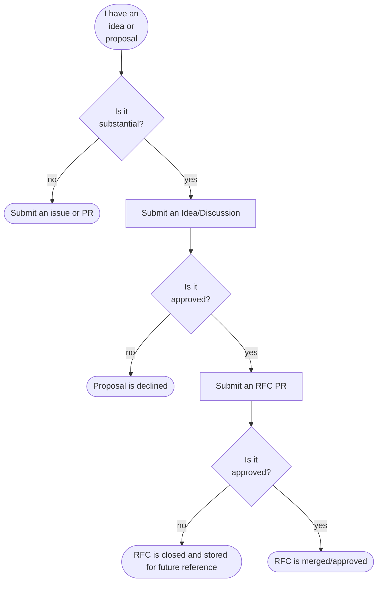

# RFCs

The RFC (Request for Comments) process is used to propose significant changes or
additions to the Trident project. RFCs are intended to foster discussion and
gather feedback from the community before implementing major features or
modifications.

Many changes such as bug fixes, documentation updates, or minor enhancements do
not require an RFC and can be submitted directly as pull requests or issues.

Changes that are considered substantial should follow the RFC process to ensure
that all stakeholders have the opportunity to review and provide input.

## RFC Process



### Substantial Change

A substantial change is defined as any modification that significantly impacts
the functionality, architecture, APIs, or user experience of Trident.
Examples of substantial changes include:

- Introducing new core features or modules
- Major changes to existing features or workflows
- Changes that affect backward compatibility
- Significant architectural changes
- Changes that require extensive documentation updates

### Submitting a Proposal Discussion

Substantial change proposals should begin with an Idea Discussion in GitHub. This allows the
community to provide initial feedback and helps refine the proposal before drafting a formal RFC.

Proposal discussions can be submitted in
[GitHub](https://github.com/microsoft/trident/discussions/new?category=trident-proposals).

### Submitting an RFC

#### Starting the RFC

Once the proposal discussion has been approved, the author should draft a formal
RFC. To start an RFC, clone the Trident repository and create a copy of the RFC
template located at `docs/Development/RFCs/.0000-template.md` to
`docs/Development/RFCs/0000-my-feature.md`, replacing `my-feature` with a
descriptive name for the RFC.

```bash
cp docs/Development/RFCs/.0000-template.md docs/Development/RFCs/0000-my-feature.md
```

Keep the number as `0000` until the RFC is ready to be submitted as a pull request.

#### Writing the RFC

Fill out the sections of the RFC template with detailed information about the
proposed change. Ensure that the motivation, scope, and design are clearly
articulated. Provide any necessary diagrams, examples, or references to support
the proposal.

#### Publishing the RFC

When the RFC draft is complete, submit it as a pull request to the Trident
repository. The pull request should reference the original proposal discussion
and provide a summary of the changes proposed in the RFC.

Once a PR is created, update the file name prefix from `0000` to the GitHub PR
issue number with the appropriate padding. For example, if the PR number is `42`,
rename the file to `0042-my-feature.md`.

#### Reviewing the RFC

The RFC will be reviewed by the Trident maintainers and community members.
Feedback will be provided, and the author may need to make revisions based on
the comments received. The review process may involve multiple iterations until
the RFC is satisfactory.

Once there is consensus, the RFC will either be approved and merged or closed.

#### After Approval

After an RFC is approved and merged, create an issue to track the implementation
of the proposed changes. The issue should reference the merged RFC and outline
the steps required for implementation. When convenient, add a link to the issue
in the RFC document for future reference.

### What an Approved RFC Means

A merged RFC indicates that the proposed change has been reviewed and approved
by the Trident community and maintainers. However, it does not guarantee that
the change will be implemented immediately. The implementation timeline may vary
based on priorities and resources.

## Approved RFCs

import DocCardList from '@theme/DocCardList';

The following RFCs have been accepted:

<DocCardList />