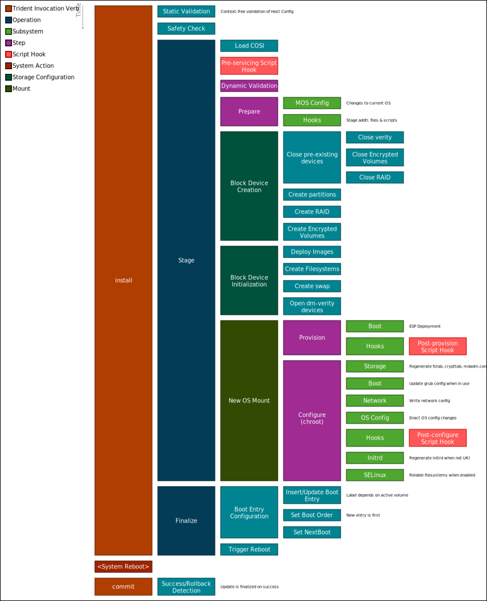

# Install Service

An install is a [clean install](../Reference/Glossary.md#clean-install) of an
Azure Linux OS onto a machine using Trident. It is the most comprehensive
servicing type, driven entirely by a
[Host Configuration](../Reference/Host-Configuration/API-Reference/HostConfiguration.md)
file that declares the desired state of the system. The Host Configuration is
the ultimate authority on how the disk should be laid out, what images to
deploy, and how the OS should be configured.

For an overview of how Trident determines what to do based on the Host
Configuration, see
[How Trident Knows What to Do](./How-Trident-Knows-What-to-Do.md).

## Operations

An install is split into two [operations](./Operations.md):

1. **Stage** — partitions the disk, streams OS images, and configures the target
   OS. This is the bulk of the work.
2. **Finalize** — configures UEFI boot variables and triggers a reboot into the
   newly installed OS.

These can be run together or separately. See
[Two-Step Installation and Update](../How-To-Guides/Two-Step-Installation-and-Update.md)
for details on running them independently.

## What Happens During an Install

The diagram below shows the high-level flow of an install. Each box represents
a subsystem that handles a specific aspect of the Host Configuration.

### Storage

The storage subsystem is responsible for preparing the disk:

- **Partitioning** — creates GPT partition tables and partitions as specified in
  the Host Configuration, including [A/B volume pairs](../Reference/Glossary.md#ab-volume-pair)
  for future updates.
- **Image streaming** — streams OS images from remote sources (HTTP or OCI) to
  their target partitions using the
  [image streaming pipeline](./Image-Streaming-Pipeline.md). Images are in
  [COSI](./COSI.md) format.
- **Software RAID** — creates and configures RAID arrays when redundancy is
  required. See [Rebuild RAID](./Rebuild-RAID.md).
- **Encryption** — sets up LUKS encryption with TPM-based PCR sealing for
  Secure Boot or OS integrity protection.
- **Partition adoption** — reuses existing partitions on the disk when the Host
  Configuration specifies adoption rather than creation.
- **Verity** — configures dm-verity for [root](./Root-Verity.md) or
  [usr](./Usr-Verity.md) filesystem integrity verification.

### Bootloader

Trident configures the bootloader based on the COSI image metadata and the Host
Configuration:

- **GRUB2** or **systemd-boot** are supported as bootloader types. See
  [Bootloader Configuration](./Bootloader-Configuration.md).
- **UEFI boot variables** are set so the firmware boots the newly installed OS.
  See [UEFI Variables](./UEFI-Variables.md) and
  [UEFI Fallback](./UEFI-Fallback.md).
- **Unified Kernel Images (UKI)** are supported for combined kernel, initrd,
  and command line images signed for Secure Boot.

### OS Configuration

After images are written to disk, Trident enters a
[deployment chroot](./Deployment-Chroot.md) to configure the target OS. The
full list of supported OS configuration options is defined in the
[`Os` object](../Reference/Host-Configuration/API-Reference/Os.md) of the Host
Configuration. Key capabilities include:

- **Network** — applies [netplan configuration](./Network-Configuration.md) for
  the target OS.
- **SELinux** — configures [SELinux mode and policy](./SELinux-Configuration.md).
- **Initrd** — regenerates the initramfs when the target OS requires it (GRUB
  only).
- **Extensions** — deploys [system extensions (sysexts)](./Sysexts.md) and
  [configuration extensions (confexts)](./Confexts.md).

### Customization

- **Script hooks** — user-provided scripts can be executed at defined points
  during the install. See [Script Hooks](./Script-Hooks.md).

### Management

Trident records the installed Host Configuration and system state in its
datastore, enabling future [A/B updates](../Reference/Glossary.md#ab-update),
[runtime updates](./Runtime-Updates.md), [rollbacks](./Manual-Rollback.md), and
[commit](../Reference/Glossary.md#operation) operations.

## After the Install

After finalize triggers a reboot, the machine boots into the newly installed OS.
If [health checks](./Health-Checks.md) are configured, Trident validates the
deployment on the next boot. A successful `trident commit` marks the install as
complete and ready for future servicing.
