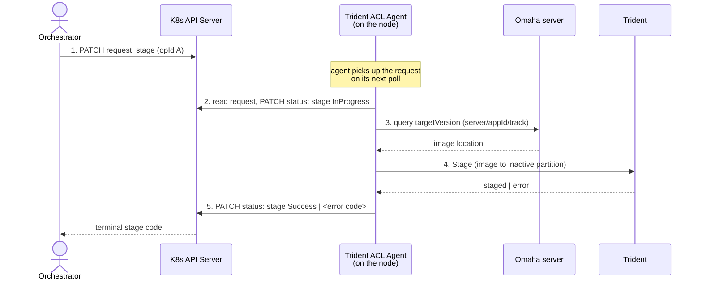
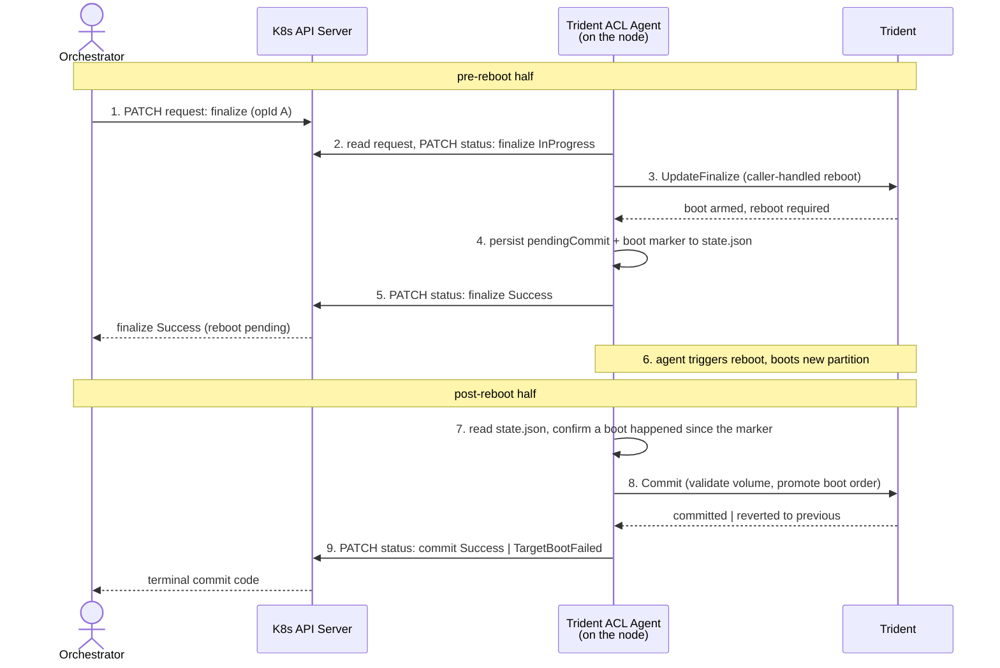

# Trident ACL Agent

`trident-acl-agent` is an on-node daemon that drives Trident
[A/B updates](./AB-Update.md) from a Kubernetes control plane, using node
annotations instead of a direct API call as the trigger. It is the on-node
half of Azure Container Linux (ACL)'s update mechanism. Any Kubernetes
control-plane component (a custom controller, an operator, or a script
driven by `kubectl patch`) can
orchestrate updates across a fleet of nodes by writing to the annotation
contract described below, provided it is willing to speak the
[Omaha](https://github.com/omaha-consortium/omaha) protocol for image
distribution and honors the agent's per-node protocol.

## Deployment

`trident-acl-agent` ships in the `trident-acl` RPM subpackage
(built alongside, and `Requires:` the same version of, the main `trident`
package). Installing it:

```console
$ tdnf install trident-acl
```

lays down the `/usr/bin/trident-acl-agent` binary and its
`trident-acl-agent.service` unit
(`packaging/systemd/trident-acl-agent.service`) under the systemd unit
directory, along with the package's `%license`-installed `LICENSE`/`NOTICE`
files. Installing the package does not by itself enable or start the
service — a deployment decides when that happens, e.g. by running
`systemctl enable --now trident-acl-agent.service` on the node, or by
baking that enablement into the image build (as this repo's own
`updateimg-acl-agent.yaml` test image does via Image Customizer's
`services: enable` list).

The shipped unit carries no `Environment=` lines beyond `ExecStart`, so
every deployment-specific choice — which annotation prefix to watch, where
to read the current version from, which Kubernetes API server to talk to,
and so on — is supplied the same way any other systemd service is
configured: standard `Environment=`/`EnvironmentFile=` constructs, most
commonly a drop-in applied on top of the packaged unit. See
[Configuration](#configuration) below for the full list of variables and
[Setting env vars via a systemd drop-in](#setting-env-vars-via-a-systemd-drop-in)
for how to apply them without editing the packaged unit.

## The annotation contract

An orchestrator (a Kubernetes controller with RBAC permission to PATCH the
target Node object) triggers an update by writing a JSON payload to a
request annotation on the Node. The agent watches that annotation, drives
the requested operation against `tridentd`, and writes its progress and
result via annotations on the same Node.

Three annotation keys make up the contract, all sharing one configurable
prefix (`acl.microsoft.com` by default — see [Configuration](#configuration)
below):

| Annotation | Written by | Purpose |
|---|---|---|
| `<prefix>/update-request` | Orchestrator | Requests `stage`, `finalize`, or `rollback` for this node. |
| `<prefix>/update-status` | Agent | Reports the status of the requested operation. |
| `<prefix>/update-commit-status` | Agent | Reports the status of the implicit post-reboot `commit` that follows a `finalize` or `rollback`. |

A request annotation looks like:

```json
{
  "schemaVersion": "1.0",
  "nodeUpdateId":  "550e8400-e29b-41d4-a716-446655440000",
  "operationId":   "c9d6f0a2-3b41-4e8d-9f27-1a5b6c7d8e90",
  "operation":     "stage",
  "targetVersion": "202606.29.0",
  "server":        "https://nebraska.example.com/v1/update",
  "appId":         "11111111-2222-3333-4444-555555555555",
  "track":         "pin-202606.29.0"
}
```

- `nodeUpdateId` identifies one node's update sequence and is held constant
  across `stage` → `finalize` → `commit`.
- `operationId` identifies this specific step; the agent uses it to decide
  whether to start new work, resume in-flight work, or re-emit a cached
  terminal status as a no-op on a duplicate PATCH.
- `targetVersion` is the image release version to update to. Required for
  `stage`/`finalize`; omitted for `rollback`, whose target (the previous
  partition) is implicit.
- `server`, `appId`, and `track` name the Omaha instance that serves the
  target image and receives progress events for it. They are required on
  `stage`/`finalize` requests, with **no static fallback** — a request
  missing them is rejected with `InvalidRequest` rather than falling back to
  a built-in endpoint, so a node can never update from a source the
  orchestrator did not explicitly choose.

`operation` maps to Trident invocations as follows:

| `operation` | Trident invocation | Effect |
|---|---|---|
| `stage` | `trident update --allowed-operations=stage` | Queries the `server`/`appId`/`track` Omaha endpoint for `targetVersion`, then streams the resulting image to the inactive partition. No reboot. |
| `finalize` | `trident update --allowed-operations=finalize` (gRPC `UpdateFinalize`, caller-handled reboot) | Arms boot for the staged target, writes a terminal `finalize` status, then triggers the reboot. |
| `rollback` | `trident rollback --ab` (gRPC `RollbackStage`/`RollbackFinalize`, caller-handled reboot) | Swaps back to the previous partition, mirroring `finalize` on the return path. Only the last update can be undone this way. |

A fourth phase, `commit`, runs implicitly after the post-`finalize`/
`rollback` reboot: the agent runs `trident commit` on the new partition and
writes a `commit` status without needing a separate annotation request. The
orchestrator watches `<prefix>/update-commit-status` as the terminal signal
that the reboot half of the update succeeded.

`stage` end-to-end:



`finalize` / `rollback`, spanning the reboot:



A status annotation (`<prefix>/update-status` or
`<prefix>/update-commit-status`) looks like:

```json
{
  "schemaVersion":   "1.0",
  "nodeUpdateId":    "550e8400-e29b-41d4-a716-446655440000",
  "operationId":     "c9d6f0a2-3b41-4e8d-9f27-1a5b6c7d8e90",
  "operation":       "stage",
  "code":            "Success",
  "message":         "staged update to 202606.29.0",
  "fromVersion":     "202606.15.0",
  "toVersion":       "202606.29.0",
  "startedUtc":      "2026-06-29T12:00:00Z",
  "lastUpdatedUtc":  "2026-06-29T12:03:41Z",
  "finishedUtc":     "2026-06-29T12:03:41Z"
}
```

- `operation` is `stage`, `finalize`, `rollback`, or `commit` (`commit` only
  ever appears on `<prefix>/update-commit-status`, never on
  `<prefix>/update-status`).
- `code` is the outcome — see the table below.
- `message` is a short, human-readable explanation of `code`, useful for
  logs/alerts; treat its exact wording as informational, not something to
  match on (it may include error detail that varies run to run).
- `fromVersion`/`toVersion` are the versions the operation moved between
  (`toVersion` is absent for `rollback`, whose target is implicit).
- `startedUtc`/`lastUpdatedUtc`/`finishedUtc` bound the operation:
  `lastUpdatedUtc` refreshes on a heartbeat cadence while `code` is
  `InProgress` (see [below](#prepost-reboot-state-and-the-watchdog));
  `finishedUtc` is absent until `code` reaches a terminal value.

`code` is one of:

| `code` | Terminal? | Meaning |
|---|---|---|
| `InProgress` | No | The operation is running. `lastUpdatedUtc` refreshes on a heartbeat cadence; a terminal code always follows. |
| `Success` | Yes | The operation completed as requested. For `commit`, this means the reboot landed on the target partition and it was promoted. |
| `AlreadyAtTarget` | Yes | `stage`/`finalize` was requested for the version the node is already running (per `TRIDENT_ACL_AGENT_CURRENT_VERSION_KEY`); treated as a no-op success. |
| `NotStaged` | Yes | `finalize` was requested for a `nodeUpdateId` with no prior successful `stage`. Issue a `stage` first. |
| `OperationFailed` | Yes | The operation failed for a reason other than a boot/rollback outcome (e.g. the Omaha server has no update for the requested version, or the underlying `tridentd` call returned an error). See `message` for detail. |
| `TargetBootFailed` | Yes | The post-reboot `commit` found the node had rolled back to its previous partition instead of booting the target — Trident's own health checks rejected the new boot. The node is back on `fromVersion`; the orchestrator should treat this as a failed update, not retry the same `nodeUpdateId` blindly. |
| `AgentInternalError` | Yes | A failure in the agent itself rather than in Trident or the requested operation (e.g. it triggered a reboot but the reboot call failed, or it lost track of an in-flight commit). Distinct from `OperationFailed` so an orchestrator can decide to treat these differently (e.g. retry vs. escalate). |
| `InvalidRequest` | Yes | The request annotation itself was rejected before any action was taken — malformed JSON, a schema/version mismatch, a missing required field (`server`/`appId`/`track`/`targetVersion`), a `finalize` whose `targetVersion` doesn't match what was staged, or a second `finalize`/`rollback` submitted while one is already pending its post-reboot `commit`. No Trident operation runs. |

See the request/status schema types in
`crates/trident-acl-agent/src/annotations/protocol.rs` for the full contract,
including the formal JSON Schema both sides validate against.

## Pre/post-reboot state and the watchdog

Because `finalize`/`rollback` spans a reboot, the agent persists a small
state file (`TRIDENT_ACL_AGENT_ORCHESTRATION_STATE_PATH`) recording that a
commit is pending and a marker for "a boot happened after this point". On
restart, the agent checks this state to resume the post-reboot `commit`
step rather than re-running `finalize` from scratch.

While an operation is in flight, the agent refreshes the `InProgress`
status's `lastUpdatedUtc` on a heartbeat cadence
(`TRIDENT_ACL_AGENT_ORCHESTRATION_HEARTBEAT_INTERVAL`), so an external
watchdog can distinguish a working agent from a stuck one and reprovision a
node that never reports a terminal `commit` status within its SLA.

## Configuration

There is no config file. Every setting is an environment variable prefixed
`TRIDENT_ACL_AGENT_`, systemd-style: set it in the unit's own
`Environment=` lines, via a drop-in override, or by any other means that
sets the process's environment before it starts.

A variable that is unset, or set to the empty string, falls back to its
default. A variable set to a malformed value (a bad URL, a bad duration, an
unrecognized `mode`) causes the agent to fail to start with an error
naming the offending variable.

| Variable | Default | Description |
|---|---|---|
| `TRIDENT_ACL_AGENT_KUBERNETES_ANNOTATION_PREFIX` | `acl.microsoft.com` | The annotation-key prefix for the request/status/commit-status annotations (e.g. the `acl.microsoft.com` in `acl.microsoft.com/update-request`). Any orchestrator can pick its own namespace here so its annotations don't collide with another controller's. |
| `TRIDENT_ACL_AGENT_CURRENT_VERSION_PATH` | `/etc/os-release` | The file the agent reads to determine the node's currently running version. Any file works, as long as it follows the os-release format (`KEY=VALUE` lines, optionally single- or double-quoted, blank lines and `#` comments ignored) — see [below](#configuring-the-on-disk-version). |
| `TRIDENT_ACL_AGENT_CURRENT_VERSION_KEY` | `VERSION_ID` | The key the agent looks up in `TRIDENT_ACL_AGENT_CURRENT_VERSION_PATH` (`/etc/os-release` by default) to determine the node's currently running version, used to compare against a request's `targetVersion` (e.g. to short-circuit to `AlreadyAtTarget`). `VERSION_ID` is the standard `os-release` field most images already stamp; a deployment that instead carries an ACL-specific `IMAGE_VERSION` field can point this variable at that key instead — see [below](#configuring-the-on-disk-version). |
| `TRIDENT_ACL_AGENT_CURRENT_VERSION_FALLBACK` | `always` | Controls what happens when `TRIDENT_ACL_AGENT_CURRENT_VERSION_KEY` isn't present at `TRIDENT_ACL_AGENT_CURRENT_VERSION_PATH` (e.g. a dev/test host, or an image that hasn't started stamping that key yet). `always` reports `0.0.0` as the node's current version — a sentinel that can never collide with a real release version and cause a false `AlreadyAtTarget`. `error` fails the operation instead of using a placeholder version. Any other value is used verbatim as the current version, with no format validation. |
| `TRIDENT_ACL_AGENT_KUBERNETES_API_SERVER` | unset | Explicit override for the Kubernetes API server URL. When unset, the server embedded in the kubeconfig is used as-is. |
| `TRIDENT_ACL_AGENT_KUBERNETES_KUBECONFIG` | `/var/lib/kubelet/kubeconfig` | Path to the kubeconfig used to reach the Kubernetes API server and authenticate as this node. |
| `TRIDENT_ACL_AGENT_KUBERNETES_NODE_NAME` | The node's own hostname, lowercased | The Node object this agent watches/patches. |
| `TRIDENT_ACL_AGENT_TRIDENT_SOCKET` | `unix:///run/trident/trident.sock` | The gRPC Unix socket URI used to reach `tridentd`. |
| `TRIDENT_ACL_AGENT_ORCHESTRATION_STATE_PATH` | `/var/lib/trident-acl-agent/state.json` | Path to the agent's persistent state file bridging the pre-reboot and post-reboot halves of `finalize`/`rollback` across the reboot. |
| `TRIDENT_ACL_AGENT_ORCHESTRATION_STAGE_TIMEOUT` | `20m` | How long a `stage` is allowed to run (a [`humantime`](https://docs.rs/humantime) duration, e.g. `20m`, `1h`) before it's considered failed. |
| `TRIDENT_ACL_AGENT_ORCHESTRATION_FINALIZE_TIMEOUT` | `10m` | How long a `finalize` is allowed to run before it's considered failed. |
| `TRIDENT_ACL_AGENT_ORCHESTRATION_HEARTBEAT_INTERVAL` | `60s` | Refresh cadence for the `InProgress` status heartbeat. |

### Setting env vars via a systemd drop-in

The agent ships as `trident-acl-agent.service`, with no `Environment=`
lines of its own beyond `ExecStart`. Any setting is overridden with a
drop-in file, without editing the packaged unit:

```console
$ sudo systemctl edit trident-acl-agent.service
```

This opens `/etc/systemd/system/trident-acl-agent.service.d/override.conf`
in an editor. For example, to point the agent at a custom annotation
namespace:

```ini
[Service]
Environment=TRIDENT_ACL_AGENT_KUBERNETES_ANNOTATION_PREFIX=acl.contoso.com
```

With the prefix above, the orchestrator now reads/writes
`acl.contoso.com/update-request`, `acl.contoso.com/update-status`, and
`acl.contoso.com/update-commit-status` instead of the `acl.microsoft.com/*`
defaults. Reload and restart to apply:

```console
$ sudo systemctl daemon-reload
$ sudo systemctl restart trident-acl-agent.service
```

`systemctl cat trident-acl-agent.service` shows the merged unit (packaged
unit plus drop-in), useful for confirming the override took effect.

### Configuring the on-disk version

The agent determines the node's current version by reading a key out of
`TRIDENT_ACL_AGENT_CURRENT_VERSION_PATH` (`/etc/os-release` by default),
defaulting to the key `VERSION_ID` — the standard
[`os-release`](https://www.freedesktop.org/software/systemd/man/latest/os-release.html)
field most distributions already stamp. A deployment that keeps its
version stamp under a different key, a different file entirely, or both,
can point the agent there instead, as long as that file follows the
`os-release` key-value schema (`KEY=VALUE` lines, optionally quoted, blank
lines and `#` comments ignored):

```ini
[Service]
Environment=TRIDENT_ACL_AGENT_CURRENT_VERSION_PATH=/etc/my-app-release
Environment=TRIDENT_ACL_AGENT_CURRENT_VERSION_KEY=BUILD_VERSION
```

With this set, the agent reads `BUILD_VERSION` from `/etc/my-app-release`
(e.g. `BUILD_VERSION=202606.29.0`) as the node's current version, and
compares it against a request's `targetVersion` the same way it would for
`VERSION_ID`/`/etc/os-release` — including short-circuiting to
`AlreadyAtTarget` when they already match.

If the configured key is absent from the configured file (for example, on
a dev/test host with a minimal `os-release`), the agent consults
`TRIDENT_ACL_AGENT_CURRENT_VERSION_FALLBACK` (`always` by default): `always`
reports `0.0.0` as the current version — a sentinel that can never
accidentally match a real requested version; `error` fails the operation
instead of guessing; any other value is used verbatim as the current
version, unvalidated.

## Diagnostics

`trident-acl-agent --validate-connection <kubernetes|tridentd|nebraska>`
checks connectivity to a single dependency using the current environment
and exits immediately — useful for a systemd `ExecStartPre` check or manual
on-node troubleshooting without running the full orchestrator loop.

`--validate-connection nebraska` is the one place
`TRIDENT_ACL_AGENT_NEBRASKA_ENDPOINT`, `TRIDENT_ACL_AGENT_NEBRASKA_APP_ID`,
and `TRIDENT_ACL_AGENT_NEBRASKA_TRACK` are used: it issues a real
update-check query against the configured endpoint/app id/track and reports
whether the Omaha server is reachable. They default to deliberately invalid
values (`https://nebraska.example.invalid/v1/update`, an all-zero UUID, and
`unspecified`, respectively) so this check fails loudly unless a deployment
sets them. Since these variables otherwise play no role in the
annotation-driven flow, there's no reason to add them to the service's
persistent environment (e.g. via a drop-in) — set them just for this
one-off invocation instead:

```console
$ sudo TRIDENT_ACL_AGENT_NEBRASKA_ENDPOINT=https://updates.contoso.com/v1/update \
    TRIDENT_ACL_AGENT_NEBRASKA_APP_ID=aaaaaaaa-bbbb-cccc-dddd-eeeeeeeeeeee \
    TRIDENT_ACL_AGENT_NEBRASKA_TRACK=stable \
    trident-acl-agent --validate-connection nebraska
```
