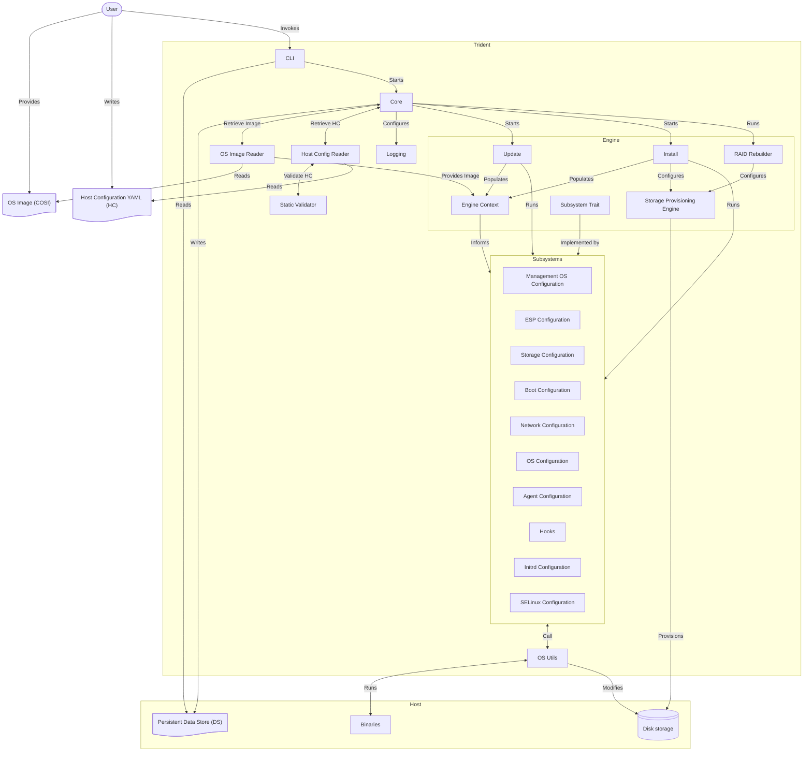

# Trident Architecture

<!--
DELETE ME AFTER COMPLETING THE DOCUMENT!
---
Task: https://dev.azure.com/mariner-org/polar/_workitems/edit/13172
Title: Trident Architecture
Type: Explanation
Objective:

Explain in mid detail the architecture of Trident, how it works, what components
it has.
-->

