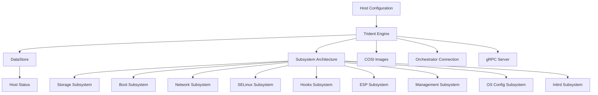
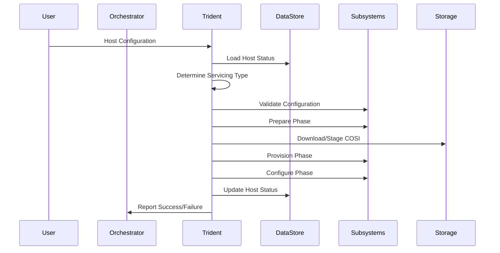

# Trident Architecture

Trident is an image-based OS lifecycle agent designed for Azure Linux, providing atomic installation, A/B-style updates, and runtime configuration management. This document explains Trident's architectural components, design principles, and operational workflow.

## Overview

Trident's architecture follows a modular, subsystem-based design that separates concerns while maintaining tight integration for OS lifecycle management. The system operates on a declarative model where users specify desired system state through Host Configuration, and Trident reconciles the current state to match this specification.



## Core Components

### Trident Engine

The **Trident Engine** serves as the central orchestrator that coordinates all subsystems and manages the overall workflow. Located in `crates/trident/src/engine/`, it provides:

- **EngineContext**: Maintains comprehensive state including Host Configuration, storage graphs, filesystem data, and servicing type information
- **Workflow Management**: Orchestrates the three-phase execution model (prepare, provision, configure)
- **Subsystem Coordination**: Manages the ordered execution of subsystems based on dependencies
- **State Tracking**: Maintains operational context throughout servicing operations

The engine implements a trait-based architecture where each subsystem implements the `Subsystem` trait with standardized lifecycle methods.

### DataStore

The **DataStore** (`crates/trident/src/datastore.rs`) provides persistent state management using SQLite:

- **Host Status Tracking**: Maintains historical record of all Host Configuration changes and their results
- **State Persistence**: Ensures operational continuity across reboots and failures
- **Audit Trail**: Provides comprehensive logging of all servicing operations
- **Recovery Support**: Enables rollback and diagnostic capabilities

The datastore can operate in temporary mode (for installer scenarios) or persistent mode (for ongoing servicing).

### Host Configuration API

The **Host Configuration** (`trident_api/src/config/host/`) defines the declarative interface:

```rust
pub struct HostConfiguration {
    pub trident: Trident,           // Trident agent configuration
    pub storage: Storage,           // Storage layout and devices
    pub scripts: Scripts,           // Custom automation hooks
    pub os: Os,                     // OS configuration
    pub management_os: ManagementOs,// Installer OS settings
    pub image: Option<OsImage>,     // COSI image reference
}
```

This YAML-based configuration describes the desired state across storage, networking, security, and system configuration layers.

## Subsystem Architecture

Trident's modular design centers around specialized subsystems that handle specific aspects of OS lifecycle management:

### Storage Subsystem

**Location**: `crates/trident/src/subsystems/storage/`

Manages complete storage stack including:

- **Disk Partitioning**: GPT partition table management using `systemd-repart`
- **RAID Configuration**: Software RAID arrays via `mdadm`
- **Encryption**: LUKS volume encryption with TPM2 integration
- **Filesystem Management**: Creation and mounting of ext4, XFS, FAT32, and NTFS filesystems
- **Verity Support**: dm-verity for read-only filesystem integrity verification
- **A/B Volume Management**: Dual-partition layout for atomic updates

### Boot Subsystem

**Location**: `crates/trident/src/engine/boot/`

Handles bootloader configuration and management:

- **GRUB2 Configuration**: Boot menu generation and kernel parameter management
- **systemd-boot Support**: UEFI boot manager integration
- **A/B Boot Logic**: Automatic selection between A/B OS volumes
- **Boot Entry Management**: Creation and maintenance of boot configurations
- **Recovery Integration**: Automatic rollback configuration

### Network Subsystem

**Location**: `crates/trident/src/subsystems/network.rs`

Manages network configuration:

- **Netplan Integration**: Declarative network configuration
- **Cloud-init Coordination**: Prevents conflicts with cloud initialization
- **Provisioning Network**: Temporary network setup for installer operations

### SELinux Subsystem

**Location**: `crates/trident/src/subsystems/selinux.rs`

Provides security policy management:

- **Policy Configuration**: SELinux mode management (enforcing/permissive/disabled)
- **Filesystem Relabeling**: Ensures proper security contexts using `setfiles`
- **Verity Compatibility**: Handles SELinux constraints with read-only filesystems
- **State Transition**: Manages SELinux state changes during updates

### Hooks Subsystem

**Location**: `crates/trident/src/subsystems/hooks.rs`

Enables custom automation:

- **Script Execution**: Pre/post servicing custom scripts
- **Environment Management**: Controlled execution environments
- **File Staging**: Preparation of custom files and configurations
- **Integration Points**: Extensibility for product-specific logic

## Operating Modes

### Installation Mode

During initial deployment, Trident operates from a live management OS (typically booted from ISO):

1. **Provisioning Network Setup**: Establishes network connectivity
2. **Storage Preparation**: Partitions disks according to Host Configuration
3. **Image Deployment**: Streams COSI filesystem images to target partitions
4. **System Configuration**: Applies OS settings, users, and security policies
5. **Bootloader Installation**: Configures GRUB2 or systemd-boot
6. **DataStore Creation**: Establishes persistent state tracking

### Servicing Mode

For ongoing updates, Trident runs within the host OS:

1. **State Analysis**: Compares current Host Status with new Host Configuration
2. **Servicing Type Selection**: Determines appropriate update strategy (A/B, in-place, etc.)
3. **Image Staging**: Downloads and validates new COSI images
4. **A/B Volume Preparation**: Installs updates to inactive volume
5. **Configuration Migration**: Transfers persistent state between A/B volumes
6. **Boot Configuration Update**: Modifies bootloader to use updated volume
7. **Rollback Preparation**: Ensures safe rollback capability

## COSI Image Format

Trident uses the **Composable OS Image (COSI)** format for atomic image deployment:

```text
image.cosi (tarball)
├── metadata.json          # Image metadata and filesystem descriptions
└── images/               # Compressed filesystem images
    ├── root.img.zst      # Root filesystem
    ├── usr.img.zst       # /usr partition  
    ├── var.img.zst       # /var partition
    └── ...
```

COSI provides:

- **Atomic Distribution**: Single file containing all required filesystem images
- **Integrity Verification**: SHA-384 checksums for all components
- **Streaming Support**: Direct deployment without intermediate storage
- **Compression**: ZSTD compression for efficient transfer
- **Metadata Integration**: Rich metadata eliminates configuration verbosity

## Communication Interfaces

### Orchestrator Integration

Trident supports integration with external orchestration systems through:

- **HTTP Status Reporting**: RESTful status updates to orchestrator endpoints
- **JSON Message Format**: Structured communication protocol
- **Connection Management**: Configurable timeouts and retry logic

### gRPC Server (Optional)

When enabled, Trident provides a gRPC interface for external management:

- **Remote Command Execution**: Accept Host Configuration updates remotely
- **Status Streaming**: Real-time operation status updates
- **Secure Communication**: TLS-enabled communication channel

## Data Flow Architecture



## Key Design Principles

### Declarative Configuration

- Host Configuration describes desired end state
- Trident determines necessary actions to reach that state
- Idempotent operations support repeated execution

### Separation of Concerns

- Each subsystem manages a specific OS layer
- Clear interfaces between components
- Modular design enables selective feature usage

### Safety and Reliability

- A/B updates provide automatic rollback capability
- Comprehensive validation before making changes
- State tracking enables recovery from failures

### Platform Agnostic

- Core logic separated from product-specific concerns
- Extensible through hooks and scripts
- Integration-friendly architecture

## Error Handling and Recovery

Trident implements comprehensive error handling:

- **Validation Phase**: Early detection of configuration issues
- **Staged Rollback**: Automatic reversion during failed updates
- **State Persistence**: Recovery information survives reboots
- **Diagnostic Logging**: Detailed operation logs for troubleshooting
- **Safe Defaults**: Conservative behavior when uncertain

## Performance Considerations

- **Streaming Architecture**: Direct COSI image deployment without intermediate storage
- **Parallel Operations**: Concurrent subsystem execution where safe
- **Incremental Updates**: A/B staging minimizes downtime
- **Resource Management**: Controlled memory and disk usage
- **Background Operations**: Non-blocking preparation phases

This architecture enables Trident to provide consistent, reliable OS lifecycle management while maintaining flexibility for diverse deployment scenarios and integration requirements.
