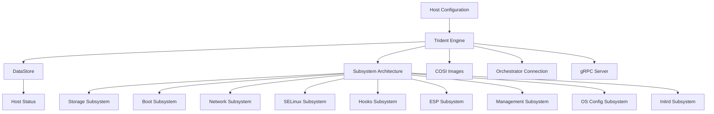
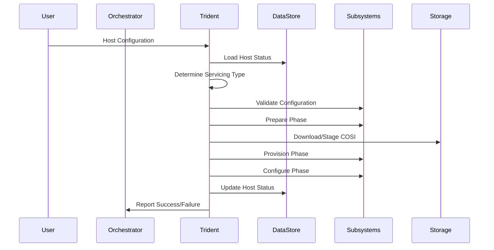

# Trident Architecture

Trident is an image-based OS lifecycle agent, providing atomic image-based installation, [A/B updates](../Reference/Glossary.md#ab-updates), and runtime configuration management. This document explains Trident's architectural components, design principles, and operational workflow.

## Overview

Trident's architecture follows a modular, [subsystem](../Reference/Glossary.md#subsystem)-based design. Trident receives a declarative [Host Configuration](../Reference/Host-Configuration/API-Reference/HostConfiguration.md), in which the user specifies the desired state of the target OS. Trident operates on the current state of the servicing OS to match this specification.



## Core Components

### Trident Engine

The **Trident Engine** serves as the central orchestrator that coordinates all subsystems and manages the overall workflow. Located in `crates/trident/src/engine/`, it provides:

- **EngineContext**: Maintains comprehensive state including Host Configuration, storage graphs, filesystem data, and servicing type information
- **Workflow Management**: Orchestrates the three-[step](../Reference/Glossary.md#step) execution model (prepare, provision, configure)
- **Subsystem Coordination**: Manages the ordered execution of subsystem steps based on dependencies
- **State Tracking**: Maintains operational context throughout servicing operations

The engine implements a Rust trait-based architecture where each subsystem implements the `Subsystem` trait with standardized lifecycle methods: `prepare`, `provision`, and `configure`.

- **prepare**: Perform non-destructive preparations for servicing, such as validating configuration, checking prerequisites, and preparing the system for changes
- **provision**: Initialize or migrate the state on the target OS from the servicing OS, such as deploying esp, installing images, updating encryption
- **configure**: Configure the system as specified by the Host Configuration, and update the Host Status accordingly

### DataStore

The **DataStore** (`crates/trident/src/datastore.rs`) provides persistent state management using SQLite:

- **Host Status Tracking**: Maintains historical record of all Host Configuration changes and their results
- **State Persistence**: Ensures operational continuity across reboots and failures
- **Audit Trail**: Provides comprehensive logging of all servicing operations
- **Recovery Support**: Enables rollback and diagnostic capabilities

The datastore can operate in temporary mode (for installer scenarios) or persistent mode (for ongoing servicing).

### Host Configuration API

The **Host Configuration** (`trident_api/src/config/host/`) defines the declarative [interface](../Reference/Host-Configuration/API-Reference/HostConfiguration.md) for specifying desired system state. It encompasses:

``` yaml
trident:
  # Trident agent configuration
storage:
  # Storage layout and devices
scripts:
  # Custom automation hooks
os:
  # Target OS configuration
management_os:
  # Servicing OS settings
image:
  # COSI image reference
```

This YAML-based configuration describes the desired state across storage, networking, security, and system configuration layers.

An example Host Configuration file can be found in the [sample host configuration](../Reference/Host-Configuration/Sample-Host-Configuration.md).

## Subsystem Architecture

Trident's modular design centers around specialized subsystems that handle specific aspects of OS lifecycle management:

### Storage Subsystem

**Location**: `crates/trident/src/subsystems/storage/`

Manages complete storage stack including:

- **Disk Partitioning**: partition management using `systemd-repart`
- **RAID Configuration**: [Software RAID arrays](../How-To-Guides/Create-a-RAID-Array.md) via `mdadm`
- **Encryption**: [volume encryption](../How-To-Guides/Create-an-Encrypted-Volume.md) with TPM2 integration
- **Filesystem Management**: Creation and mounting of ext4, XFS, FAT32, and NTFS filesystems
- **Verity Support**: dm-verity ([root](../Explanation/Root-Verity.md) or [usr](../Explanation/Usr-Verity.md)) for filesystem integrity verification
- **A/B Volume Management**: Dual-partition layout for atomic A/B updates

### Boot Subsystem

**Location**: `crates/trident/src/engine/boot/`

Handles [bootloader configuration](../Explanation/Bootloader-Configuration.md) and management:

- **GRUB2 Configuration**: Boot menu generation and kernel parameter management
- **systemd-boot Support**: UEFI boot manager integration
- **A/B Boot Logic**: Automatic selection between A/B OS volumes
- **Boot Entry Management**: Creation and maintenance of boot configurations
- **Recovery Integration**: Automatic rollback configuration

### ESP Subsystem

**Location**: `crates/trident/src/subsystems/esp.rs`

Manages the EFI System Partition (ESP):
- **File Management**: Installs and updates bootloader files

### Initrd Subsystem

**Location**: `crates/trident/src/subsystems/initrd.rs`

Manages the initial RAM disk (initrd) creation and configuration:
- **Image Creation**: Builds initrd images with necessary drivers and tools

### Network Subsystem

**Location**: `crates/trident/src/subsystems/network.rs`

Manages [network configuration](../Explanation/Network-Configuration.md):

- **Netplan Integration**: Declarative network configuration
- **Cloud-init Coordination**: Prevents conflicts with cloud initialization
- **Provisioning Network**: Temporary network setup for installer operations

### SELinux Subsystem

**Location**: `crates/trident/src/subsystems/selinux.rs`

Provides [SELinux](../Explanation/SELinux-Configuration.md) policy management:

- **Policy Configuration**: SELinux mode management (enforcing/permissive/disabled)
- **Filesystem Relabeling**: Ensures proper security contexts using `setfiles`
- **Verity Compatibility**: Handles SELinux constraints with read-only filesystems
- **State Transition**: Manages SELinux state changes during updates

### Hooks Subsystem

**Location**: `crates/trident/src/subsystems/hooks.rs`

Enables custom, user-defined, [script-based](../Explanation/Script-Hooks.md) automation:

- **Script Execution**: Pre/post servicing custom scripts
- **Environment Management**: Controlled execution environments
- **File Staging**: Preparation of custom files and configurations
- **Integration Points**: Extensibility for product-specific logic

### Management Subsystem

**Location**: `crates/trident/src/subsystems/management.rs`

Ensures that the agent configuration is aligned with the Host Configuration.

### OS Config Subsystem

**Location**: `crates/trident/src/subsystems/osconfig/mod.rs`

Manages operating system configuration aspects such as:
- **User Management**: Creation and configuration of system users and groups
- **System Settings**: Application of OS-level settings (hostname, time zone, locale)
- **Service Management**: Enabling/disabling system services
- **Package Management**: Installation and removal of OS packages
- **Kernel Parameters**: Configuration of kernel boot parameters


### MOS Config Subsystem

**Location**: `crates/trident/src/subsystems/osconfig/mod.rs`

Manages the servicing OS (Management OS) configuration aspects such as:
- **User Management**: Creation and configuration of servicing OS users and groups

## Commands

### `trident install`

On a bare metal machine, [clean install](../How-To-Guides/Perform-a-Clean-Install.md) operates from a servicing OS (typically booted from ISO):

1. **Provisioning Network Setup**: Establishes network connectivity
2. **Storage Preparation**: Partitions disks according to Host Configuration
3. **Image Deployment**: Streams COSI filesystem images to target partitions
4. **System Configuration**: Applies OS settings, users, and security policies
5. **Bootloader Installation**: Configures GRUB2 or systemd-boot
6. **DataStore Creation**: Establishes persistent state tracking

### `trident offline-initialize`

For a virtual machine, [offline initialization](../Explanation/Offline-Initialize.md) typically operates as part of the VHD creation:

1. **Image History**: Understands COSI configuration
2. **Disk Layout**: Understands the COSI partition layout
3. **DataStore Creation**: Establishes persistent state to allow future servicing

### `trident update`

For updates, Trident runs within the host OS:

1. **State Analysis**: Compares current Host Status with new Host Configuration
2. **Servicing Type Selection**: Determines appropriate update strategy (A/B, in-place, etc.)
3. **Image Staging**: Downloads and validates new COSI images
4. **A/B Volume Preparation**: Installs updates to inactive volume
5. **Configuration Migration**: Transfers persistent state between A/B volumes
6. **Boot Configuration Update**: Modifies bootloader to use updated volume
7. **Rollback Preparation**: Ensures safe rollback capability

### `trident rebuild-raid`

For [rebuilding RAID arrays](../Explanation/Rebuild-RAID.md), Trident performs:

1. **Array Detection**: Identifies existing RAID arrays and their configurations
2. **Validation**: Validates the desired configuration against current state
3. **Rebuild Execution**: Initiates the RAID rebuild process using the appropriate tools

### `trident validate`

[Validates the provided Host Configuration](../Explanation/Host-Configuration-Validation.md) without making changes:

1. **Schema Validation**: Ensures configuration adheres to defined schema
2. **Logical Consistency**: Checks for conflicting or invalid settings
3. **Dependency Verification**: Ensures all required components and subsystems are available

### `trident get`

[Gets](../Reference/Trident-CLI.md#get) the current Host Configuration, status, or last error information.

## COSI Image Format

Trident uses the [**Composable OS Image (COSI)**](../Reference/Composable-OS-Image.md) format for atomic image deployment:

```text
image.cosi (tarball)
├── metadata.json          # Image metadata and filesystem descriptions
└── images/               # Compressed filesystem images
    ├── root.img.zst      # Root filesystem
    ├── usr.img.zst       # /usr partition
    ├── var.img.zst       # /var partition
    └── ...
```

COSI provides:

- **Atomic Distribution**: Single file containing all required filesystem images
- **Integrity Verification**: SHA-384 checksums for all components
- **Streaming Support**: Direct deployment without intermediate storage
- **Compression**: ZSTD compression for efficient transfer
- **Metadata Integration**: Rich metadata eliminates configuration verbosity

## Data Flow Architecture



## Key Design Principles

### Declarative Configuration

- Host Configuration describes desired end state
- Trident determines necessary actions to reach that state
- Idempotent operations support repeated execution

### Separation of Concerns

- Each subsystem manages a specific OS layer
- Clear interfaces between components
- Modular design enables selective feature usage

### Safety and Reliability

- A/B updates provide automatic rollback capability
- Comprehensive validation before making changes
- State tracking enables recovery from failures

### Platform Agnostic

- Core logic separated from product-specific concerns
- Extensible through hooks and scripts
- Integration-friendly architecture

## Error Handling and Recovery

Trident implements comprehensive error handling:

- **Validation Phase**: Early detection of configuration issues
- **Staged Rollback**: Automatic reversion during failed updates
- **State Persistence**: Recovery information survives reboots
- **Diagnostic Logging**: Detailed operation logs for troubleshooting
- **Safe Defaults**: Conservative behavior when uncertain

## Performance Considerations

- **Streaming Architecture**: Direct COSI image deployment without intermediate storage
- **Parallel Operations**: Concurrent subsystem execution where safe
- **Fast Updates**: A/B staging minimizes downtime
- **Resource Management**: Controlled memory and disk usage
- **Background Operations**: Non-blocking preparation phases

This architecture enables Trident to provide consistent, reliable OS lifecycle management while maintaining flexibility for diverse deployment scenarios and integration requirements.
