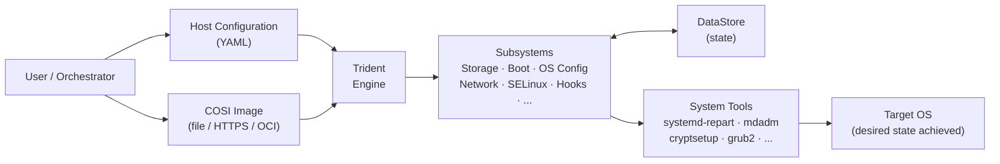
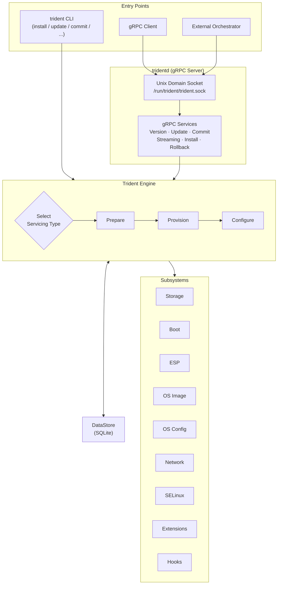
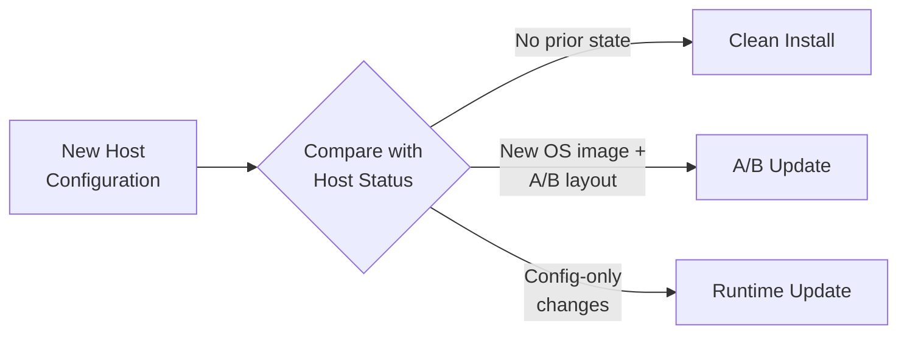
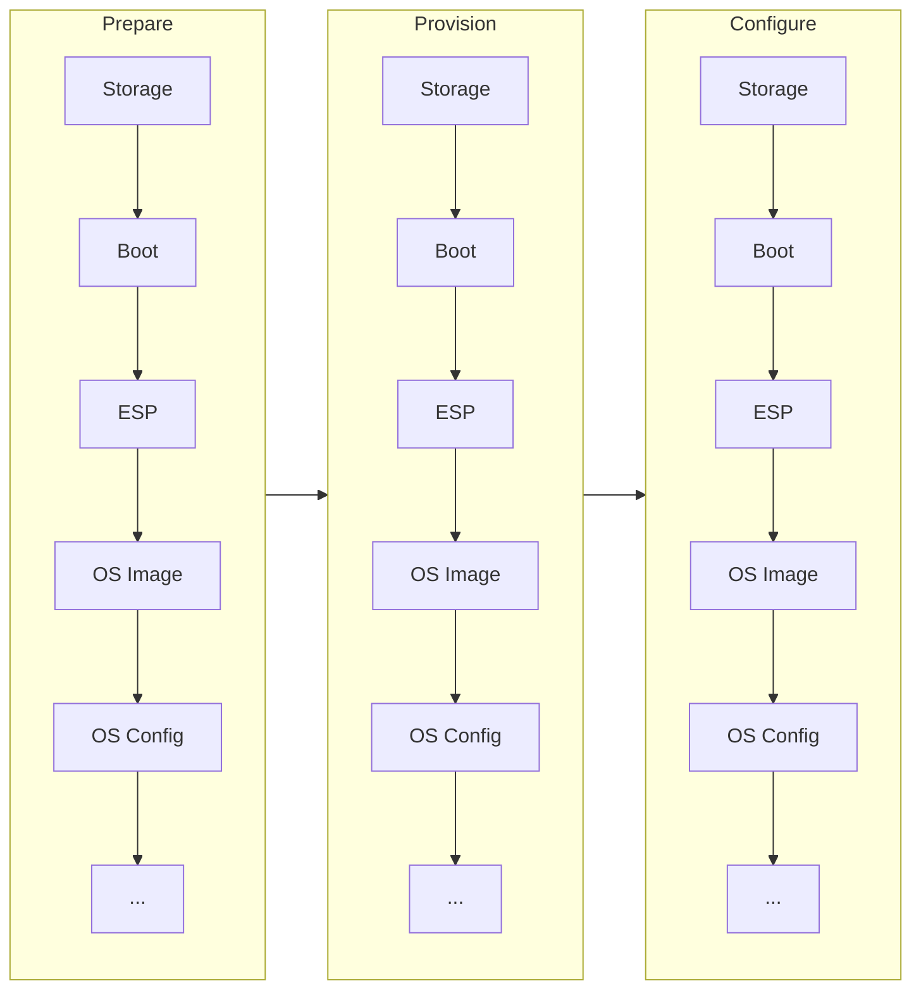
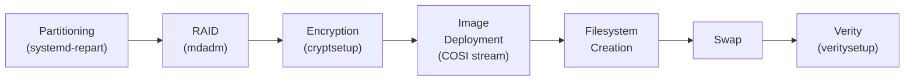
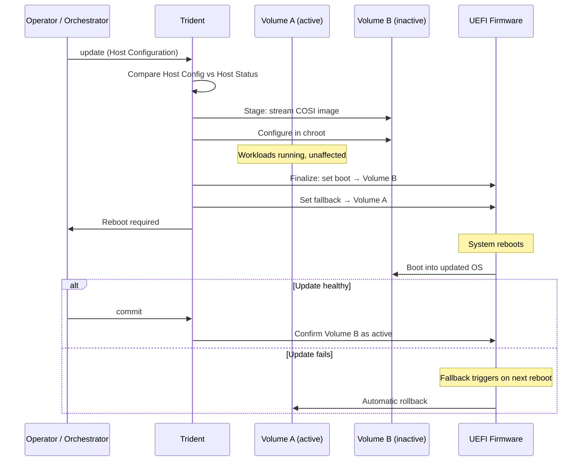
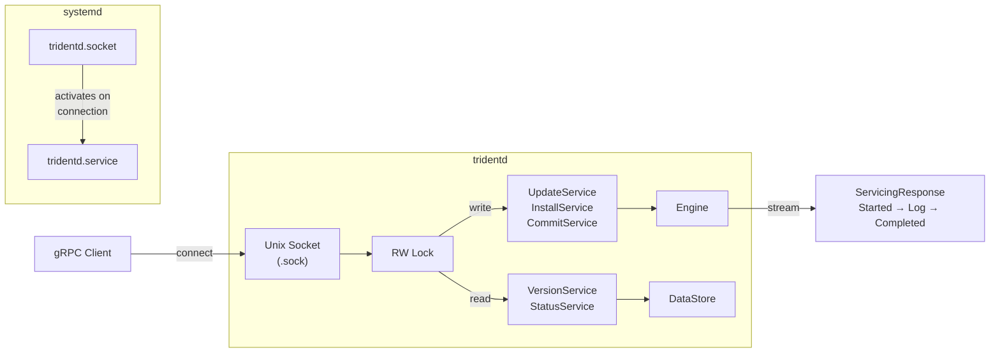
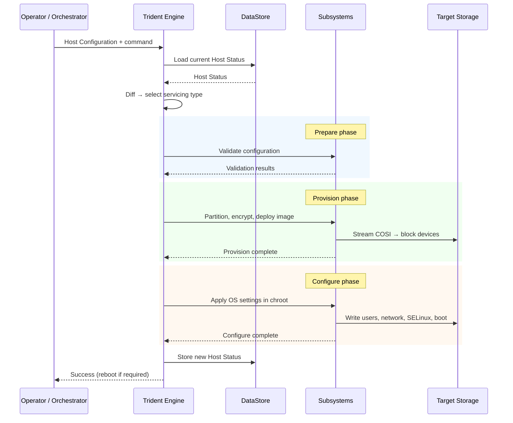

# Trident Architecture

Trident is an image-based OS lifecycle agent providing atomic
[installation](../How-To-Guides/Perform-a-Clean-Install.md),
[A/B updates](../Reference/Glossary.md#ab-updates), and runtime configuration
management. This document explains the architectural components, design
principles, and operational workflows.

For a higher-level introduction, see
[What Is Trident](../Trident/What-Is-Trident.md) and
[How Does Trident Work](../Trident/How-Does-Trident-Work.md).

## Overview

Trident's architecture follows a modular,
[subsystem](../Reference/Glossary.md#subsystem)-based design. A declarative
[Host Configuration](../Reference/Host-Configuration/API-Reference/HostConfiguration.md)
describes the desired state of the target OS. Trident compares this against the
current state and determines the necessary actions to reconcile them.


```mermaid
flowchart LR
    USER["User / Orchestrator"] --> HC["Host Configuration\n(YAML)"]
    USER --> COSI["COSI Image\n(file / HTTPS / OCI)"]

    HC --> Engine["Trident\nEngine"]
    COSI --> Engine

    Engine --> Subsystems["Subsystems\nStorage · Boot · OS Config\nNetwork · SELinux · Hooks · ..."]

    Subsystems <--> DS["DataStore\n(state)"]
    Subsystems --> SysTools["System Tools\nsystemd-repart · mdadm\ncryptsetup · grub2 · ..."]

    SysTools --> TARGET["Target OS\n(desired state achieved)"]
```

## Execution Modes

Trident ships as a single binary that supports three execution modes:

1. **CLI** — The operator invokes commands directly (e.g., `trident install`,
   `trident update`). Each command runs to completion and exits.
2. **Daemon** — `trident daemon` starts a long-running gRPC server (`tridentd`)
   that listens on a Unix domain socket. External orchestrators connect as gRPC
   clients to request servicing operations.
3. **gRPC Client** — A built-in client that connects to a running daemon and
   issues commands over gRPC, providing the same operations as the CLI but
   through the daemon's API.

All three modes funnel into the same engine, so behavior is identical regardless
of how Trident is invoked.


```mermaid
flowchart TB
    subgraph EntryPoints ["Entry Points"]
        CLI["trident CLI\n(install / update / commit / ...)"]
        GRPC_CLIENT["gRPC Client"]
        ORCH["External Orchestrator"]
    end

    subgraph Daemon ["tridentd (gRPC Server)"]
        SOCKET["Unix Domain Socket\n/run/trident/trident.sock"]
        SERVICES["gRPC Services\nVersion · Update · Commit\nStreaming · Install · Rollback"]
    end

    CLI --> ENGINE
    GRPC_CLIENT --> SOCKET
    ORCH --> SOCKET
    SOCKET --> SERVICES
    SERVICES --> ENGINE

    subgraph ENGINE ["Trident Engine"]
        SELECT{"Select\nServicing Type"}
        PREPARE["Prepare"]
        PROVISION["Provision"]
        CONFIGURE["Configure"]
        SELECT --> PREPARE --> PROVISION --> CONFIGURE
    end

    ENGINE <--> DS["DataStore\n(SQLite)"]

    subgraph Subsystems
        direction LR
        S1[Storage]
        S2[Boot]
        S3[ESP]
        S4[OS Image]
        S5[OS Config]
        S6[Network]
        S7[SELinux]
        S8[Extensions]
        S9[Hooks]
    end

    ENGINE --> Subsystems
```

## Engine

The engine is the central orchestrator. It receives a Host Configuration (the
desired state) and the current Host Status (from the datastore), determines
what servicing type is needed, and executes the appropriate operation.

### Servicing Type Selection

When a new Host Configuration is provided, the engine compares it against the
stored Host Status and selects one of the following servicing types:

- **Clean Install** — No prior state exists. Trident partitions the disk,
  deploys the OS image, and configures the system from scratch.
- **A/B Update** — The host has a prior installation with an
  [A/B partition layout](../How-To-Guides/Configure-an-AB-Update-Ready-Host.md).
  Trident stages the new OS onto the inactive volume, configures it, and
  switches the boot target.
- **Runtime Update** — Configuration-only changes that do not require a new
  OS image (e.g., adding users or changing network settings).


```mermaid
flowchart LR
    HC["New Host\nConfiguration"] --> DIFF{"Compare with\nHost Status"}
    DIFF -- "No prior state" --> INSTALL["Clean Install"]
    DIFF -- "New OS image +\nA/B layout" --> AB["A/B Update"]
    DIFF -- "Config-only\nchanges" --> RT["Runtime Update"]
```

### Subsystem Lifecycle

Each subsystem implements a trait with three ordered lifecycle steps:

1. **Prepare** — Non-destructive work: validate configuration, check
   prerequisites, and plan changes.
2. **Provision** — Initialize or migrate state on the target OS from the
   servicing OS: deploy images, set up encryption, install the ESP.
3. **Configure** — Apply OS settings as specified by the Host Configuration
   and update the Host Status.

The engine executes all subsystems through each step in order — every
subsystem completes its prepare step before any subsystem begins provisioning,
and so on.


```mermaid
flowchart LR
    subgraph Prepare
        direction TB
        P1[Storage] --> P2[Boot] --> P3[ESP] --> P4[OS Image] --> P5[OS Config] --> P6["..."]
    end
    subgraph Provision
        direction TB
        V1[Storage] --> V2[Boot] --> V3[ESP] --> V4[OS Image] --> V5[OS Config] --> V6["..."]
    end
    subgraph Configure
        direction TB
        C1[Storage] --> C2[Boot] --> C3[ESP] --> C4[OS Image] --> C5[OS Config] --> C6["..."]
    end
    Prepare --> Provision --> Configure
```

## Subsystems

Subsystems are the building blocks that carry out the actual work. The engine
invokes them in a fixed order during each operation. Each subsystem is
responsible for one domain:

| Subsystem      | Responsibility                                                             |
| -------------- | -------------------------------------------------------------------------- |
| **Storage**    | Disk partitioning, [RAID](../How-To-Guides/Create-a-RAID-Array.md), [encryption](../How-To-Guides/Create-an-Encrypted-Volume.md), filesystem creation, swap |
| **Boot**       | [Bootloader](../Explanation/Bootloader-Configuration.md) installation, UEFI variables, A/B boot switching |
| **ESP**        | [EFI System Partition](../Explanation/ESP-Detection.md) file management    |
| **OS Image**   | Streaming and deploying [COSI](../Explanation/COSI.md) images to target block devices |
| **OS Config**  | [Users](../How-To-Guides/Configure-Users.md), hostname, kernel parameters, systemd services |
| **Network**    | [Network configuration](../Explanation/Network-Configuration.md) via Netplan |
| **SELinux**    | [SELinux](../Explanation/SELinux-Configuration.md) policy and labeling     |
| **Extensions** | [System extensions](../Explanation/Sysexts.md) (sysexts)                  |
| **Hooks**      | Custom pre/post [scripts](../Explanation/Script-Hooks.md) executed at defined points |
| **Management** | Management OS configuration for the deployment environment                |
| **InitRD**     | Initramfs configuration                                                    |

### Storage Pipeline

The storage subsystem has the most complex pipeline, executing in this order:

1. **Partitioning** — Create or adopt partitions on target disks using the
   layout specified in the Host Configuration.
2. **RAID** — Assemble software RAID arrays (`mdadm`) if configured.
3. **Encryption** — Set up LUKS volumes (`cryptsetup`) with optional TPM-bound
   keys.
4. **Image Deployment** — Stream filesystem images from COSI files directly
   onto target block devices.
5. **Filesystem Creation** — Create any filesystems not provided by the OS
   image (ext4, XFS, FAT32, NTFS).
6. **Swap** — Configure swap partitions.
7. **Verity** — Set up dm-verity for [root](../Explanation/Root-Verity.md) or
   [`/usr`](../Explanation/Usr-Verity.md) integrity verification.


```mermaid
flowchart LR
    PART["Partitioning\n(systemd-repart)"] --> RAID["RAID\n(mdadm)"]
    RAID --> ENC["Encryption\n(cryptsetup)"]
    ENC --> IMG["Image\nDeployment\n(COSI stream)"]
    IMG --> FS["Filesystem\nCreation"]
    FS --> SWAP["Swap"]
    SWAP --> VERITY["Verity\n(veritysetup)"]
```

### Boot Subsystem

The boot subsystem manages the bootloader and firmware configuration:

- **GRUB2** — Installs and configures GRUB2, generates boot entries, and
  manages the A/B boot switching logic.
- **systemd-boot** — UEFI boot manager integration.
- **UEFI Variables** — Sets EFI boot order and [fallback](../Explanation/UEFI-Fallback.md)
  entries so that a failed update automatically rolls back to the previous OS.
- **ESP Management** — Handles [EFI System Partition detection](../Explanation/ESP-Detection.md),
  [redundant ESP](../How-To-Guides/Set-Up-Redundant-ESP.md) setups, and
  partition adoption.

## Commands

### `trident install`

Performs a [clean install](../How-To-Guides/Perform-a-Clean-Install.md) from a
servicing OS (typically booted from ISO or PXE):

1. **Provisioning Network Setup** — Establish network connectivity.
2. **Storage Preparation** — Partition disks according to Host Configuration.
3. **Image Deployment** — Stream COSI filesystem images to target partitions.
4. **System Configuration** — Apply OS settings, users, and security policies.
5. **Bootloader Installation** — Configure GRUB2 or systemd-boot.
6. **DataStore Creation** — Establish persistent state tracking.

### `trident offline-initialize`

For virtual machines, [offline initialization](../Explanation/Offline-Initialize.md)
runs as part of VM image creation:

1. **Image History** — Read COSI metadata to understand the image layout.
2. **Disk Layout** — Map the COSI partition layout.
3. **DataStore Creation** — Establish persistent state to enable future
   servicing.

### `trident update`

Performs an [A/B update](../Explanation/AB-Update.md) from within the running
host OS:

1. **State Analysis** — Compare current Host Status with new Host Configuration.
2. **Servicing Type Selection** — Determine update strategy (A/B or runtime).
3. **Image Staging** — Download and validate new COSI images.
4. **A/B Volume Preparation** — Install updates to inactive volume.
5. **Configuration Migration** — Transfer persistent state between A/B volumes.
6. **Boot Configuration Update** — Modify bootloader to target the updated
   volume.
7. **Rollback Preparation** — Configure UEFI fallback for safe rollback.

### `trident commit`

After verifying a successful update, certifies the deployment and updates the
boot configuration to reflect the new active volume.

### `trident rebuild-raid`

[Rebuilds RAID arrays](../Explanation/Rebuild-RAID.md): detects existing arrays,
validates the desired configuration, and initiates the rebuild process.

### `trident validate`

[Validates](../Explanation/Host-Configuration-Validation.md) a Host
Configuration without making changes: checks schema correctness, logical
consistency, and dependency availability.

### `trident get`

Retrieves information from the datastore. The subcommand accepts a `kind`
argument (defaults to `status`):

| Kind | Description |
|------|-------------|
| `status` | Current Host Status (default) |
| `configuration` | Active Host Configuration |
| `last-error` | Last recorded fatal error |
| `rollback-chain` | Full history of available rollback points |
| `rollback-target` | The specific state that would be restored by a rollback |

Output can be directed to a file with `--outfile`.

### `trident rollback`

Triggers a manual rollback to the previous system state. Supports two modes:

1. **Runtime Rollback** (`--runtime`) — Reverts runtime configuration changes
   without rebooting. Only available when the last operation was a runtime
   update.
2. **A/B Rollback** (`--ab`) — Switches the active/inactive volume pair back,
   effectively reverting to the previous OS version. Requires a reboot to take
   effect.

A `--check` flag is available to preview what rollback operation would be
performed without executing it. Like `update`, rollback supports
`--allowed-operations` to control stage/finalize phases independently.

Rollback can only be triggered from the `Provisioned`,
`ManualRollbackAbStaged`, or `ManualRollbackRuntimeStaged` servicing states.

### `trident diagnose`

Generates a diagnostic support bundle as a compressed tarball. Collects:

- Trident logs and datastore state
- System information
- Optionally, full system journal and dmesg output (`--journal`)
- Optionally, SELinux audit logs (`--selinux`)

The bundle is saved to the path specified by `--output` and can be shared for
troubleshooting.

### `trident stream-disk` (gRPC client only)

Streams a disk image from a URL directly to the target device. This command is
available only through the gRPC client interface and is used for low-level
image deployment scenarios. Accepts an optional `--hash` parameter for manifest
integrity verification.

## A/B Update Mechanism

Trident's [A/B update](../Explanation/AB-Update.md) model uses paired volumes
(e.g., `root-a` / `root-b`). At any time, one volume is active and one is
inactive:

1. **Stage** — The new OS image is streamed onto the inactive volume. OS
   configuration is applied in a
   [deployment chroot](../Explanation/Deployment-Chroot.md). Running workloads
   on the active volume are unaffected.
2. **Finalize** — The boot configuration is updated to point at the newly
   staged volume. [UEFI fallback](../Explanation/UEFI-Fallback.md) is
   configured so that a boot failure automatically reverts to the previously
   active volume.
3. **Reboot** — The system boots into the new OS.
4. **Commit** — After the operator or orchestrator verifies the update, a
   `commit` marks the deployment as successful and updates the boot
   configuration to reflect the new active volume.

If the commit never happens (e.g., the new OS fails
[health checks](../Explanation/Health-Checks.md)), the UEFI fallback triggers
an automatic rollback on the next reboot.


```mermaid
sequenceDiagram
    participant Caller as Operator / Orchestrator
    participant Trident
    participant VolumeA as Volume A (active)
    participant VolumeB as Volume B (inactive)
    participant UEFI as UEFI Firmware

    Caller->>Trident: update (Host Configuration)
    Trident->>Trident: Compare Host Config vs Host Status
    Trident->>VolumeB: Stage: stream COSI image
    Trident->>VolumeB: Configure in chroot
    Note over VolumeA: Workloads running, unaffected
    Trident->>UEFI: Finalize: set boot → Volume B
    Trident->>UEFI: Set fallback → Volume A
    Trident->>Caller: Reboot required

    Note over UEFI: System reboots
    UEFI->>VolumeB: Boot into updated OS

    alt Update healthy
        Caller->>Trident: commit
        Trident->>UEFI: Confirm Volume B as active
    else Update fails
        Note over UEFI: Fallback triggers on next reboot
        UEFI->>VolumeA: Automatic rollback
    end
```

## COSI Image Format

Trident uses the [Composable OS Image (COSI)](../Reference/Composable-OS-Image.md)
format for atomic image deployment:

```text
image.cosi (tarball)
├── metadata.json          # Image metadata and filesystem descriptions
└── images/                # Compressed filesystem images
    ├── root.img.zst       # Root filesystem
    ├── usr.img.zst        # /usr partition
    └── ...
```

Key properties:

- **Streaming Support** — Filesystem images are deployed directly to target
  block devices without intermediate storage.
- **Integrity Verification** — SHA-384 checksums for all components.
- **Compression** — ZSTD compression for efficient transfer.
- **Metadata Integration** — Rich metadata from the build eliminates
  configuration duplication between image creation and deployment.

For details on how Trident consumes COSI files, see
[How Trident Consumes COSI](../Explanation/How-Trident-Consumes-COSI.md).

## gRPC Server

The daemon exposes a gRPC API over a Unix domain socket
(`/run/trident/trident.sock`). Key design points:

- **Tonic + Tokio** — Built on the Tonic gRPC framework with the Tokio async
  runtime.
- **Socket Activation** — Integrates with systemd socket activation so the
  daemon only runs when a client connects.
- **Streaming Responses** — All servicing operations return a stream of
  progress messages (Started → Log records → Completed).
- **Concurrency Control** — A read-write lock allows multiple status queries
  concurrently but restricts servicing operations to one at a time.
- **Inactivity Shutdown** — The daemon shuts down automatically after a
  configurable idle period (default: 5 minutes).


```mermaid
flowchart LR
    CLIENT["gRPC Client"] -- "connect" --> SOCKET["Unix Socket\n(.sock)"]

    subgraph tridentd
        SOCKET --> LOCK["RW Lock"]
        LOCK -- "read" --> READ_SVC["VersionService\nStatusService"]
        LOCK -- "write" --> WRITE_SVC["UpdateService\nInstallService\nCommitService"]
        WRITE_SVC --> ENGINE["Engine"]
        READ_SVC --> DS["DataStore"]
    end

    subgraph systemd
        UNIT_SOCK["tridentd.socket"] -- "activates on\nconnection" --> UNIT_SVC["tridentd.service"]
    end

    ENGINE -- "stream" --> RESP["ServicingResponse\nStarted → Log → Completed"]
```

For full details, see the [gRPC Server explanation](./gRPC-Server.md).

## Datastore

Trident maintains a SQLite database on the managed filesystem. The datastore
records:

- The Host Configuration used for each servicing operation.
- The resulting Host Status after each operation.
- A history of all servicing operations for audit and diagnostics.

The datastore operates in two modes: **persistent** for ongoing servicing of an
installed host, or **temporary** for installer scenarios where the datastore is
created fresh and written to the target filesystem.

This enables Trident to determine the current system state on subsequent
invocations without rescanning hardware.

## Host Configuration

All behavior is driven by the
[Host Configuration](../Reference/Host-Configuration/API-Reference/HostConfiguration.md)
YAML file. It specifies:

```yaml
trident:       # Trident agent configuration
storage:       # Storage layout: disks, partitions, RAID, encryption
os:            # OS settings: users, SELinux, network, services
image:         # COSI image URL and integrity hash
scripts:       # Custom pre/post automation hooks
management_os: # Servicing OS settings
```

The engine compares a new Host Configuration against the stored Host Status to
decide which subsystems need to run and what servicing type to use.

For a complete example, see the
[sample Host Configuration](../Reference/Host-Configuration/Sample-Host-Configuration.md).

## Data Flow

The following shows the end-to-end data flow for a typical servicing operation:


```mermaid
sequenceDiagram
    participant Caller as Operator / Orchestrator
    participant Trident as Trident Engine
    participant DS as DataStore
    participant Sub as Subsystems
    participant Disk as Target Storage

    Caller->>Trident: Host Configuration + command
    Trident->>DS: Load current Host Status
    DS-->>Trident: Host Status
    Trident->>Trident: Diff → select servicing type

    rect rgb(240, 248, 255)
        Note over Sub: Prepare phase
        Trident->>Sub: Validate configuration
        Sub-->>Trident: Validation results
    end

    rect rgb(240, 255, 240)
        Note over Sub: Provision phase
        Trident->>Sub: Partition, encrypt, deploy image
        Sub->>Disk: Stream COSI → block devices
        Sub-->>Trident: Provision complete
    end

    rect rgb(255, 248, 240)
        Note over Sub: Configure phase
        Trident->>Sub: Apply OS settings in chroot
        Sub->>Disk: Write users, network, SELinux, boot
        Sub-->>Trident: Configure complete
    end

    Trident->>DS: Store new Host Status
    Trident-->>Caller: Success (reboot if required)
```

## Design Principles

- **Declarative Configuration** — The Host Configuration describes the desired
  end state. Trident determines the necessary actions. Operations are
  idempotent.
- **Separation of Concerns** — Each subsystem manages a specific OS layer with
  clear interfaces between components.
- **Safety and Reliability** — A/B updates provide automatic rollback. Changes
  are validated before execution. State tracking enables recovery from failures.
- **Platform Agnostic** — Core servicing logic is separated from
  product-specific concerns. Extensibility is provided through hooks and
  scripts.

## External Tool Integration

Trident wraps standard Linux utilities rather than reimplementing their
functionality:

| Tool               | Used For                                        |
| ------------------ | ----------------------------------------------- |
| `systemd-repart`   | Declarative partition management                |
| `mdadm`            | Software RAID creation and management           |
| `cryptsetup`       | LUKS disk encryption                            |
| `veritysetup`      | dm-verity integrity verification                |
| `grub-install`     | GRUB2 bootloader installation                   |
| `grub-mkconfig`    | GRUB configuration generation                   |
| `systemctl`        | systemd service management                      |
| `udevadm`          | Device event handling and settling              |
| `lsblk` / `blkid`  | Block device discovery and identification       |
| `chroot`           | Isolated OS configuration of staged filesystems |
| `setfiles`         | SELinux filesystem relabeling                   |

