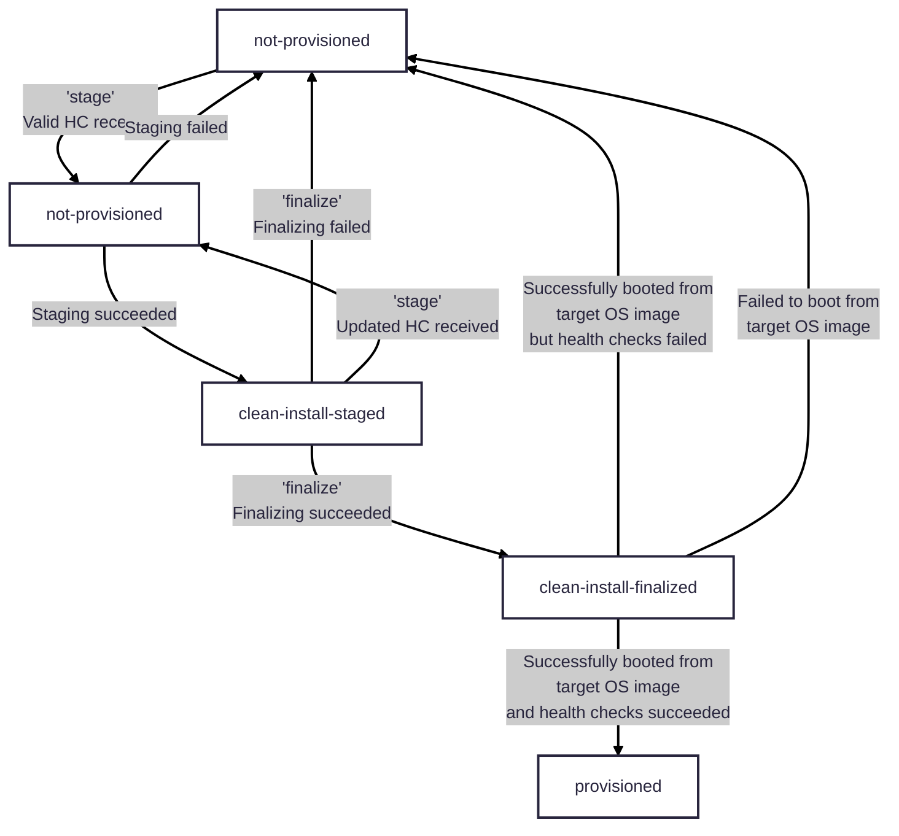
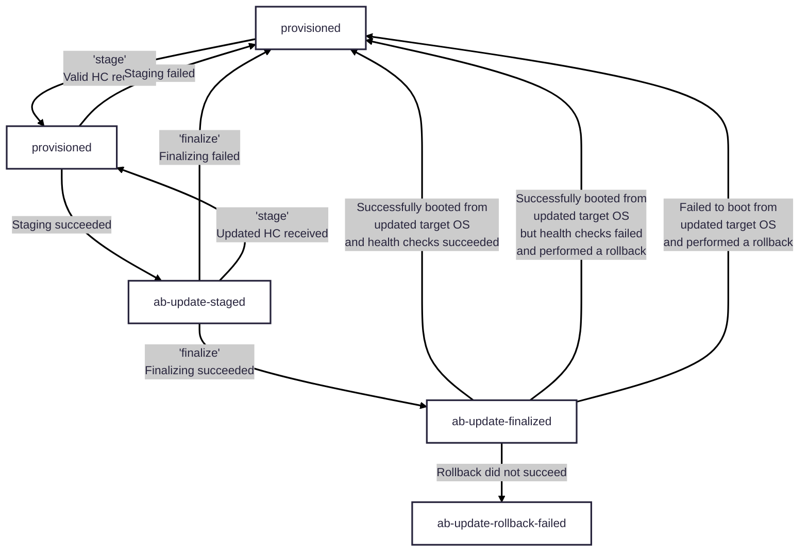

# Trident State Machine

## Servicing Type and Servicing State

To track the progress of clean install or A/B upgrade and enable decoupling of
`stage` from `finalize`, Trident uses **TWO** objects:

1. **Servicing type**: `ServicingType` describes the type of changes required
based on Host Status and Host Configuration. This object has the following values:

   - `AbUpdate`:  Update that requires switching to a different root partition
      and rebooting.
   - `CleanInstall`: Clean install of the target OS image when the host is
      booted from the servicing OS.
   - `NoActiveServicing`: No servicing is currently in progress.

2. **Servicing state**: `ServicingState` describes the current state of the
servicing done by Trident. The host will transition through a different
sequence of servicing states, depending on the servicing type that Trident is
executing. This object has the following values:

   - `NotProvisioned`: The host is running from the servicing OS and has
      not yet been provisioned by Trident.
   - `CleanInstallStaged`: Clean install has been staged, i.e., the initial
      target OS images have been deployed onto block devices.
   - `AbUpdateStaged`: A/B update has been staged. The target OS images
      have been deployed onto block devices.
   - `CleanInstallFinalized`: Clean install has been finalized, i.e., UEFI
      variables have been set, so that firmware boots from the target OS image
      after reboot.
   - `AbUpdateFinalized`: A/B update has been finalized. For the next boot, the
      firmware will boot from the updated target OS image.
   - `AbUpdateHealthCheckFailed`: After A/B update has booted into the target OS,
      user-specified health check(s) are run. Should any of them fail, the machine
      will enter this state and will boot into the servicing OS.
   - `AbUpdateRollbackFailed`: If A/B update fails, the machine should boot
      from the servicing OS. If Trident is unable to successfully rollback to the
      servicing OS, it will enter this state.
   - `Provisioned`: Servicing has been completed, and the host successfully
      booted from the updated target OS image. Trident is ready to begin a new
      servicing.

## State Diagrams

The state diagrams below illustrate how `servicingState` of the host will
change in Host Status, depending on Host Configuration and the value(s)
provided in the `--allowed-operations` option:

### Clean Install State Diagram

### A/B Update State Diagram

