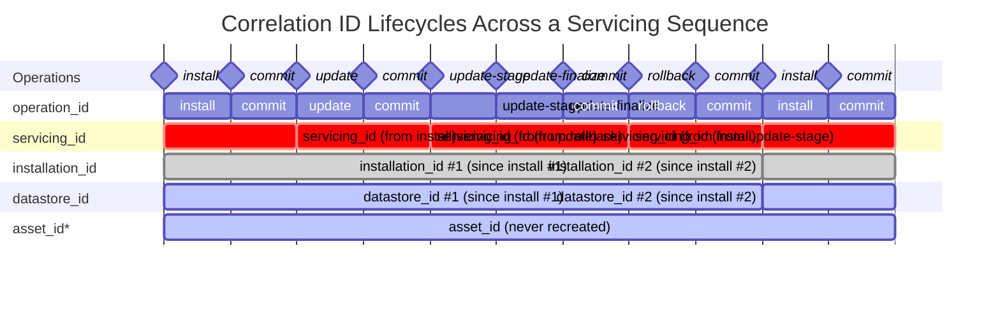

# Telemetry

Trident records the same metrics/spans locally in two places regardless of
whether remote telemetry is enabled: appended to
`/var/log/trident-metrics.jsonl`, and logged to journald under the
`trident-tracing` syslog identifier. Retrieve the journald copy with:

``` bash
journalctl -t trident-tracing
```

On top of these local copies, Trident can optionally send this same
best-effort stream of tracing data to Azure Monitor / Application
Insights. See [Agent Configuration](./Agent-Configuration.md) for how to
enable it.

## Host Metadata

Every event sent also includes as much of the following host metadata as
is available at the time, so operators should be aware this leaves the
host along with the metrics/spans themselves:

- `asset_id`: the host's DMI product UUID (a stable hardware identifier).
- `os_release`: the `VERSION` field from `/etc/os-release`.
- `kernel_version`: the running kernel release (`uname -r`).
- `total_cpu`: the number of CPUs.
- `total_memory_gib`: total memory, in GiB.
- `trident_version`: the running Trident version.
- `datastore_id`: an ID that lets separate events be correlated back to the
  same datastore over its entire lifetime (generated on first access to
  the datastore, whether or not an install has actually happened yet).
  Not present on events that fire before the datastore has ever been
  accessed (e.g. very early in a host's first-ever `install`, before
  `Trident::new` opens or creates it).
- `installation_id`: an ID that lets separate events be correlated back to
  the same host installation over time. Unlike `datastore_id`, this is
  only ever created (get-or-create, never overwritten) at the start of
  `Trident::install`. Any event that fires before that point (i.e.
  before a host's first-ever install has actually created one) instead
  reports that invocation's own `operation_id` as a stand-in
  `installation_id` -- the same value that will end up persisted as the
  real `installation_id` if that invocation goes on to become the
  first-ever install. A datastore created before `installation_id` was
  introduced is migrated the first time it is opened: a one-time write
  persists an `installation_id` for it (without touching any other
  data), so older hosts pick up the field on their next command rather
  than remaining permanently without one.
- `servicing_id`: an ID that lets events emitted across a whole servicing
  operation (an install, update, or manual rollback) be correlated with
  each other -- including across separate stage/finalize invocations
  (each with their own `operation_id`) and a later `commit`. Set to the
  `operation_id` of whichever invocation actually performed the staging
  (`ensure_servicing_id`, unconditionally overwritten every time a
  stage-capable invocation runs); a finalize-only invocation and `commit`
  instead read the already-persisted value back rather than generating
  their own, and never generated by a `grpc-client` invocation (only
  `cli`/`daemon` do the actual staging work). Once attached, it is never
  cleared: on the daemon, where one long-lived process handles many
  requests over time, a later request for a command that never stages or
  finalizes anything (e.g. `get`, `validate`, `diagnose`) still reports
  the most recently staged `servicing_id`, since the host is considered to
  remain within that servicing episode until the next stage overwrites
  it. Only absent for events fired before any servicing operation has
  ever staged on that datastore.
- `operation_id`: an ID that lets events emitted during the same command
  invocation be correlated with each other.
- `command`: which command produced the event (e.g. `install`, `update`,
  `update_stage`, `update_finalize`, `commit`, `rollback`, `rebuild_raid`).
- `source`: which of Trident's three entry points produced the event --
  `cli` (a command run directly, without a daemon), `daemon` (a command
  the daemon executed for a gRPC request), or `grpc-client` (the CLI
  acting as a client, relaying a command to a running daemon).

## Correlation ID Lifecycle

The five correlation-style fields above have deliberately different
lifetimes -- some outlive many servicing operations, some are recreated on
every reinstall, and some exist only for a single command invocation. The
diagram below shows how each behaves across a representative sequence of
operations: `install`, `commit`, `update`, `commit`, `update-stage`,
`update-finalize`, `commit`, `rollback`, `commit`, `install`, `commit`.



\* `asset_id` was a real field (a hardware/product-UUID-based identifier,
read from `/sys/class/dmi/id/product_uuid`) that Trident emitted before
this design existed. It was removed once `installation_id`/`servicing_id`
were introduced (see `telemetry: remove asset_id from platform info`) and
is shown here only for lifecycle contrast with `datastore_id` -- it is
**not** currently emitted by Trident.

Reading the diagram by row, from most to least stable:

- **`asset_id`** (no longer emitted, shown for contrast): would have
  identified the physical machine itself, surviving every reinstall.
- **`datastore_id`**: tied to a single datastore file. Recreated whenever a
  new datastore is created -- in this sequence, only the second `install`
  (day 10) starts a new one.
- **`installation_id`**: created once at the first `install` against a
  given datastore and never overwritten after that -- but since it lives
  in the datastore, it is recreated alongside `datastore_id` whenever a new
  datastore is created (the second `install`).
- **`servicing_id`**: correlates every event in one servicing episode
  (across separate stage/finalize invocations and any later `commit`)
  back to whichever invocation actually staged it. Regenerated by every
  invocation that stages something new (`install`, `update`,
  `update-stage`, `rollback`) -- note `update-finalize` does *not*
  regenerate it, since finalize-only invocations only read the value back.
- **`operation_id`**: the shortest-lived of the five, minted fresh for
  every single command invocation and never reused.

## Delivery

Telemetry delivery is always best-effort and never affects servicing
outcomes, but failures are not all logged at the same level: a failure to
serialize an event, or to enqueue it because the background uploader has
already shut down, is logged at trace level, while a failure to actually
deliver an event (e.g. no network connectivity, or a non-2xx response from
Application Insights) is logged at error level, so operators can find
remote-delivery problems in normal logs.
