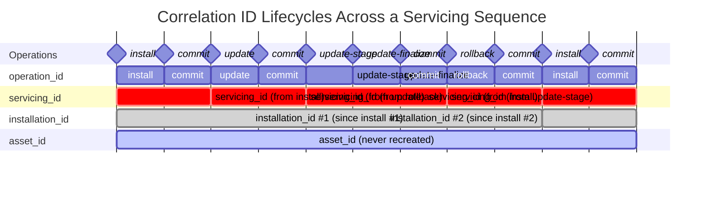

# Telemetry

Trident records the same metrics/spans locally in two places regardless of
whether remote telemetry is enabled: `/var/log/trident-metrics.jsonl`, and
journald under the `trident-tracing` syslog identifier. Retrieve the
journald copy with:

``` bash
journalctl -t trident-tracing
```

The local metrics file is recreated (truncated) at the start of most
command invocations, then appended to with that invocation's own metrics
as they're emitted -- it holds one command's telemetry, not a durable,
ever-growing history across the host's lifetime. `diagnose` is the
exception: it appends to the existing file instead of truncating it, since
it reads back and repackages that file's pre-existing content into a
support bundle.

On top of these local copies, Trident can optionally send this same
best-effort stream of tracing data to Azure Monitor / Application
Insights. See [Agent Configuration](./Agent-Configuration.md) for how to
enable it.

Telemetry defaults to **disabled** (`OptOut`). To enable it, add a line to
the Agent Configuration file:

``` conf
Telemetry=OptIn
```

## Host Metadata

Every event sent also includes as much of the following host metadata as
is available at the time, so operators should be aware this leaves the
host along with the metrics/spans themselves:

- `asset_id`: the host's DMI product UUID (a stable hardware identifier).
- `os_release`: the `VERSION` field from `/etc/os-release`.
- `kernel_version`: the running kernel release (`uname -r`).
- `total_cpu`: the number of CPUs.
- `total_memory_gib`: total memory, in GiB.
- `trident_version`: the running Trident version.
- `installation_id`: an ID that lets separate events be correlated back to
  the same host installation over time.
- `servicing_id`: an ID that lets events emitted across a whole servicing
  operation (an install, update, or manual rollback) be correlated with
  each other.
- `operation_id`: an ID that lets events emitted during the same command
  invocation be correlated with each other.
- `command`: which command produced the event (e.g. `install`, `update`,
  `update_stage`, `update_finalize`, `commit`, `rollback`, `rebuild_raid`).
- `source`: which of Trident's entry points produced the event -- `cli` (a
  command run directly, without a daemon) or `daemon` (a command the
  daemon executed for a gRPC request). A third entry point, `grpc-client`
  (the CLI acting as a client, relaying a command to a running daemon),
  is defined but not currently wired up to produce this enrichment --
  see `logging::operation_context`'s module doc for why that's not
  considered a gap worth closing.

## Correlation ID Lifecycle

The four correlation-style fields above have deliberately different
lifetimes -- some outlive many servicing operations, some are recreated on
every reinstall, and some exist only for a single command invocation. The
diagram below shows how each behaves across a representative sequence of
operations: `install`, `commit`, `update`, `commit`, `update-stage`,
`update-finalize`, `commit`, `rollback`, `commit`, `install`, `commit`.



Reading the diagram by row, from most to least stable:

- **`asset_id`**: identifies the physical machine itself, via its DMI
  product UUID. The most stable of the four -- read directly from
  hardware rather than the datastore, so it survives every reinstall,
  including the second `install` (day 10) that recreates
  `installation_id`.
- **`installation_id`**: normally created once at the first `install`
  against a given datastore and never overwritten after that -- but
  recreated whenever a new datastore is created (the second `install`,
  day 10), since it lives in the datastore. The CIH update-bootstrap
  path and the legacy-datastore migration (see the `installation_id`
  bullet above) are the other two ways it can be created, outside of
  `install`.
- **`servicing_id`**: correlates every event in one servicing episode
  (across separate stage/finalize invocations and any later `commit`)
  back to whichever invocation actually staged it. Regenerated by every
  invocation that stages something new (`install`, `update`,
  `update-stage`, `rollback`) -- note `update-finalize` does *not*
  regenerate it, since finalize-only invocations only read the value back.
- **`operation_id`**: the shortest-lived of the four, minted fresh for
  every single command invocation and never reused.

## Delivery

Telemetry delivery is always best-effort and never affects servicing
outcomes, but failures are not all logged at the same level: a failure to
serialize an event, or to enqueue it because the background uploader has
already shut down, is logged at trace level, while a failure to actually
deliver an event (e.g. no network connectivity, or a non-2xx response from
Application Insights) is logged at error level, so operators can find
remote-delivery problems in normal logs.
