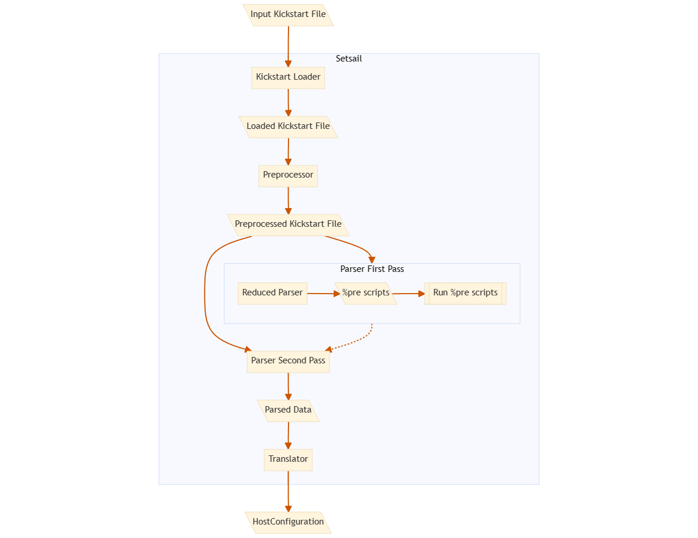
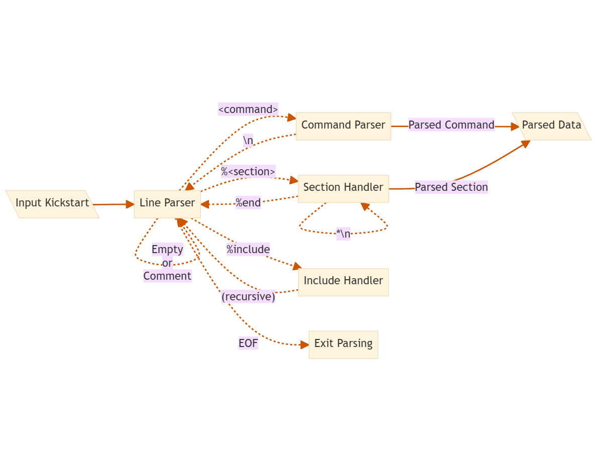

# ⛵ Setsail

Kickstart but maritime themed. ⚓

## Overview

Setsail is composed of three main components:

- Preprocessor
- Parser
- Translator

The full flow looks like this:



The overall flow closely resembles Anaconda's:


## Preprocessor

This component only handles `%ksappend <file>` directives.

## Parser Design

The parser itself resembles the principles of pykickstart, which makes sense
because they both parse the same thing.

The setsail parser is made to mostly behave in the same ways as pykicksatart.
This means an error in pykickstart is expected to be an error here, and a
something that works/is allowed in pykickstart should be here too.

The main difference is that pykickstart fails fast, whereas setsail makes a best
effort run. The reason is that we want to collect as many errors as possible
from the beginning to reduce the debugging burden on users.

In broad terms, the parser's behavior is described by this state machine.



### First Pass

The first pass uses a reduced instance of the parser that only cares about
`%pre` sections and ignores everything else. Per pykickstart's documentation,
`%include` should not reference files with `%pre` scripts. This is not an error,
they will simply be ignored.

Every valid `%pre`` script is executed in the provisioning OS afterwards.

### Second Pass

The second pass uses a full parser to extract every single detail from the file.
From here we extract `%post` scripts, partitions, networking, etc...

All the parsed data is used to populate an intermediary data structure:

```rust
/// Struct to hold all meaningful data parsed from a kickstart file
#[derive(Debug, Default)]
pub struct ParsedData {
    pub scripts: Vec<Script>,
    pub partitions: Vec<cmd::Partition>,
    pub users: HashMap<String, cmd::User>,
    pub root: Option<cmd::Rootpw>,
    // . . .
}
```

Kickstart mostly follows a "last keyword wins" philosophy. Aside of this,
kickstart is mostly declarative and ordering is not generally relevant. The only
exceptions to this are a couple commands where the order in which the
instructions are written does reflect the order in which something is to be
created.
A good example of this behavior is the `partition` command, where the
order in which the partitions are defined in kickstart will also be the
order of the real partitions on disk.

## Translator

The translator takes in the `ParsedData` object and attempts to produce a valid
HostConfiguration instance from it.
