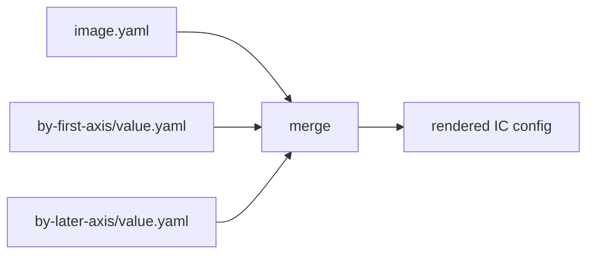

# Merge model

The merge model is designed to be deterministic and reviewable.



## Precedence is axis declaration order

Fragments apply in the order axes are declared in `matrix:`. A later axis wins later `$set` conflicts and appends later to lists.

```yaml
matrix:
  edition: [lite, pro]
  channel: [stable, edge]
```

Here `by-edition/...` applies before `by-channel/...`. This is intentional: adding a directory or changing alphabetical order cannot silently change precedence. Authors control precedence where they declare the axes.

A fragment can target a **combination** of axes (`by-edition+arch/pro+arm64.yaml`, a conjunction) or
**several values of one axis** (`by-channel/stable+edge.yaml`, a disjunction). Such fragments sort after the
single-axis ones they refine (more axes = more specific = later), and a narrower single-value fragment wins
over a broader disjunction on the same axis. `tailor explain <image> --cell <slug>` prints the exact order;
see [image.yaml](../reference/image-yaml.md) and [Merge directives](../reference/directives.md).

## Fragment sort order

For a given cell, the fragments that apply are sorted by these keys, in order, and merged base → last:

1. **Arity** — how many axes the fragment constrains. A single-axis fragment
   (`by-edition/pro.yaml`) applies before a multi-axis one (`by-edition+arch/pro+arm64.yaml`), so the
   more specific composite wins.
2. **Axis declaration order** — among fragments of equal arity, the axis declared earlier in `matrix:`
   applies first (later-declared axes win later conflicts).
3. **Breadth** — a broader disjunction (`by-channel/stable+edge.yaml`) applies before a narrower
   single value (`by-channel/edge.yaml`) on the same axis, so the single value wins.

### Worked example

```yaml
matrix:
  edition: [lite, pro]
  channel: [stable, edge]
```

For the cell `edition=pro, channel=edge`, these fragments merge in this order (each may override the
previous):

1. `image.yaml` (the base)
2. `by-edition/pro.yaml` (arity 1, first-declared axis)
3. `by-channel/stable+edge.yaml` (arity 1, later axis, broad)
4. `by-channel/edge.yaml` (arity 1, later axis, narrow — beats the disjunction above)
5. `by-edition+channel/pro+edge.yaml` (arity 2 — most specific, wins last)

## Maps, lists, and scalars

- Maps deep-merge.
- Lists append by default; `$prepend`/`$append` add to either end and `$replace`/`$remove` rewrite or trim.
- Differing scalar assignments conflict unless the later assignment uses `$set`.
- Set a key's value to the bare token `$unset` to remove the inherited key entirely.

This makes accidental double ownership loud while keeping additive IC lists easy. See
`docs/reference/directives.md` for every directive.

## Why no IC-aware merge?

tailor does not know that an IC list contains packages, partitions, filesystems, or services. It does not merge list items by `id` or deduplicate packages. If a structured list must change, own the whole list in the fragment or use `$replace`.

That keeps tailor a thin wrapper over Image Customizer rather than a second IC schema implementation.
